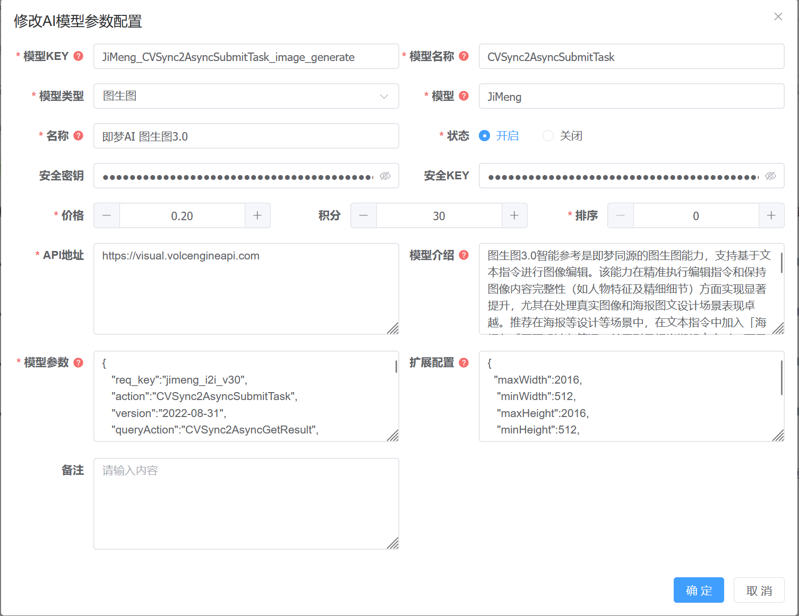

# LitchiPicture

[TOC]

## 项目介绍

**LZ-Picture**（荔枝云图库）是一个综合性的云端图像管理平台，用户可以上传、整理、分享和发现图片。结合了现代网络技术和AI能力，打造了一个功能丰富的图像存储库，拥有面向用户和管理员的双重界面。

LZ-Picture是一个全栈应用程序，提供以下功能：

- **图像管理**：上传、整理、压缩和水印图片
- **用户空间**：个性化图片画廊和文件夹组织
- **社交功能**：点赞、收藏、分享和下载图片
- **积分系统**：基于积分的经济体系，用于下载和高级功能
- **AI集成**：高级图像分析和处理
- **管理工具**：完整后端管理系统

该平台采用模块化系统构建，后端服务和前端界面清晰分离，遵循企业应用开发的最佳实践。

### 在线地址

https://springsun.online/

### 系统架构

LZ-Picture遵循现代多层架构：

系统基于**Spring Boot 3.x**构建，采用模块化方法，每个功能域都有其专属模块，职责清晰。

来源：[pom.xml](https://zread.ai/SpringSunYY/LZ-Picture/Picture/pom.xml)

### 关键组件

### 后端模块

| 模块                  | 用途                           |
| --------------------- | ------------------------------ |
| **picture-admin**     | 主应用程序入口和管理API控制器  |
| **picture-framework** | 提供所有模块基础的核心框架组件 |
| **picture-system**    | 系统级功能，包括权限和基础配置 |
| **picture-common**    | 共享工具、助手和通用代码       |
| **picture-picture**   | 核心图像处理和管理功能         |
| **picture-user**      | 用户资料管理和用户数据         |
| **picture-user-auth** | 认证和授权系统                 |
| **picture-points**    | 平台经济积分/信用系统          |
| **picture-ai**        | 图像分析和处理的AI集成         |
| **picture-config**    | 系统配置管理                   |
| **picture-quartz**    | 定时任务和后台处理             |

### 前端应用

- **Picture-ui**：基于Vue的用户界面，使用Tailwind CSS
- **Picture-back-ui**：基于Vue的系统管理界面，若依VUE3

两个前端都是现代单页应用（SPA），通过RESTful API与后端通信。


## 开发规范

1. ### 缓存

   - 缓存每个单词统一使用：分割，最后一个使用：Constants.COMMON_SEPARATOR_CACHE公共字段拼接所需内容，因为自定义缓存是有自动添加COMMON_SEPARATOR_CACHE的
   - 首个单词必须为每个模块的模块名，比如ai，命名为：ai:ai:....
   - 注意：如果是若依自带的，缓存默认会加上：sys_config
   - 缓存缓存时间统一为秒

2. ### 后端

   - 类字段统一采用驼峰命名
   - Constants字段统一全部大写加_分割单词
   - 枚举命名：类为每个模块单词的首字母加上该字典类型，字段为该字典类型+值，例：类名PPictureReviewStatus，字段：PICTURE_REVIEW_STATUS_0
   - 方法有两个相似的必须提出来当方法，减少代码耦合
   - 逻辑复杂或者处理同一个内容需要多个步骤的需要抽出方法，方便调用、在其他地方使用这个逻辑时能够直接调用，降低bug率
   - 一个方法行数实际代码数量不得超过一百行

3. ### 用户端前端

   - 文件命名规范：每个模块会有模块的文件夹，比如图片模块picture文件夹，下面加上他的文件，picture.vue这样，如果是详情，pictureDetail.vue，采用驼峰命名，同时如果多个相似要放在同一个文件夹，比如图片模块的图库，就可以放在图库picture/space/space.vue

   - vue模块：js必须要有name，模块+文件名，template最外层div必须加class，并且class命名为横杠来分割单词，模块+文件名例：forgetPassword，user-forgot-password

   - css使用scss

4. ### 管理前端

   - 采用若依当前规则即可
   - css使用scss

5. ### 配置模块命名规则

   - 权限标识：路由地址+对应功能
   - 配置键名：模块:功能:功能

6. ### 其他

   - 公共使用的方法必须提到对应的公共方法类或者ts、js文件
   - 参数不能使用基类，必须使用对应的vo、dto，前端同理使用type，防止参数耦合
   - 前端使用多的，相似度高的地方要提取为组件

## 公共功能

### 1.自定义缓存

#### 	1.缓存注解

```java
/**
 * 自定义缓存注解，父类字段无法拿到
 * 坚持是前行的舟
 */
@Target(ElementType.METHOD)
@Retention(RetentionPolicy.RUNTIME)
public @interface CustomCacheable {
    String keyPrefix();          // 缓存 key 的前缀

    String keyField() default "";           // 从入参中提取 key 的字段路径（支持嵌套字段）

    long expireTime() default 3600L; // 缓存时间（秒）

    boolean paginate() default false; // 是否启用分页缓存

    String pageNumberField() default ""; // 页码字段（如果 paginate 为 true，则使用该字段）

    String pageSizeField() default "";  // 每页大小字段（如果 paginate 为 true，则使用该字段）

    boolean useQueryParamsAsKey() default false; // 是否将整个查询对象转换为 JSON 字符串作为缓存 key 的一部分
}

```

2. #### 删除缓存

   ```java
   /**
    * 自定义缓存删除注解
    */
   @Target(ElementType.METHOD)
   @Retention(RetentionPolicy.RUNTIME)
   @Documented
   public @interface CustomCacheEvict {
   
       String[] keyPrefixes();
   
       String[] keyFields() default {}; // 支持嵌套，如 "request.userId"
   
       boolean useQueryParamsAsKey() default false; // 如果true，加上参数JSON串模糊删除
   
   }
   ```

   

### 2.自定义排序

```java
/**
 * 自定义排序注解
 * 首先我希望我变好，也希望你
 *
 * @Project: Picture
 * @Author: YY
 * @CreateTime: 2025-07-27  16:41
 * @Version: 1.0
 */
@Target(ElementType.METHOD)
@Retention(RetentionPolicy.RUNTIME)
@Documented
public @interface CustomSort {
    String[] sortFields() default {};   //排序字段
    String[] sortMappingFields() default {}; //映射字段，前端只需要传过来字段名，如果多表查询设置映射字段，映射字段为查询时所需字段
}
```


## 配置模块

### 1. 配置信息

- 配置信息存入缓存信息，name是键名，value是值，键值对

- 值可以是文件和值

- 初始化项目加载所有配置信息

- 根据order_num升序

- 配置信息添加是否内置，如果内置则用户端不可以通过接口获取到数据

- 新增及使用方式：

  1. 首先新增key，例如：user:login:captchaEnabled

  2. 在类ConfigInfoUtils添加对应字段和默认值

     ```java
         public static final String USER_LOGIN_CAPTCHA_ENABLED_KEY = "user:login:captchaEnabled";
         public static Boolean USER_LOGIN_CAPTCHA_ENABLED_VALUE = true;
     ```

     3. 在refreshConfig新增，即完成

        ```
        USER_LOGIN_CAPTCHA_ENABLED_VALUE = getBool(USER_LOGIN_CAPTCHA_ENABLED_KEY);
        ```

     4. 使用直接调用**USER_LOGIN_CAPTCHA_ENABLED_VALUE**

     5. 用户前端使用方式

        1. 用户第一次获取配置之后会存入本地缓存，在utils/config.js

        2. 存入缓存stores/config.js

        3. 使用方式：

           ```js
           titleDesc.value = await useConfig('picture:report:content')
           ```

           

### 2. 菜单信息

- 创建规则：根据提示创建
- 动态路由，为用户端实现动态路由
- 权限管理，菜单作为权限管理
- 缓存，刷新缓存
- 状态和是否显示都可以作为改菜单是否有权限，是否开启权限，是否显示对应接口，如果不显示表示这个接口不开启
- 自定义路由信息，根据用户权限
- 写死的路由不做排序，但是有前后之分，动态路由是中间的，有排序的

### 3.国际化

​		当前尚未完全实现。

#### 	1.国际化国家

- 简称是唯一的

#### 	2.国际化键名

- 根据order_num升序
- 键是唯一的

#### 	3.国际化信息

- 后续国际化信息根据国家（简称）+键名，同时组成唯一键 （待完成）
- 信息需要存入缓存，根据国家作为redis key存入  map key（键名）——value（信息）
- 新增国际化信息并存入缓存，项目启动初始化至缓存

### 4.消息模板

- 可以新增，生成事例，根据变量生成事例
- 回退对应版本

### 5.公告

- 公告没有模板，基本填写，不为所有用户推送，所有用户可以查看
- 前端每日会刷新一次，每日会通知一次
- 前端位置components/NoticeWindows.vue


### 6.文件日志

- 记录文件上传的日志，防止冗余图片，比如头像、图片、封面

- 使用方式，异步执行：

  ```java
          //异步执行存入文件日志
          PictureAsyncManager.me().execute(PictureFileLogAsyncFactory.recordFileLog(picture,
                  getLoginUser().getUserId(),
                  CFileLogTypeEnum.LOG_TYPE_0.getValue()
          ));
  ```
  
```java
     /**
       * 记录文件日志
       *
       * @param fileResponse 图片信息
       * @param userId              用户编号
       * @param logType             日志类型
       * @param deviceInfo          设备信息
       * @return void
       * @author: YY
       * @date: 2025/5/10 22:56
       **/
      void recordFileLog(FileResponse fileResponse, String userId, String logType, DeviceInfo deviceInfo);
```

  其中逻辑：如果传入原图和压缩图，就执行保存对应的信息

- 更新逻辑，需要自己实现，当前的直接去看项目注释，例如：

  ```java
      /**
       * 异步更新文件日志，判断是否和存入数据库日志一样，如果不一样则更新，如果一样则不更新，表示没有新上传图片
       * 因为新增时图片已经为正常
       * 不一样表示新上传图片，要把上传的图片更新为正常，老图片为冗余
       *
       * @param old 老的用户信息
       * @param userInfo 新的用户信息
       * @return TimerTask
       * @author: YY
       * @method: updateUserInfoAvatarFileLog
       * @date: 2025/5/31 16:03
       **/
      public static TimerTask updateUserInfoAvatarFileLog(UserInfo old, UserInfo userInfo) {
          return new TimerTask() {
              @Override
              public void run() {
                  //如果头像地址不一致
                  if (!old.getAvatarUrl().equals(userInfo.getAvatarUrl())) {
                      FileLogUpdate newFileLogUpdate = new FileLogUpdate();
                      newFileLogUpdate.setUserId(userInfo.getUserId());
                      newFileLogUpdate.setTargetId(userInfo.getUserId());
                      newFileLogUpdate.setTargetContent(userInfo.getUserName());
                      //为什么只要压缩图片？？？因为头像和封面只有压缩图
                      newFileLogUpdate.setThumbnailUrl(userInfo.getAvatarUrl());
                      newFileLogUpdate.setQueryLogType(CFileLogTypeEnum.LOG_TYPE_2.getValue());
                      //新的新增时为冗余，要更新为正常
                      newFileLogUpdate.setQueryLogStatus(CFileLogStatusEnum.LOG_STATUS_0.getValue());
                      newFileLogUpdate.setUpdateLogStatus(CFileLogStatusEnum.LOG_STATUS_1.getValue());
                      SpringUtils.getBean(IFileLogInfoService.class).updateFileLog(newFileLogUpdate);
  
                      FileLogUpdate oldFileLogUpdate = new FileLogUpdate();
                      oldFileLogUpdate.setTargetId(old.getUserId());
                      oldFileLogUpdate.setTargetContent(old.getUserName());
                      oldFileLogUpdate.setThumbnailUrl(old.getAvatarUrl());
                      oldFileLogUpdate.setUserId(old.getUserId());
                      oldFileLogUpdate.setQueryLogType(CFileLogTypeEnum.LOG_TYPE_2.getValue());
                      oldFileLogUpdate.setQueryLogStatus(CFileLogStatusEnum.LOG_STATUS_1.getValue());
                      oldFileLogUpdate.setUpdateLogStatus(CFileLogStatusEnum.LOG_STATUS_0.getValue());
                      SpringUtils.getBean(IFileLogInfoService.class).updateFileLog(oldFileLogUpdate);
                  }
              }
          };
      }
  ```

  

## 用户模块

### 1 .登录

- 账号密码登录，自定义密码加密方式，根据密码加密方式判断密码
- 手机短信登录
- 注册
- 忘记密码

### 2. 用户详情

- 多种加密方式加密用户密码
- 用户详细信息
- 用户修改自己的信息
- 用户修改密码
- 查看最近登录记录
- 以及各种日志

## 图片模块

### 1. 图片信息

1. #### 图片上传

   - 图片上传会压缩图片，同时也会保留原图，添加水印，返回图片基本信息


   - 用户上传图片，选择图片文件夹、图片空间、图片标签，如果标签不存在则新增标签


   - 用户上传图片后会异步更新对应空间的使用量，会判断用户空间使用量，对于团队空间，团队内的成员也可以创建，创建者和编辑者

   - 图片分类，如果用户选择了图片分类，会判断图片分类是否存在，状态是否为正常，只有正常的才可以选择

     ```java
     if (StringUtils.isNotEmpty(pictureInfo.getCategoryId())) {
                 //查询分类是否存在
                 categoryInfo = pictureCategoryInfoService.selectPictureCategoryInfoByCategoryId(pictureInfo.getCategoryId());
                 ThrowUtils.throwIf(StringUtils.isNull(categoryInfo)
                                 || !categoryInfo.getCategoryStatus().equals(PCategoryStatusEnum.CATEGORY_STATUS_0.getValue()),
                         HttpStatus.MOVED_PERM, "分类不存在或不可选");
                 categoryInfo.setUsageCount(categoryInfo.getUsageCount() + 1);
             }
     ```

   - 空间文件夹，和分类同理，会判断是否是该空间内文件夹，判断是否有团队空间对应权限

### 2. 图片详情

- 用户自己查看详情，获取图片所有信息，接口：

  ```java
   /**
       * 获取我的图片详细信息
       */
      @PreAuthorize("@uss.hasPermi('picture:upload:detail')")
      @GetMapping("/my/{pictureId}")
      public AjaxResult getMyInfo(@PathVariable("pictureId") String pictureId) {
          UserPictureDetailInfoVo userPictureDetailInfoVo = pictureInfoService.userMySelectPictureInfoByPictureId(pictureId, getUserId());
          return success(userPictureDetailInfoVo);
      }
  ```

  会判断做以下判断

  ```java
    //如果图片不是公共且图片审核状态不是通过，且当前用户不是作者，且不是空间的成员
          if (!userPictureDetailInfoVo.getPictureStatus().equals(PPictureStatusEnum.PICTURE_STATUS_0.getValue())
                  && !userPictureDetailInfoVo.getUserId().equals(UserInfoSecurityUtils.getUserId())
                  && !spaceAuthUtils.checkUserJoinSpace(userPictureDetailInfoVo.getSpaceId())) {
              throw new ServiceException("图片审核不通过，无法查看");
          }
  ```

- 用户查看详情，用户查看详情不会获取所有信息，会判断自己是否点赞收藏

  ```java
     //查询是否有行为，点赞、收藏
          isBehavior(pictureId, userId, userPictureDetailInfoVo);
          //如果图片不是公共且图片审核状态不是通过，且当前用户不是作者
          if (!userPictureDetailInfoVo.getPictureStatus().equals(PPictureStatusEnum.PICTURE_STATUS_0.getValue())
                  && !userPictureDetailInfoVo.getUserId().equals(UserInfoSecurityUtils.getUserId())
                  && !spaceAuthUtils.checkUserJoinSpace(userPictureDetailInfoVo.getSpaceId())) {
              throw new ServiceException("图片审核不通过，无法查看");
          }
  ```

- 图片缓存，用户查看详情和查看自己图片详情其实本质就是一个，只不过有了不同处理逻辑，其中走的是同一个，都是先查数据库然后存入缓存拿缓存，但是此处缓存因为springAop，所以做了手动缓存。

  ```java
   //手动设置缓存，这里基本内部调用，spring没有托管，所以需要手动设置缓存
          String key = PICTURE_PICTURE_DETAIL + COMMON_SEPARATOR_CACHE + pictureId;
          if (redisCache.hasKey(key)) {
              return redisCache.getCacheObject(key);
          }
  ```

- 图片更新及快捷更新名字，同理，会删除对应缓存

- 用户点赞收藏转发会异步更新图片信息，这里使用的是策略模式更新对应信息，每个模式可能不同，需具体实现，同时会存入图片热门统计排行
- 其他逻辑当前基本同理，没有什么比较复杂逻辑
- 图片详情增加上传类型，由后端判断，判断是什么类型，比如此AI模块的图片，就是所有的上传信息

### 3. 图片下载

- 获取原图链接

  ​	1.查询图片是否存在且是正常的

  ```java
          //判断图片1、是否存在，2、是否是作者，如果不是是否是正常，如果也不是判断是否不是空间成员，如果都false判断是否删除
          ThrowUtils.throwIf(StringUtils.isNull(pictureInfo)
                          || ((
                          !pictureInfo.getUserId().equals(userId)
                                  && pictureInfo.getPictureStatus().equals(PSpaceStatusEnum.SPACE_STATUS_1.getValue())
                                  && !spaceAuthUtils.checkUserJoinSpace(pictureInfo.getSpaceId())
                  )
                          || pictureInfo.getIsDelete().equals(CommonDeleteEnum.DELETED.getValue())),
                  "图片不存在");
  ```

  2. 执行下载逻辑：作者或者加入空间的无需使用积分，积分大于0需消耗积分，大于等于10才分成积分,且必须是10的倍数

- 根据下载记录获取原图链接，无需消耗积分，基本逻辑和获取原图链接一样。

### 4. 图片推荐

1. 用户推荐模型：图片推荐是指根据用户的推荐模型推荐图片
   - 用户当前点赞，浏览，下载等行为都会给对应图片的标签，分类加分，根据分数为用户推荐图片
   - 默认缓存最热门的分类和图片，可以自定义数量
2. 图片推荐
   - 根据用户推荐模型，计算给用户推荐的图片并存入缓存
   - 如果没有了直接推荐热门图片
3. 图片详情推荐
   - 根据图片的标签和分数进行推荐图片
4. 搜索建议
   - like查询热门图片
   - 搜索推荐：查看热门的图片

### 5. 空间信息

1. ### 空间信息

   - 空间信息新增修改以及列表，空间信息的个数的限制


   - 空间文件夹的新增修改，最多七层
   - 空间封面上传

2. ### 团队空间

   - 创建团队空间，用户创建团队空间自己默认成为创建者

   - 邀请别人成为空间成员，编辑者、预览者，在自己空间的成员可以免费查看图片和下载图片
   - 编辑成除了不可以删除其他的都可以，预览者只可以查看

3. ### 团队空间权限**SpaceAuthUtils**

   - 用户同意进入空间之后删除原有的加入空间缓存，后续重新获取并缓存，也需要删除原有的空间权限

   - 获取空间成员的权限、是否包含某权限、任意权限

   - 判断是否有编辑权限、是否为创建者

   - 注意，需要删除的缓存很多，这里要熟读代码，比如表格的缓存，让用户实时看到，权限缓存

   - 关键删除，删除的时候邀请人和用户自己都要删除，不然可能数据不一致

     ```java
         /**
          * 删除空间权限 用户编号
          */
         public void deleteSpacePerm(String userId) {
             spaceInfoService.deleteSpaceTeamTableCacheByUserId(userId);
             deleteUserJoinSpace(userId);
             deleteSpaceMemberPerm(userId);
         }
     ```

     ```java
         //删除空间成员缓存
         @Override
         public void deleteSpaceMemberCacheBySpaceId(String spaceId) {
             redisCache.deleteObjectsByPattern(PICTURE_SPACE_MEMBER_DATA + COMMON_SEPARATOR_CACHE + spaceId + "*");
         }
     ```

     ```Java
           /**
          * 删除团队空间表格缓存
          *
          * @param userId
          * @return void
          * @author: YY
          * @method: deleteSpaceTeamTableCacheByUserId
          * @date: 2025/6/29 18:59
          **/
        @Override
         public void deleteSpaceTeamTableCacheByUserId(String userId) {
             redisCache.deleteObjectsByPattern(PICTURE_SPACE_TEAM_TABLE_DATA + COMMON_SEPARATOR_CACHE + userId + "*");
             redisCache.deleteObjectsByPattern(PICTURE_SPACE_LIST + COMMON_SEPARATOR_CACHE + userId + "*");
         }
     ```

     ```java
                 spaceAuthUtils.deleteSpacePerm(db.getUserId());
                 spaceInfoService.deleteSpaceTeamTableCacheByUserId(db.getUserId());
                 spaceMemberInfoService.deleteSpaceMemberCacheBySpaceId(db.getSpaceId());
     ```

   #### 4.前端使用

   ```js
   /**
    * 检查是否有指定空间权限
    */
   export function checkSpacePerm(perm: string): boolean {
     try {
       // console.log('检查权限：', perm)
       // console.log('已加载权限：', spacePerm.getSpacePerms())
       return spacePerm.getSpacePerms().includes(perm)
     } catch {
       console.warn('权限未加载，暂时拒绝访问')
       return false
     }
   ```

   ```js
   /**
    * 检查是否拥有任意一组权限
    */
   export function checkSpacePermsAny(perms: string[]): boolean {
     try {
       for (const perm of perms) {
         if (checkSpacePerm(perm)) {
           return true
         }
       }
       return false
     } catch {
       return false
     }
   }
   ```

   ```js
   /**
    * 构建空间权限
    * @param spaceId 空间编号
    * @param roleType 角色类型
    */
   export function buildSpacePermByUser(spaceId: string, roleType: string) {
     return buildSpacePerm(useUserStore().userId, spaceId, roleType)
   }
   ```

   ```js
   export function buildSpacePerm(userId: string, spaceId: string, roleType: string) {
     return userId + ':' + spaceId + ':' + roleType
   }
   ```

   ```js
   /**
    * 判断是否可以编辑
    */
   export function checkSpaceEditor(spaceId: string): boolean {
     return checkSpacePermsAny([
       buildSpacePermByUser(spaceId, PSpaceRole.SPACE_ROLE_1),
       buildSpacePermByUser(spaceId, PSpaceRole.SPACE_ROLE_0),
     ])
   }
   ```

   ```js
   /**
    * 判断是否是创建则
    */
   export function checkSpaceCreator(spaceId: string): boolean {
     return checkSpacePerm(buildSpacePermByUser(spaceId, PSpaceRole.SPACE_ROLE_0))
   }
   ```

   

## 积分模块

### 1.   积分套餐

- 积分套餐新增修改：积分套餐也有赠送积分。

- 用户选择积分套餐可以进行充值
- 定时任务，每天定时更新积分套餐

### 2.  积分充值

1. 用户选择积分套餐后进行充值

2. 支付

   1. 用户首先选择积分套餐，选择完成后选择支付渠道，例：支付宝
   2. 选择支付渠道后开始进行支付，后台创建支付订单并向支付宝发起支付请求，请求成功后创建支付订单，存订单如缓存并，返回订单号给前端，前端跳转支付页面并轮训获取订单状态，支付成功后支付页面跳转套餐页面，原页面获取到订单支付成功后跳转下一步，用户点击返回返回套餐页面，此时后端任务支付宝回调接口后更新订单状态并充值。
   3. 如果原来用户没有账号为用户创建账户。
   4. 充值成功
   5. 异常捕获

   - 捕获支付期间所有的异常

4. 积分记录

- 记录积分充值记录，金额，充值数
- 积分使用记录：记录用户积分使用记录，使用之前多少，使用之后多少


## AI模块

AI模块采用深色主题，其实可以实现深色主题和浅色主题切换，但大多前端都是AI生成的页面结构，重新构造比较麻烦，所以当前尚未实现，后续可以实现。

### 1. AI生图

1. AI生图接口在图片模块，因为后续需要对图片操作；
1. 生成任务创建之后直接扣取用户积分，如果查询任务失败则返回用户积分，如果使用别人的作品参考，奖励作者积分；
1. 可以批量选择模型，也可以批量生成图片，每个请求可以自定义最多并发。
1. 生成成功之后会自动上传到oss服务器，同时会上传压缩图。


- #### 	文生图\图生图

​		目前主要采用即梦AI生图，采用配置形式生图   

每个配置拥有详细信息，主要是模型参数，对应接口所需要参数。

模型参数：

```json
{
   "req_key":"jimeng_i2i_v30",
   "action":"CVSync2AsyncSubmitTask",
   "version":"2022-08-31",
   "queryAction":"CVSync2AsyncGetResult",
   "prompt":"",
   "binary_data_base64":"",
   "image_urls":"",
   "seed": -1,
   "width":512,
   "height":512,
   "use_pre_llm":false,
   "use_sr":true,
   "return_url":true,
   "path":"/",
   "service":"cv",
   "region":"cn-north-1",
   "schema":"https",
   "method":"POST",
   "host":"visual.volcengineapi.com"
}
```

```java
@EqualsAndHashCode(callSuper = true)
@Data
@NoArgsConstructor
public class JiMengParams extends Params<JiMengParams> {
    //算法名称
    private String req_key;

    //开启文本扩写
    private Boolean use_pre_llm;

    //随机种子
    private Integer seed;

    //接口名
    private String action;
    private String queryAction;

    //版本号
    private String version;

    private String method;

    private boolean return_url;

    private String region;
    private String service;
    private String schema;
    private String host;
    private String path;
    private String ak;
    private String sk;
    private String task_id;

    private String req_json;

    private String[] image_urls;

    private String[] binary_data_base64;

    @Data
    public static class ReqJson {
        private boolean return_url;
    }

    @Override
    public JiMengParams jsonToObj(String json) {
        return JSONObject.parseObject(json, JiMengParams.class);
    }

    @Override
    public String objToJson(JiMengParams params) {
        return JSONObject.toJSONString(params);
    }
}
```

扩展配置

```json
{
  "maxWidth":2016,
   "minWidth":512,
   "maxHeight":2016,
   "minHeight":512,
   "promptLength":800,
   "maxNumbers":1,
}
```

```java
@EqualsAndHashCode(callSuper = true)
@Data
@NoArgsConstructor
public class JiMengVerify extends Verify<JiMengVerify> {
    //最大数量
    private Integer maxNumbers;
    @Override
    public String objToJson(JiMengVerify verify) {
        return JSONObject.toJSONString(verify);
    }

    @Override
    public JiMengVerify jsonToObj(String json) {
        return JSONObject.parseObject(json, JiMengVerify.class);
    }

}
```

根据策略模式调用不同的模型，这样只要之后有新的调用接口，可以直接加AI模型参数配置即可，无需编辑代码，同理如果需要不同平台，只需要实现此平台的代码，所有接口都可以调用，提高开发效率。

```java
    public List<GenerateLogInfo> executeUserGenerate(AiGenerateRequest request) {
        //首先查询到所有的模型参数
        List<String> modelKeys = request.getModelKeys();
        List<GenerateLogInfoDto> generateLogInfoDtos = new ArrayList<>();
        ArrayList<GenerateLogInfo> logInfos = new ArrayList<>();
        Long totalPoints = 0L;
        for (String modelKey : modelKeys) {
            //查询每个key是否存在
            ModelParamsInfo modelParamsInfo = modelParamsInfoService.selectModelParamsInfoByModelKey(modelKey);
            ThrowUtils.throwIf(StringUtils.isNull(modelParamsInfo) ||
                            !modelParamsInfo.getParamsStatus().equals(AiModelParamsStatusEnum.MODEL_PARAMS_STATUS_0.getValue()),
                    HttpStatus.NO_CONTENT,
                    "模型参数不存在或者未启用");
            GenerateLogInfoDto generateLogInfoDto = new GenerateLogInfoDto(request, modelParamsInfo);
            generateLogInfoDtos.add(generateLogInfoDto);
            totalPoints += modelParamsInfo.getPointsNeed() * request.getNumbers();
        }
        //判断用户积分是否足够 查询用户账户是否存在，存在判断积分
        AccountInfo accountInfo = accountInfoService.selectAccountInfoByUserId(request.getUserId());

        ThrowUtils.throwIf(StringUtils.isNull(accountInfo)
                || accountInfo.getPointsBalance() < totalPoints, "积分不足");
        for (GenerateLogInfoDto info : generateLogInfoDtos) {
            //遍历执行，拿到对应的执行器
            for (AiGenerateStrategyService strategyService : aiGenerateStrategyServiceList) {
                AiGenerateStrategyConfig annotation = strategyService.getClass().getAnnotation(AiGenerateStrategyConfig.class);
                if (annotation.model().equals(info.getModel())) {
                    List<GenerateLogInfo> generateLogInfos = strategyService.userGenerate(info);
                    logInfos.addAll(generateLogInfos);
                }
            }
        }
        return logInfos;
    }
```

- 查询任务

​	查询任务和生图同理。以实现的即梦AI为例，生图有同步和异步，同步生成成功后直接成功，异步则需要查询任务，同时，后台会有定时任务每六小时查询一次。

### 2. 发布作品

在我的资产可以直接发布作品，可以设置图片为公共还是私有，公共后台会自动申请图片为公共，后台可以直接审核，私有后续想公开则需要自己重新申请，无论公共还是私有，都要选择分类，空间，因为是进入图片模块，当前这里没有实现团队空间，但是也可以把图片上传到团队空间，用户共同管理图片。

### 3. 我的

我的则是可以查看自己的作品，同理也可以在ai图片详情跳转到别人的主页查看别人的作品，只可以查看公共作品，私有不可以看。

### 4. 发现/灵感

其实和图片模块的主页和搜索一样，只不过是必须查看AI生成的而已。

## 配置信息

```
docker run -p 6379:6379 --name redis8.0.2 -v /code/container/redis/conf/redis.conf:/etc/redis/redis.conf -v /code/container/redis/data:/data -v /code/container/redis/logs:/logs -d redis:8.0.2 redis-server /etc/redis/redis.conf
```

```
docker run -p 3306:3306 --name mysql --restart always -v /code/container/mysql/conf/my.cnf:/etc/mysql/my.cnf -v /code/container/mysql/logs:/logs -v /code/container/mysql/data:/var/lib/mysql -e MYSQL_ROOT_PASSWORD=mysql1234 -d mysql:8.0.36
```

```
nohup java \
-Xms256m \
-Xmx512m \
-XX:MaxMetaspaceSize=192m \
-XX:MaxDirectMemorySize=64m \
-XX:+UseParallelGC \
-XX:+TieredCompilation \
-XX:TieredStopAtLevel=1 \
-XX:+HeapDumpOnOutOfMemoryError \
-XX:HeapDumpPath=./dump.hprof \
-XX:+ExitOnOutOfMemoryError \
-XX:ThreadStackSize=256 \
-Dfile.encoding=UTF-8 \
-jar picture-admin.jar > nohup.out 2>&1 &

```


## 项目启动

根据本项目的基础可知，本项目基础是根据若依为基础二次开发，所以启动基本上和若依一致，以下是启动步骤。

### 1. 后端启动

- 数据库初始化：在docment目录下拿到初始化sql，创建数据库并执行sql

- 开启redis：修改你的redis配置

- 注意：还有一个application-config.yml文件（此文件和application.yml同级），都是比较关键的信息，git上并未提交，你可以根据以下内容配置自己的信息，如果尚未改好是不可以运行的。

  ```yml
  aliyun:
    # 阿里云
    access-key-id: *****
    # 阿里云密钥
    access-key-secret: ******
    # 阿里云API
    api-key: sk-******
    # 阿里云OSS文件夹，最顶级
    dir: picture
    # 阿里云OSS
    endpoint: "https://oss-cn-guangzhou.aliyuncs.com"
    # 阿里云OSS域名
    dns-url: "******"
    # 阿里云OSS存储桶
    bucket: ******
    # 阿里云OSS区域
    region: ap-guangzhou
  
  alipay:
    # 支付宝私钥文件路径
    privateKeyPath: E:/Project/Picture/alipay_sb_private.txt
    # 支付宝公钥文件路径
    publicKeyPath: E:/Project/Picture/alipay_sb_public.txt
    # 支付宝网关
    serverUrl: "https://openapi.alipay.com/gateway.do"
  #  serverUrl: "https://openapi-sandbox.dl.alipaydev.com/gateway.do"
    # 应用ID
    appId: "******"
    # 异步回调地址
    notifyUrl: "https://*****/user/points/pay/alipay/callback"
    # 同步回调地址
    returnUrl: "https://******/user/points/pay/alipay/callback"
    # 重定向地址，这里我是直接跳转的
    redirectUrl: "http://localhost/points"
    format: "json"
    charset: "UTF-8"
    signType: "RSA2"
    productCode: "FAST_INSTANT_TRADE_PAY"
    timeoutExpress: "5m"
    connectTimeout: 30000
    readTimeout: 30000
  ```

  ### 

### 2. 前端启动

- 前端启动较为简单，若依原本使用yarn，我这里使用的是npm：

  ```
  npm install
  ```

- 运行，直接去对应的package.json运行就行

- 注意：我的node版本为18.18.2，如果有问题尽量保证和我版本一致，使用nvm做版本管理node我觉得更好。


## 最后

​	本项目设计比较临乱，有一些功能只是设计了数据库，功能尚未实现，但所有功能都是自己独立开发，且有些功能都是后面才想到的，期间也放弃了很多功能，也是自己当前独立开发的最大一个项目，如果有什么疑问，或者缺点，也欢迎您提出，十分感谢。

这里有我们工作室的名片，如果有需要也可以联系我们：


