<div style="
height:200mm;
display:flex;
flex-direction:column;
justify-content:center;
align-items:center;
">
<h1 style="
text-align:center;
">
LZ-Picture V1.0 软件设计说明书
</h1>
<table style="
margin:0 auto;
">
<tr>
<td>软件简称</td>
<td>LZ-Picture</td>
</tr>
<tr>
<td>软件版本</td>
<td>V1.0</td>
</tr>
<tr>
<td>开发语言</td>
<td>Java 21、Vue 3、TypeScript、JavaScript、SQL</td>
</tr>
<tr>
<td>软件分类</td>
<td>互联网/图像管理与内容服务</td>
</tr>
<tr>
<td>适用平台</td>
<td>Windows、Linux、macOS（跨平台）</td>
</tr>
<tr>
<td>编写日期</td>
<td>2026 年 6 月</td>
</tr>
</table>
</div>

<div style="page-break-after: always;"></div>

[TOC]

# 第 1 章 引言

## 1.1 编写目的

本说明书面向《计算机软件著作权登记》需要，对"LZ-Picture"软件系统进行完整、规范化描述。本说明书详细阐述了系统的设计目标、整体架构、功能模块、关键算法、数据库结构、对外接口以及运行部署方案，作为软件产品登记的支撑材料，同时也为后续的开发、测试、运维以及二次扩展提供统一规范。

通过阅读本说明书，读者可以快速了解：

1. LZ-Picture的整体定位和功能边界；
2. 系统采用的技术栈与整体架构；
3. 各个功能模块的设计思路、关键流程与数据模型；
4. 与外部依赖（对象存储、短信、支付、AI）的对接方式；
5. 系统部署与运行的硬件软件环境要求。

## 1.2 项目背景

随着短视频、自媒体和 AIGC 内容创作的爆发式增长，图像内容的生产、存储、整理、分享、协作、二次创作已经形成庞大的产业需求。个人创作者普遍使用"图床 + 网盘 + 即时通讯"组合管理图像，团队又需要"项目素材库 + 版本管理 + 权限协作"的能力。传统的图床工具仅解决"上传与访问"单一环节，无法满足团队协作、积分激励、AI 生图、统计运营等复合场景。

**LZ-Picture** 正是为解决上述痛点而设计的"一站式"图像内容平台。系统以 Spring Boot 3 + Vue 3 全栈技术为基础，向下对接阿里云 OSS（对象存储）、阿里云短信、支付宝、即梦 AI 等成熟云服务，向上提供面向 C 端用户、B 端运营团队以及后台管理员的三类使用角色，覆盖图像上传管理、团队空间协作、积分体系运营、AI 生图、统计大屏等完整业务。


# 第 2 章 软件概述

## 2.1 软件简介

LZ-Picture（LZ-Picture）是一个面向图像内容创作与运营场景的**综合性云端图像管理平台**。系统同时提供用户端（C 端，B/S）、管理端（B 端，B/S）以及运营大屏三类入口，集成"图像上传、压缩、水印、分类、标签、推荐、点赞、收藏、下载、分享"等基础图床能力，进一步融合"团队空间、积分充值、支付宝支付、AI 文生图/图生图"等业务能力，并以"统计大屏"为运营管理提供数据支撑。

系统采用"前后端分离 + 单体多模块"架构：前端包含 Picture-ui（用户端，Vue 3 + Tailwind）、Picture-back-ui（管理端，Vue 3 + Element Plus）两个 Web SPA；后端基于 Spring Boot 3，将功能拆分为 12 个 Maven 子模块聚合部署，分别承担认证、用户、图片、空间、积分、AI、定时任务、系统管理、代码生成器等职责。

## 2.2 主要功能

系统功能按使用对象分为三类：C 端用户（Picture-ui）、B 端管理员（Picture-back-ui）、运营大屏（Picture-back-ui 内嵌）。其核心功能模块如下所示：

| 类别 | 功能模块 | 主要能力 |
| --- | --- | --- |
| **C 端用户端**（Picture-ui） | 1. 注册与登录 | 手机号+短信验证码、账号密码、第三方登录（预留） |
| | 2. 个人资料 | 昵称、头像、个性签名、个人主页 |
| | 3. 图像管理 | 上传、批量上传、压缩、水印、删除、编辑、批量操作 |
| | 4. 公共图库浏览 | 关键字、标签、分类、作者多维度搜索 |
| | 5. 社交互动 | 点赞、收藏、下载、分享 |
| | 6. 个人空间 | 私有图像管理、文件夹管理 |
| | 7. 团队空间 | 创建/加入/扩容/转让空间，多人协作 |
| | 8. 积分体系 | 充值、消费、签到、邀请 |
| | 9. AI 生图 | 文生图、图生图、多模型选择、批量生成 |
| **B 端管理端**（Picture-back-ui） | 1. 用户管理 | 注册审核、冻结、解冻、积分调整 |
| | 2. 空间审核 | 团队空间申请、扩容、举报处理 |
| | 3. 图片审核 | 公共图片审核、下架、申诉 |
| | 4. 积分管理 | 套餐配置、订单查询、流水审计 |
| | 5. AI 模型参数 | 多模型配置、参数 JSON 配置、限流 |
| | 6. 字典与配置 | 业务字典、系统参数动态配置 |
| | 7. 国际化 | 多语言键名与文案维护 |
| | 8. 权限与日志 | 通知公告、菜单、角色、权限、登录/操作日志 |
| | 9. 服务监控 | CPU、内存、磁盘、连接池、缓存命中率 |
| | 10. 统计大屏 | 用户、空间、积分业务多维可视化 |

## 2.3 用户特点

| 角色 | 特征 | 操作能力 |
| --- | --- | --- |
| 个人用户 | 普通网民、设计师、自媒体作者 | 浏览、上传、互动、生图 |
| 团队用户 | 设计团队、运营小组、企业内部 | 协作空间、成员管理、扩容 |
| 管理员 | 平台运营、内容审核、技术支持 | 全部后台管理、监控、配置 |
| 平台游客 | 仅浏览公共图库 | 浏览、搜索 |

## 2.4 运行环境

**硬件环境**

| 角色 | 最低配置 | 推荐配置 |
| --- | --- | --- |
| 应用服务器 | 4C8G 100G | 8C16G 500G SSD |
| 数据库服务器 | 4C8G 200G | 8C32G 1T SSD |
| 缓存服务器 | 2C4G | 4C8G |
| 对象存储 | 阿里云 OSS（按量付费） | 同左 |

**软件环境**

| 类别 | 名称与版本 |
| --- | --- |
| 操作系统 | Linux（CentOS 7+/Ubuntu 22.04+）或 Windows Server |
| JDK | OpenJDK 21 |
| Node.js | Node 18 LTS / pnpm 8+ |
| Maven | Maven 3.9+ |
| 数据库 | MySQL 8.0.36+ |
| 缓存 | Redis 7+（推荐 8.x） |
| Web 容器 | 内嵌 Tomcat（Spring Boot 3.3.5） |
| 反向代理 | Nginx 1.22+ |
| 容器化 | Docker / Docker Compose（可选） |
| 浏览器 | Chrome 110+、Edge 110+、Firefox 110+ |


# 第 3 章 总体设计

## 3.1 设计思想与原则

LZ-Picture在设计阶段遵循以下原则：

1. **前后端分离**：后端只输出 RESTful JSON，前端负责渲染与交互；
2. **单体多模块**：使用 Spring Boot + Maven Module 拆分业务，便于协作与编译加速；
3. **配置与代码分离**：所有可变配置（AI 模型参数、积分套餐、业务字典）入表，运行时通过 Redis 缓存读取；
4. **约定优于配置**：基于 RuoYi-Vue 前后端分离版，统一 Controller/Service/Mapper/VO/DTO 分层；
5. **AOP 统一非业务**：通过自定义注解 + AOP 实现缓存、排序、日志、限流；
6. **策略模式 + 配置化**：AI 多模型以"接口 + JSON 配置"接入，新增模型无需改代码；
7. **安全优先**：JWT + Redis 黑名单、XSS 过滤、SQL 注入防护（MyBatis Plus 参数化）；
8. **可观测性**：登录/操作日志、登录失败锁定、慢 SQL 监控、服务监控大屏。

## 3.2 系统总体架构

本系统采用经典 B/S 三层架构，整体分为：**前端表示层**、**后端服务层**、**存储与中间件层**、**外部服务层**。

### 3.2.1 总体架构图

客户端层分为 **C 端（Picture-ui）** 与 **B 端（Picture-back-ui）** 两个独立的 Vue 3 SPA，分别面向终端用户与平台运营方。
后端服务层按业务域拆分为 picture-* 多模块（picture-user / picture-picture / picture-points / picture-ai / picture-quartz / picture-system / picture-config / picture-generator / picture-common / picture-framework），由 picture-admin 作为启动入口聚合。
后端模块按"业务域"组织，技术选型上的 C 端 / B 端区分详见如下图所示。

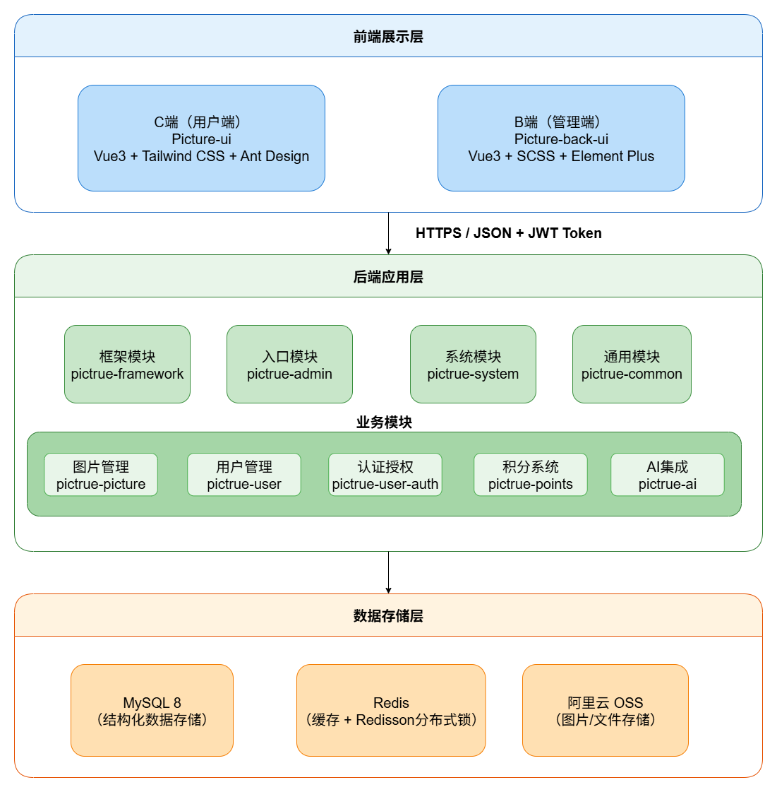

### 3.2.2 技术架构选型

**（1）前端 C 端（Picture-ui，用户端）**

| 层 | 技术 | 版本 | 说明 |
| --- | --- | --- | --- |
| 框架 | Vue | 3.4+ | 组合式 API |
| 构建 | Vite | 5+ | 快速冷启动 |
| 路由 | Vue Router | 4+ | history 模式 |
| 状态管理 | Pinia | 2+ | 替代 Vuex |
| UI 库 | Tailwind CSS | 3+ | 原子化样式 |
| UI 组件 | ant-design-vue | 4+ | 中后台组件补充 |
| HTTP | Axios | 1+ | 拦截器统一处理 |
| 工具 | VueUse | 10+ | 组合式工具集 |
| 富文本 | md-editor-v3 | 4+ | 公告/简介 |
| 图片裁剪 | cropperjs | 1+ | 头像裁剪 |

**（2）前端 B 端（Picture-back-ui，管理端）**

| 层 | 技术 | 版本 | 说明 |
| --- | --- | --- | --- |
| 框架 | Vue | 3.4+ | 组合式 API |
| 构建 | Vite | 5+ | 快速冷启动 |
| 路由 | Vue Router | 4+ | 动态路由 + 路由守卫 |
| 状态管理 | Pinia | 2+ | 用户、字典、字典缓存 |
| UI 库 | Element Plus | 2.5+ | 表格/表单/树/抽屉 |
| 图标 | @element-plus/icons-vue | 2+ | 全量图标 |
| HTTP | Axios | 1+ | JWT 注入 + 401 拦截 |
| 可视化 | ECharts | 5+ | 数据可视化 |
| 富文本 | Quill / wangEditor | 1.10+ | 公告编辑 |
| 代码生成器前端 | Sortable.js + VForm | 1+ | 拖拽表单生成 Vue |
| 工具 | VueUse / nprogress | 10+ / 0.2+ | loading 进度条 |

**（3）后端（picture-* 多模块，Spring Boot 3.3.5）**

| 层 | 技术 | 版本 | 说明 |
| --- | --- | --- | --- |
| Web 框架 | Spring Boot | 3.3.5 | Jakarta EE 9 |
| ORM | MyBatis Plus | 3.5.12 | 增强分页/代码生成 |
| 数据连接池 | Druid | 1.2.23 | 数据库连接池，监控/防 SQL 注入 |
| 安全 | Spring Security + JWT | 6+ / 0.9.1 | spring-boot-starter-security + jwt；JWT 生成解析 |
| JSON | Fastjson2 | 2.0.53 | JSON序列化 |
| Redis | spring-boot-starter-data-redis + Redisson | 3.27.2 | Redisson 用于分布式锁 + 对象缓存 |
| 工具 | Hutool | 5.8.26 | hutool-core / hutool-http / hutool-json |
| 定时任务 | Quartz | 2.3+ | 定时任务 |
| 日志 | Logback + MDC | 1.4+ | 链路追踪 |
| Excel | EasyExcel | 3.3+ | 导入导出 |
| 对象存储 | Aliyun OSS SDK | 3.17+ | aliyun-sdk-oss |
| 短信 | Aliyun SMS SDK | 2.0+ | aliyun-java-sdk-dysmsapi |
| 支付 | Alipay SDK | 4.38+ | alipay-sdk-java，电脑网站支付 |

**（4）存储与中间件**

| 层 | 技术 | 版本 | 说明 |
| --- | --- | --- | --- |
| 关系数据库 | MySQL | 8.0+ | utf8mb4 |
| 缓存 / 分布式锁 | Redis | 7+ | 缓存 / 黑名单 / 限流（由 Redisson 客户端访问） |
| 对象存储 | 阿里云 OSS |  | 文件 / CDN |
| 反向代理 | Nginx | 1.24+ | 静态资源 / HTTPS 卸载 / 负载均衡 |

**（5）外部服务**

| 服务 | 用途 |
| --- | --- |
| 阿里云短信 | 登录/注册/找回密码/支付密码 验证码 |
| 支付宝（PC 网站支付） | 积分充值 |
| 即梦 AI（火山引擎） | 文生图、图生图、扩图 |

## 3.3 系统功能模块划分

本系统功能模块严格按照业务域划分，对应后端 Maven 模块。
**每个业务模块都明确说明面向 C 端（用户端）、B 端（管理端）或 C/B 端共用**。

```
LZ-Picture
│
├── 0. 启动模块（picture-admin）
│   └── 聚合入口、启动配置、端口与资源定义
│
├── 1. 用户模块（picture-user + picture-user-auth）
│   ├── 1.1 注册登录    ── 手机+短信、账号密码、找回密码
│   ├── 1.2 用户资料    ── 昵称、头像、签名、性别、生日
│   ├── 1.3 用户主页    ── 公开作品
│   ├── 1.4 登录日志、操作日志
│   ├── 1.5 鉴权    ── JWT、菜单权限、按钮权限
│   └── 1.6 用户管理    ── 增删改查、分配角色、启停账号、重置密码
│
├── 2. 图片模块（picture-picture）
│   ├── 2.1 图片上传    ── OSS、压缩、水印、缩略图
│   ├── 2.2 公共图库    ── 分类筛选、标签筛选、无限滚动
│   ├── 2.3 评论点赞收藏── 一级评论、回复、点赞、收藏
│   ├── 2.4 搜索与浏览  ── AOP 记录搜索日志、关键字高亮
│   ├── 2.5 推荐        ── 基于标签、分类、热度
│   ├── 2.6 分类/标签管理── CRUD、级联、排序、标签云
│   ├── 2.7 评论审核    ── 删除、隐藏
│   ├── 2.8 流水管理    ── 下载/搜索/浏览/行为 流水
│   └── 2.9 数据统计    ── 趋势、排行、分布
│
├── 3. 空间模块（picture-picture）
│   ├── 3.1 空间创建    ── 容量、有效期、说明
│   ├── 3.2 空间扩容    ── 用户申请、管理员审核
│   ├── 3.3 空间成员    ── 角色：创建者/编辑者/查看者
│   ├── 3.4 空间邀请    ── 邀请码、过期、次数
│   ├── 3.5 空间文件夹  ── 树形分类
│   ├── 3.6 空间图片    ── 共享上传、权限校验
│   └── 3.7 空间管理    ── 启停、强制清理、统计
│
├── 4. 积分模块（picture-points）
│   ├── 4.1 积分账户    ── 余额、累计、冻结
│   ├── 4.2 积分套餐    ── 基础积分、赠送积分、价格
│   ├── 4.3 充值订单    ── 创建、查询、回调、关闭
│   ├── 4.4 支付        ── 支付宝下单、回调、验签
│   ├── 4.5 充值消费流水── 列表、详情
│   ├── 4.6 套餐管理    ── 上下架、编辑、定价
│   ├── 4.7 提现订单    ── 申请、审核、发放、拒绝
│   ├── 4.8 支付方式    ── 启停、密钥配置
│   ├── 4.9 风险控制    ── 风控日志、错误日志
│   └── 4.10 数据统计   ── 充值排行、消费趋势、套餐热度
│
├── 5. AI 模块（picture-ai）
│   ├── 5.1 模型参数配置── JSON 入库、热更新
│   ├── 5.2 任务创建    ── 同步/异步、批量、并发
│   ├── 5.3 任务查询    ── 用户主动、平台兜底
│   ├── 5.4 策略调用    ── JiMeng 等
│   ├── 5.5 生成记录    ── 用户、模型、参数、积分、结果
│   ├── 5.6 提示词模板  ── CRUD、多语言
│   ├── 5.7 对话日志    ── 会话管理、日志检索
│   └── 5.8 使用流水    ── 用户调用 + 官方调用
│
├── 6. 定时任务模块（picture-quartz）
│   ├── 6.1 套餐每日刷新    ── 上下架、过期
│   ├── 6.2 异步 AI 任务 6h 兜底
│   ├── 6.3 空间过期清理
│   └── 6.4 日志清理    ── 登录/操作/搜索
│
├── 7. 系统管理模块（picture-system）
│   ├── 7.1 用户/角色/部门/岗位
│   ├── 7.2 菜单/字典/参数
│   ├── 7.3 通知公告
│   └── 7.4 监控    ── 在线用户、缓存、连接池、服务
│
├── 8. 配置模块（picture-config）
│   ├── 8.1 动态配置    ── 运行时可改
│   ├── 8.2 国际化    ── 多语言键、消息
│   ├── 8.3 通知模板
│   └── 8.4 文件日志
│
├── 9. 代码生成模块（picture-generator）
│   ├── 9.1 表导入
│   ├── 9.2 模板渲染    ── Controller/Service/Mapper/Vue
│   └── 9.3 一键下载
│
├── 10. 公共模块（picture-common）
│   ├── 10.1 全局异常
│   ├── 10.2 统一返回
│   ├── 10.3 自定义缓存注解 @CustomCacheable
│   ├── 10.4 自定义缓存清除注解 @CustomCacheEvict
│   ├── 10.5 自定义排序注解 @CustomSort
│   ├── 10.6 XSS 过滤
│   ├── 10.7 数据权限    ── 基于部门、角色
│   ├── 10.8 限流防刷    ── Redis 滑动窗口
│   ├── 10.9 RedisCache 工具
│   ├── 10.10 OSS 工具
│   └── 10.11 空间权限工具
│
└── 11. 框架模块（picture-framework）
    ├── 11.1 Web 配置    ── 拦截器、跨域、静态资源
    ├── 11.2 安全框架    ── 认证、授权、会话管理
    ├── 11.3 Redis 配置  ── 连接池、序列化
    └── 11.4 AOP 配置    ── 切面注册
```

## 3.4 接口设计概述

### 3.4.1 接口风格

- 协议：HTTP/1.1 + HTTPS
- 风格：RESTful
- 数据格式：JSON（UTF-8）
- 鉴权：JWT（Authorization: Bearer xxx）
- 接口前缀：用户端 `/user/**`、管理端 `/admin/**`、工具 `/tool/**`、监控 `/monitor/**`

### 3.4.2 统一返回结构

```json
{
  "code": 200,
  "msg": "操作成功",
  "data": { ... }
}
```

| 字段 | 类型 | 说明 |
| --- | --- | --- |
| code | int | 业务码（200 成功，500 失败，401 未登录，403 无权限，4001~4xxx 业务异常） |
| msg | String | 提示信息 |
| data | Object | 业务数据，可为分页对象、列表、POJO |

### 3.4.3 分页结构

```json
{
  "code": 200,
  "msg": "ok",
  "total": 1234,
  "rows": [ ... ],
}
```

## 3.5 数据结构总体设计

系统数据按模块划分为以下7类：

1. **配置模块（picture-config）**：配置信息、文件日志、国际化键名、国际化国家、国际化信息、通知模版、菜单信息、用户公告、权限信息；
2. **用户模块（picture-user）**：用户封禁权限、用户通知、用户登录日志、统计信息、用户第三方账号绑定、用户好友关系、用户信息、用户关系；
3. **图库模块（picture-picture）**：图片申请、图片分类、图片点赞、图片下载、图片详情、用户图片推荐模型、图片标签、图片标签关联、用户搜索记录、空间扩容、空间文件夹、空间信息、空间成员邀请、空间成员、统计信息、用户行为、用户举报、用户浏览记录；
4. **积分模块（picture-points）**：积分账户、异常捕获日志、支付方式、支付订单、统计信息、充值记录、充值积分套餐、积分使用记录、风控日志、用户提现记录；
5. **AI 模块（picture-ai）**：AI 对话明细、AI 会话、用户生成记录、模型参数、官方 AI 操作日志、提示词信息、用户 AI 使用记录；
6. **系统管理模块（picture-admin）**：参数配置、部门、字典数据、字典类型、定时任务调度、定时任务调度日志、系统访问记录、菜单权限、通知公告、操作日志、岗位、角色、角色部门关联、角色菜单关联、用户信息、用户岗位关联、用户角色关联；
7. **定时任务模块（picture-quartz，）**：Blob 触发器、日历信息、Cron 触发器、已触发的触发器、任务详细信息、悲观锁、暂停的触发器组、调度器状态、简单触发器、同步行锁、触发器详细信息。

数据库表名前缀约定：`c_` 配置模块、`u_` 用户模块、`p_` 图库模块、`po_` 积分模块、`a_` AI 模块、`sys_` 系统管理、`qrtz_` 定时任务（后两者沿用若依框架）。

## 3.6 安全与可靠性设计

| 维度 | 设计要点 |
| --- | --- |
| 身份认证 | JWT（HS256），30 分钟无感刷新 + Redis 黑名单注销机制 |
| 权限控制 | RBAC（用户-角色-菜单-按钮），支持数据范围（本人/本部门/本部门及子级/全部） |
| 密码安全 | BCrypt 加盐存储，5 次错误锁定 10 分钟 |
| 接口防刷 | 基于 Redis 滑动窗口限流，关键接口（登录、上传、生成）按用户/IP 限流 |
| 注入防护 | MyBatis Plus 参数化 + 排序字段白名单（@CustomSort） |
| XSS 防护 | 框架级 XSS 过滤（基于 Jsoup），管理端关闭部分接口 |
| 上传安全 | 后缀白名单、MIME 校验、OSS 直传 + 服务端二次校验 |
| 数据备份 | MySQL 每日全量 + Binlog 增量，OSS 跨区复制 |
| 事务一致性 | 本地事务 + Redis 缓存双删策略（更新时先更库再删缓存） |
| 日志追溯 | 登录/操作/异常全链路日志，支持 MDC 链路追踪 |


# 第 4 章 详细设计

本章选取LZ-Picture中具有代表性的 **7 个核心功能**进行详细设计说明。每个核心功能给出功能描述、关键流程图、类结构、关键算法/代码片段，便于审查专家快速理解系统的独创性与复杂度。

## 4.1 核心功能一：基于注解的自定义缓存（@CustomCacheable / @CustomCacheEvict）

### 4.1.1 功能定位

针对系统中"统计/列表/详情"等读多写少的查询接口，传统做法是每个方法手动调用 RedisCache.set/get，容易出现"忘记清缓存"、"key 拼错"、"过期时间不一致"等问题。**本功能通过自定义注解 + AOP + 反射字段解析**实现"零侵入式"缓存，并支持嵌套字段路径解析、整体参数作为 key、批量清除模糊匹配 key。

### 4.1.2 注解定义

```java
/**
 * 自定义缓存注解，方法返回值会被自动缓存到 Redis
 * 支持嵌套字段（如 "request.userId"）和分页缓存
 */
@Target(ElementType.METHOD)
@Retention(RetentionPolicy.RUNTIME)
public @interface CustomCacheable {
    String keyPrefix();                              // 缓存 key 前缀，必填
    String keyField() default "";                    // 嵌套 key 字段路径，如 "request.userId"
    long expireTime() default 10800L;               // 过期时间（秒），默认3小时
    boolean paginate() default false;               // 是否启用分页缓存
    String pageNumberField() default "";             // 页码字段路径
    String pageSizeField() default "";               // 每页大小字段路径
    boolean useQueryParamsAsKey() default false;    // 是否将整个参数数组序列化为 JSON 作为 key 的一部分
}
```

```java
/**
 * 自定义缓存删除注解，支持前缀模糊删除、嵌套字段精确删除
 */
@Target(ElementType.METHOD)
@Retention(RetentionPolicy.RUNTIME)
@Documented
public @interface CustomCacheEvict {
    String[] keyPrefixes();                          // 要删除的 key 前缀集合
    String[] keyFields() default {};                 // 嵌套字段路径，与 keyPrefixes 一一对应
    boolean useQueryParamsAsKey() default false;     // 是否拼接参数 JSON 进行模糊删除
}
```

### 4.1.3 流程图

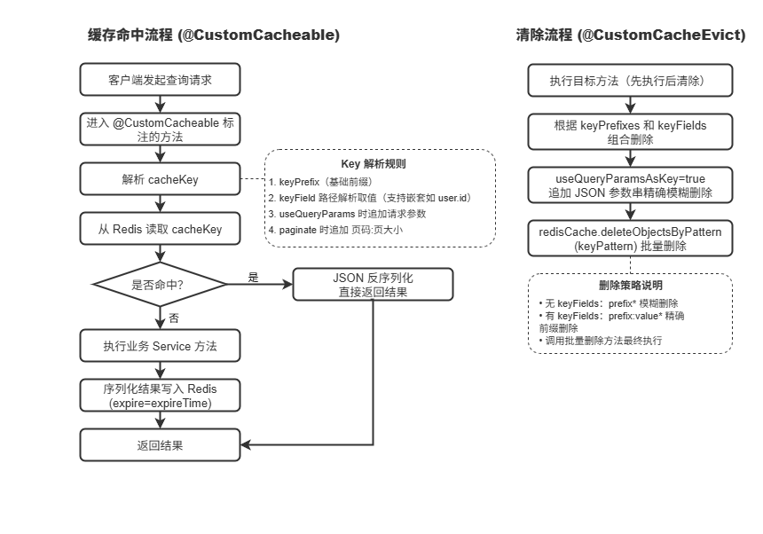

### 4.1.4 关键算法：嵌套字段路径解析

```java
/**
 * 根据参数名+字段路径，获取嵌套对象字段值
 * keyFieldPath 示例："request.userId"
 * - 第一部分 "request" 是参数名
 * - 后续 "userId" 是嵌套字段路径
 */
private Object getValueByParamNameAndFieldPath(String[] paramNames, Object[] args, String keyFieldPath) {
    if (keyFieldPath == null || keyFieldPath.isEmpty()) return null;
    String[] parts = keyFieldPath.split("\\.");
    String paramName = parts[0];
    String nestedPath = keyFieldPath.substring(paramName.length());
    if (nestedPath.startsWith(".")) nestedPath = nestedPath.substring(1);

    // 根据参数名查找对应参数值
    Object paramValue = null;
    for (int i = 0; i < paramNames.length; i++) {
        if (paramNames[i].equals(paramName)) {
            paramValue = args[i];
            break;
        }
    }
    if (paramValue == null) return null;

    if (nestedPath.isEmpty()) {
        return paramValue;
    } else {
        return getNestedFieldValue(paramValue, nestedPath);
    }
}

/**
 * 递归获取嵌套字段值（支持多层嵌套）
 * 例如 fieldPath = "user.profile.age"
 */
private Object getNestedFieldValue(Object obj, String fieldPath) {
    try {
        String[] fields = fieldPath.split("\\.");
        Object current = obj;
        for (String field : fields) {
            if (current == null) return null;
            Field f = current.getClass().getDeclaredField(field);
            f.setAccessible(true);
            current = f.get(current);
        }
        return current;
    } catch (Exception e) {
        return null;
    }
}

/**
 * 缓存 key 组装规则
 * 格式：[prefix][:keyFieldValue][:JSON序列化参数][:pageNum:pageSize]
 */
private String buildCacheKey(String keyPrefix, Object keyFieldValue,
                             boolean useQueryParams, Object[] args,
                             boolean paginate, int pageNum, int pageSize) {
    StringBuilder sb = new StringBuilder(keyPrefix);
    if (keyFieldValue != null && !keyFieldValue.toString().isEmpty()) {
        sb.append(COMMON_SEPARATOR_CACHE).append(keyFieldValue.toString());
    }
    if (useQueryParams) {
        sb.append(COMMON_SEPARATOR_CACHE).append(JSON.toJSONString(args));
    }
    if (paginate) {
        sb.append(COMMON_SEPARATOR_CACHE).append(pageNum);
        sb.append(COMMON_SEPARATOR_CACHE).append(pageSize);
    }
    return sb.toString();
}
```

### 4.1.5 使用示例

```java
// 示例1：基于用户ID的缓存（嵌套字段解析）
@CustomCacheable(
    keyPrefix = "user:info",
    keyField = "username",
    expireTime = 3600
)
public UserInfo selectUserInfoByUsername(String username) {
    return baseMapper.selectByUsername(username);
}

// 示例2：基于嵌套字段的缓存（形如 "request.userId"）
@CustomCacheable(
    keyPrefix = "ai:generate:list",
    keyField = "request.userId",
    expireTime = 1800
)
public List<GenerateLogInfo> selectGenerateLogList(GenerateLogRequest request) {
    return baseMapper.selectList(request);
}

// 示例3：使用完整参数作为 key（useQueryParamsAsKey）
@CustomCacheable(
    keyPrefix = "picture:search:log",
    useQueryParamsAsKey = true
)
public List<SearchLogInfoVO> getSearchLogList(SearchLogQuery query) {
    return baseMapper.selectSearchLogList(query);
}

// 示例4：数据变更时清除缓存（按前缀模糊删除）
@CustomCacheEvict(keyPrefixes = {"picture:category"})
public int updatePictureCategory(PictureCategoryInfo info) {
    return baseMapper.updateById(info);
}

// 示例5：精确清除（按嵌套字段值删除）
@CustomCacheEvict(
    keyPrefixes = {"ai:generate:list"},
    keyFields = {"request.userId"}
)
public int deleteGenerateLog(Long userId) {
    return baseMapper.deleteByUserId(userId);
}

// 示例6：带参数的精确清除
@CustomCacheEvict(
    keyPrefixes = {"picture:apply:detail"},
    keyFields = {"pictureApplyInfo.applyId"},
    useQueryParamsAsKey = true
)
public int updatePictureApply(PictureApplyInfo info) {
    return baseMapper.updateById(info);
}
```

## 4.2 核心功能二：基于注解的安全排序（@CustomSort）

### 4.2.1 功能定位

管理端表格常需要"点击列头排序"。若直接把前端传入的字段名拼到 SQL `ORDER BY` 后，存在 SQL 注入风险；若每个 Service 写死排序，又难以满足多列组合排序。**本功能通过自定义注解 + AOP 自动把"前端字段名"映射到"数据库字段名"，并校验合法性，规避注入。**

### 4.2.2 注解定义

```java
/**
 * 自定义排序注解
 * 通过白名单机制防止 SQL 注入，支持前端字段名到数据库字段名的映射
 */
@Target(ElementType.METHOD)
@Retention(RetentionPolicy.RUNTIME)
@Documented
public @interface CustomSort {
    String[] sortFields() default {};            // 前端允许的字段名（白名单）
    String[] sortMappingFields() default {};     // 映射到数据库的字段名（与 sortFields 一一对应）
}
```

### 4.2.3 流程图

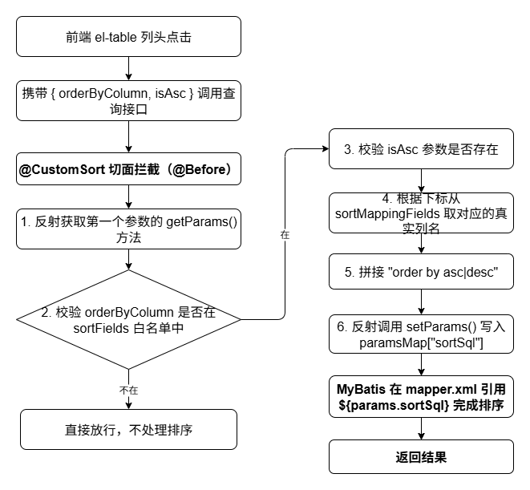

### 4.2.4 关键实现

```java
@Aspect
@Component
public class CustomSortAspect {

    public static final String SORT_SQL = "sortSql";
    public static final String ORDER_BY_COLUMN = "orderByColumn";
    public static final String IS_ASC = "isAsc";
    @Before("@annotation(customSort)")
    public void doBefore(JoinPoint joinPoint, CustomSort customSort) {
        // 清除排序字段参数并校验是否存在排序参数
        if (!clearSortJudgeParams(joinPoint)) {
            return;
        }
        // 执行排序处理
        handleSort(joinPoint, customSort);
    }
    private void handleSort(JoinPoint joinPoint, CustomSort customSort) {
        Object params = joinPoint.getArgs()[0];
        if (StringUtils.isNotNull(params) && hasGetParamsMethod(params)) {
            try {
                // 动态调用 getParams 方法获取参数 Map
                Method getParamsMethod = params.getClass().getMethod("getParams");
                @SuppressWarnings("unchecked")
                Map<String, Object> paramsMap = (Map<String, Object>) getParamsMethod.invoke(params);
                if (StringUtils.isEmpty(paramsMap)) {
                    paramsMap = new HashMap<>();
                }

                String[] sortFields = customSort.sortFields();
                String[] sortMappingFields = customSort.sortMappingFields();

                // 获取前端传来的排序字段和排序方向
                String field = paramsMap.get(ORDER_BY_COLUMN).toString();
                boolean isAsc = paramsMap.get(IS_ASC).toString().equalsIgnoreCase("true");

                // 白名单校验
                if (!ArrayUtils.contains(sortFields, field)) {
                    return;
                }

                // 字段映射（支持多表查询场景）
                if (StringUtils.isNotEmpty(sortMappingFields)) {
                    int index = ArrayUtils.indexOf(sortFields, field);
                    field = sortMappingFields[index];
                }

                if (StringUtils.isEmpty(field)) {
                    return;
                }

                // 拼接 SQL 并写回 paramsMap
                String sql = "order by " + field + " " + (isAsc ? "asc" : "desc");
                paramsMap.put(SORT_SQL, sql);

                // 反射调用 setParams 方法设置新的 Map
                Method setParamsMethod = params.getClass().getMethod("setParams", Map.class);
                setParamsMethod.invoke(params, paramsMap);
            } catch (Exception e) {
                throw new ServiceException("排序出错:" + e.getMessage());
            }
        }
    }

    /**
     * 清除排序参数并校验是否存在排序字段
     * 防止 SQL 注入
     */
    private boolean clearSortJudgeParams(JoinPoint joinPoint) {
        Object params = joinPoint.getArgs()[0];
        if (StringUtils.isNotNull(params) && hasGetParamsMethod(params)) {
            try {
                Method getParamsMethod = params.getClass().getMethod("getParams");
                @SuppressWarnings("unchecked")
                Map<String, Object> paramsMap = (Map<String, Object>) getParamsMethod.invoke(params);
                if (StringUtils.isEmpty(paramsMap)) {
                    paramsMap = new HashMap<>();
                }
                // 先清除 sortSql 防止注入
                paramsMap.put(SORT_SQL, "");
                // 获取排序参数
                Object orderBy = paramsMap.get(ORDER_BY_COLUMN);
                Object asc = paramsMap.get(IS_ASC);
                return StringUtils.isNotNull(orderBy) && StringUtils.isNotNull(asc);
            } catch (Exception e) {
                throw new ServiceException("排序出错:" + e.getMessage());
            }
        }
        return false;
    }

    /**
     * 判断对象是否有 getParams 方法
     */
    private static boolean hasGetParamsMethod(Object obj) {
        try {
            obj.getClass().getMethod("getParams");
            return true;
        } catch (NoSuchMethodException e) {
            return false;
        }
    }
}
```

mapper.xml 引用：

```xml
<choose>
    <when test="params.sortSql != null and params.sortSql != ''">
        ${params.sortSql}
    </when>
    <otherwise>
        ORDER BY create_time DESC
    </otherwise>
</choose>
```

### 4.2.5 使用示例

```java
// 示例1：基础排序（字段名相同）
@CustomSort(
    sortFields = {"createTime", "updateTime"},
    sortMappingFields = {"create_time", "update_time"}
)
public List<PictureInfo> selectPictureInfoList(PictureQuery query) {
    return baseMapper.selectList(query);
}

// 示例2：仅白名单校验（字段名一致，无需映射）
@CustomSort(
    sortFields = {"usageCount", "lookCount", "downloadCount"}
)
public List<TagInfo> selectTagInfoList(TagQuery query) {
    return baseMapper.selectList(query);
}

// 示例3：多表查询场景（前端传 categoryName，数据库实际是 t.category_name）
@CustomSort(
    sortFields = {"categoryName", "createTime", "picCount"},
    sortMappingFields = {"t.category_name", "t.create_time", "COUNT(t.id)"}
)
public List<CategoryVO> getCategoryWithCount(CategoryQuery query) {
    return baseMapper.selectCategoryWithCount(query);
}
```

## 4.3 核心功能三：策略模式 + 配置化 AI 多模型接入

### 4.3.1 功能定位

AI 平台众多（文心一言、即梦、通义、星火），各家参数格式、鉴权方式、同步/异步调用、计费规则差异巨大。若每接入一个新模型都要改业务代码，则维护成本极高。**本功能通过"接口 + 注解 + JSON 配置 + 策略分发"，实现新增模型仅需在数据库新增一条配置记录，零代码修改。**

### 4.3.2 核心类图

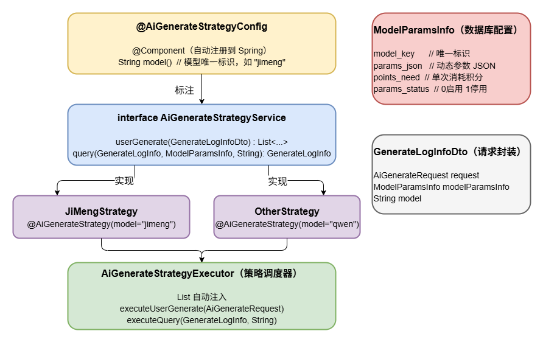

### 4.3.3 流程图

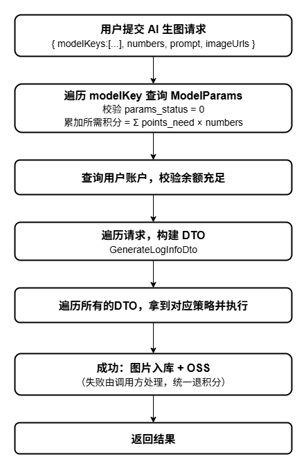

### 4.3.4 查询任务流程

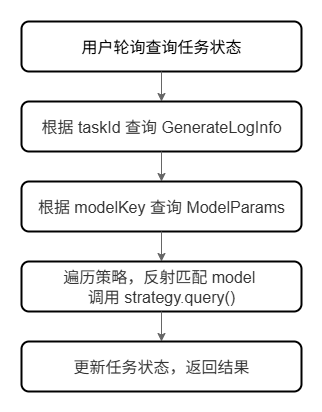

### 4.3.5 关键实现

```java
    /**
     * 用户生成执行
     */
    public List<GenerateLogInfo> executeUserGenerate(AiGenerateRequest request) {
        List<String> modelKeys = request.getModelKeys();
        List<GenerateLogInfoDto> generateLogInfoDtos = new ArrayList<>();
        List<GenerateLogInfo> logInfos = new ArrayList<>();
        Long totalPoints = 0L;

        // 1. 遍历 modelKey，校验模型参数并累加积分
        for (String modelKey : modelKeys) {
            ModelParamsInfo modelParamsInfo = modelParamsInfoService
                .selectModelParamsInfoByModelKey(modelKey);
            ThrowUtils.throwIf(StringUtils.isNull(modelParamsInfo) ||
                            !modelParamsInfo.getParamsStatus()
                                .equals(AiModelParamsStatusEnum.MODEL_PARAMS_STATUS_0.getValue()),
                    HttpStatus.NO_CONTENT, "模型参数不存在或者未启用");

            generateLogInfoDtos.add(new GenerateLogInfoDto(request, modelParamsInfo));
            totalPoints += modelParamsInfo.getPointsNeed() * request.getNumbers();
        }

        // 2. 校验用户积分余额
        AccountInfo accountInfo = accountInfoService.selectAccountInfoByUserId(request.getUserId());
        ThrowUtils.throwIf(StringUtils.isNull(accountInfo)
                || accountInfo.getPointsBalance() < totalPoints, "积分不足");

        // 3. 遍历执行策略
        for (GenerateLogInfoDto info : generateLogInfoDtos) {
            for (AiGenerateStrategyService strategyService : aiGenerateStrategyServiceList) {
                // 反射获取 @AiGenerateStrategyConfig 注解匹配 model
                AiGenerateStrategyConfig annotation = strategyService.getClass()
                    .getAnnotation(AiGenerateStrategyConfig.class);
                if (annotation.model().equals(info.getModel())) {
                    List<GenerateLogInfo> result = strategyService.userGenerate(info);
                    logInfos.addAll(result);
                }
            }
        }
        return logInfos;
    }

    /**
     * 查询任务（支持异步模型轮询）
     */
    public GenerateLogInfo executeQuery(GenerateLogInfo generateLogInfo, String username) {
        ModelParamsInfo modelParamsInfo = modelParamsInfoService
            .selectModelParamsInfoByModelKey(generateLogInfo.getModelKey());
        ThrowUtils.throwIf(StringUtils.isNull(modelParamsInfo),
                HttpStatus.NO_CONTENT, "模型参数不存在或者未启用");

        for (AiGenerateStrategyService aiGenerateStrategyService : aiGenerateStrategyServiceList) {
            AiGenerateStrategyConfig annotation = aiGenerateStrategyService.getClass()
                .getAnnotation(AiGenerateStrategyConfig.class);
            if (annotation.model().equals(modelParamsInfo.getModel())) {
                return aiGenerateStrategyService.query(generateLogInfo, modelParamsInfo, username);
            }
        }
        return null;
    }
```

### 4.3.6 策略接口与注解

```java
/**
 * AI 生成策略配置注解
 * 标注在实现类上，自动注册到 Spring 并被 Executor 扫描
 */
@Target(ElementType.TYPE)
@Retention(RetentionPolicy.RUNTIME)
@Component  // 自动注册
public @interface AiGenerateStrategyConfig {
    String model();  // 模型唯一标识
}

/**
 * AI 生成策略服务接口
 */
public interface AiGenerateStrategyService {

    /**
     * 用户生成（主流程）
     */
    List<GenerateLogInfo> userGenerate(GenerateLogInfoDto info);

    /**
     * 查询任务状态（支持异步模型轮询）
     */
    GenerateLogInfo query(GenerateLogInfo query, ModelParamsInfo modelParamsInfo, String username);
}
```

### 4.3.7 策略实现示例（即梦 AI）

```java
@Service
@AiGenerateStrategyConfig(model = "jimeng")  // 模型标识
public class JiMengStrategyService implements AiGenerateStrategyService {

    @Override
    public List<GenerateLogInfo> userGenerate(GenerateLogInfoDto dto) {
        JiMengParams params = dto.getParams().jsonToObj(
            dto.getModelParamsInfo().getParamsJson());
        params.setPrompt(dto.getRequest().getPrompt());
        params.setImage_urls(dto.getRequest().getImageUrls());
        // 1. 提交任务（同步/异步）
        // 2. 解析响应，获取 taskId 或直接获取 url
        // 3. 上传 OSS，写入 g_generate_log_info
        // 4. 失败：抛业务异常，由外层统一处理
        return logInfos;
    }

    @Override
    public GenerateLogInfo query(GenerateLogInfo query, ModelParamsInfo modelParamsInfo, String username) {
        // 异步模型：轮询第三方 API 查询任务状态
        // 更新本地记录的图片 URL 和任务状态
        return updatedLogInfo;
    }
}
```

### 4.3.8 新增模型接入流程

新增一个 AI 模型（如通义）仅需：

1. **数据库**：在 `model_params_info` 表新增一条记录，`model_key = "qwen"`, `params_json` 存储鉴权参数
2. **代码**：新建 `QwenStrategyService.java`，实现 `AiGenerateStrategyService` 接口，标注 `@AiGenerateStrategyConfig(model = "qwen")`
3. **无需修改任何现有代码**，Spring 自动注入，`AiGenerateStrategyExecutor` 自动发现并调度

## 4.4 核心功能四：团队空间多角色权限

### 4.4.1 功能定位

团队空间（Space）是"多用户共享的图像容器"，涉及空间创建、扩容、邀请、成员角色（创建者/编辑者/查看者）、文件夹、图片共享。**本功能**通过"用户-空间-角色"三维关系 + Redis 缓存权限位 + 同步删除三表策略，保证数据一致性。

### 4.4.2 关系模型（简化）

```
sp_space_info（空间主表）
sp_space_member_info（空间成员表，user_id + space_id + role + join_time）
sp_space_invitation_info（邀请码表，code + space_id + expire + used_count）
sp_space_folder_info（文件夹表，space_id + parent_id + name）
sp_space_dilatation_info（扩容申请表）
```

### 4.4.3 核心类图

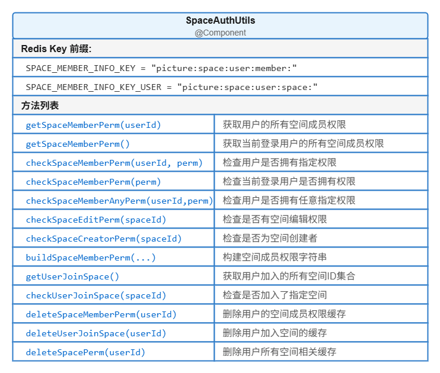

### 4.4.4 权限标识规则

```dylan
Redis 缓存结构：
  Key: picture:space:user:member:{userId}
  Value: Set<String>  // 元素格式：userId:spaceId:roleType
  例如: ["10001:660e3a12b3:0", "10001:xxx:1"]

权限标识 = userId + ":" + spaceId + ":" + roleType
例如：10001:660e3a12b3:0   表示用户10001在空间660e...中的"创建者"角色

角色枚举：
  SPACE_ROLE_0 = "0"  // 创建者
  SPACE_ROLE_1 = "1"  // 编辑者
  SPACE_ROLE_2 = "2"  // 查看者
```

### 4.4.5 流程图：权限校验

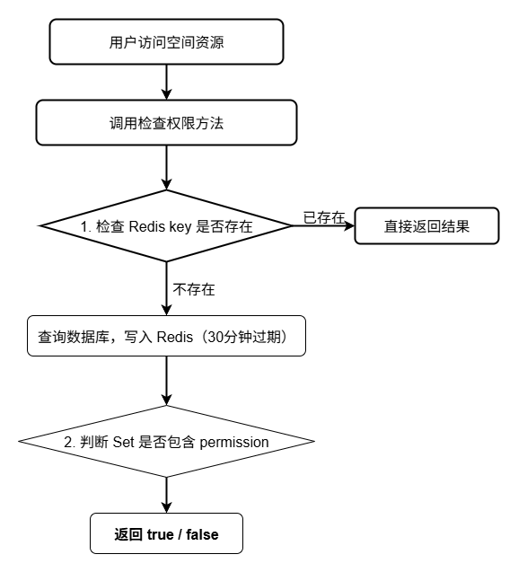

### 4.4.6 流程图：删除成员权限（三表一致性）

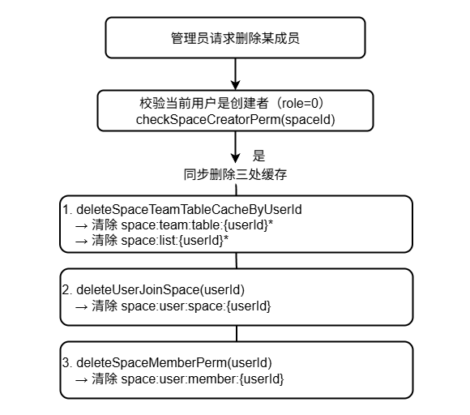

### 4.4.7 关键实现

```java
    /**
     * 获取用户空间权限集合
     * 先查 Redis，未命中则查数据库并缓存
     */
    public Set<String> getSpaceMemberPerm(String userId) {
        String key = SPACE_MEMBER_INFO_KEY + userId;
        if (redisCache.hasKey(key)) {
            return redisCache.getCacheObject(key);
        }
        List<SpaceMemberInfo> spaceMemberInfoList =
            spaceMemberInfoService.selectSpaceMemberInfoByUserId(userId);
        Set<String> hashSet = new HashSet<>();
        for (SpaceMemberInfo spaceMemberInfo : spaceMemberInfoList) {
            hashSet.add(buildSpaceMemberPerm(
                spaceMemberInfo.getUserId(),
                spaceMemberInfo.getSpaceId(),
                spaceMemberInfo.getRoleType()));
        }
        redisCache.setCacheObject(key, hashSet, EXPIRE_TIME, TimeUnit.SECONDS);
        return hashSet;
    }

    /**
     * 检查是否有编辑权限（创建者或编辑者）
     */
    public boolean checkSpaceEditPerm(String spaceId) {
        return checkSpaceMemberAnyPerm(
            buildSpaceMemberPerm(spaceId, PSpaceRoleEnum.SPACE_ROLE_1.getValue()) + ","
                + buildSpaceMemberPerm(spaceId, PSpaceRoleEnum.SPACE_ROLE_0.getValue()));
    }

    /**
     * 检查是否是创建者
     */
    public boolean checkSpaceCreatorPerm(String spaceId) {
        return checkSpaceMemberAnyPerm(
            buildSpaceMemberPerm(spaceId, PSpaceRoleEnum.SPACE_ROLE_0.getValue()));
    }

    /**
     * 构建空间成员权限标识
     */
    public String buildSpaceMemberPerm(String userId, String spaceId, String roleType) {
        return userId + ":" + spaceId + ":" + roleType;
    }

    /**
     * 获取用户加入的空间（私有空间 + 团队空间）
     */
    public Set<String> getUserJoinSpace() {
        String userId = UserInfoSecurityUtils.getUserId();
        String key = SPACE_MEMBER_INFO_KEY_USER + userId;
        if (redisCache.hasKey(key)) {
            return redisCache.getCacheObject(key);
        }
        // 查询团队空间成员关系
        List<SpaceMemberInfo> spaceMemberInfos =
            spaceMemberInfoService.selectSpaceMemberInfoByUserId(userId);
        // 查询私有空间
        List<SpaceInfo> spaceInfos = spaceInfoService.list(
            new LambdaQueryWrapper<SpaceInfo>()
                .eq(SpaceInfo::getUserId, userId)
                .eq(SpaceInfo::getIsDelete, CommonDeleteEnum.NORMAL.getValue())
                .eq(SpaceInfo::getSpaceType, PSpaceTypeEnum.SPACE_TYPE_2.getValue()));
        // 合并
        Set<String> collect = spaceMemberInfos.stream()
            .map(SpaceMemberInfo::getSpaceId)
            .collect(Collectors.toSet());
        for (SpaceInfo spaceInfo : spaceInfos) {
            collect.add(spaceInfo.getSpaceId());
        }
        redisCache.setCacheObject(key, collect, EXPIRE_TIME, TimeUnit.SECONDS);
        return collect;
    }

    /**
     * 删除用户全部空间权限（三处缓存）
     */
    public void deleteSpacePerm(String userId) {
        spaceInfoService.deleteSpaceTeamTableCacheByUserId(userId);
        deleteUserJoinSpace(userId);
        deleteSpaceMemberPerm(userId);
    }
```

### 4.4.8 前端权限工具

```ts
/**
 * 检查是否有指定空间权限
 */
export function checkSpacePerm(perm: string): boolean {
  try {
    return spacePerm.getSpacePerms().includes(perm)
  } catch {
    console.warn('权限未加载，暂时拒绝访问')
    return false
  }
}

/**
 * 检查是否拥有任意一组权限
 */
export function checkSpacePermsAny(perms: string[]): boolean {
  try {
    for (const perm of perms) {
      if (checkSpacePerm(perm)) {
        return true
      }
    }
    return false
  } catch {
    return false
  }
}

/**
 * 判断是否是创建者
 */
export function checkSpaceCreator(spaceId: string): boolean {
  return checkSpacePerm(buildSpacePermByUser(spaceId, PSpaceRole.SPACE_ROLE_0))
}

/**
 * 判断是否可以编辑（创建者或编辑者）
 */
export function checkSpaceEditor(spaceId: string): boolean {
  return checkSpacePermsAny([
    buildSpacePermByUser(spaceId, PSpaceRole.SPACE_ROLE_1),
    buildSpacePermByUser(spaceId, PSpaceRole.SPACE_ROLE_0),
  ])
}

/**
 * 判断是否可以查看（创建者、编辑者或查看者）
 */
export function checkSpaceJoin(spaceId: string): boolean {
  return checkSpacePermsAny([
    buildSpacePermByUser(spaceId, PSpaceRole.SPACE_ROLE_1),
    buildSpacePermByUser(spaceId, PSpaceRole.SPACE_ROLE_0),
    buildSpacePermByUser(spaceId, PSpaceRole.SPACE_ROLE_2),
  ])
}

/**
 * 构建空间权限
 * @param spaceId 空间编号
 * @param roleType 角色类型
 */
export function buildSpacePermByUser(spaceId: string, roleType: string) {
  return buildSpacePerm(useUserStore().userId, spaceId, roleType)
}
export function buildSpacePerm(userId: string, spaceId: string, roleType: string) {
  return userId + ':' + spaceId + ':' + roleType
}
```

## 4.5 核心功能五：积分体系与支付宝支付集成

### 4.5.1 功能定位

积分是平台激励与变现的核心。**本功能**管理账户、套餐、订单、流水，并对接支付宝完成支付回调，支持失败重试、订单关闭、积分冻结/解冻、对账。

### 4.5.2 流程图：支付订单

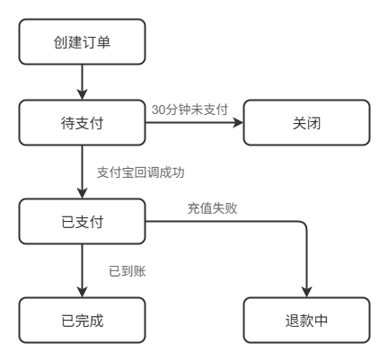

### 4.5.3 流程图：用户充值

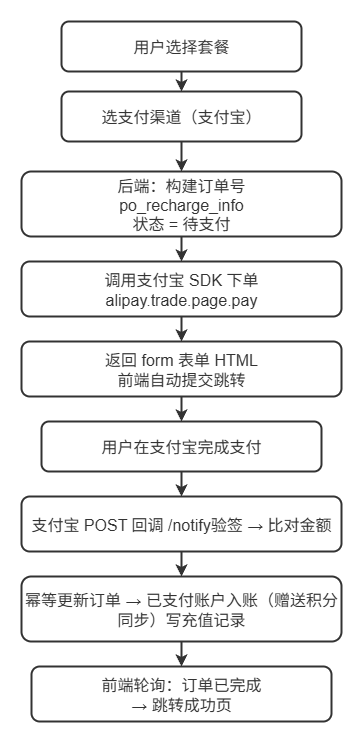

### 4.5.4 核心设计

**模块分层**

| 层次 | 职责 | 代表类 |
|------|------|--------|
| Controller | 接收支付请求、处理回调重定向 | `UserPayController` |
| Service | 业务编排、事务管理 | `PayServiceImpl` |
| Manager | 封装支付宝 SDK 调用 | `AlipayManager` |

**关键设计决策**

1. **双表记录**：支付订单（`po_payment_order_info`）+ 充值记录（`po_points_recharge_info`）分离，前者面向支付通道，后者面向用户积分
2. **雪花算法订单号**：使用 `IdUtils.snowflakeId()` 生成订单号，保证分布式唯一性
3. **分布式锁幂等**：回调处理使用 Redisson 锁 `POINTS_ORDER_LOCK + outTradeNo`，防止并发重复入账
4. **事务一致性**：支付状态更新、积分入账、流水记录均在事务中完成
5. **异步通知**：支付成功后通过 `UserAsyncManager` 异步发送站内信通知用户
6. **缓存加速**：订单详情写入 Redis，轮询查询优先读缓存

**关键代码示例**

```java
// 创建订单：双表记录 + 事务保存
PaymentOrderInfo order = new PaymentOrderInfo();
order.setOrderId(outTradeNo);  // 雪花算法生成
order.setOrderStatus(ORDER_STATUS_0);  // 待支付

PointsRechargeInfo recharge = new PointsRechargeInfo();
recharge.setTotalCount(pkg.getPoints() + pkg.getPointsBonus());  // 含赠送

transactionTemplate.execute(() -> {
    paymentOrderInfoService.save(order);
    pointsRechargeInfoService.save(recharge);
});

// 回调验签 + 分布式锁保证幂等
RLock lock = redissonClient.getLock(POINTS_ORDER_LOCK + outTradeNo);
lock.tryLock(5, 30, TimeUnit.SECONDS);
try {
    if (TRADE_SUCCESS.equals(tradeStatus)) {
        account.setPointsBalance(account.getPointsBalance() + recharge.getTotalCount());
        accountInfoService.updateById(account);
    }
} finally {
    lock.unlock();
}
```

**回调处理流程**

```
支付宝回调 → RSA验签 → 查询订单 → 加分布式锁 → 更新状态 → 积分入账 → 写流水 → 发通知 → 释放锁
```

## 4.6 核心功能六：图像上传、压缩、水印与 OSS 接入

### 4.6.1 功能定位

图像是平台的核心资源。**本功能**封装 OSS 上传、OSS 图片处理（格式转换、水印）、CDN 回源鉴权等通用能力，对业务层提供 `uploadPicture(File, opts)`、`uploadUrl(url, opts)` 统一 API。

### 4.6.2 处理流程

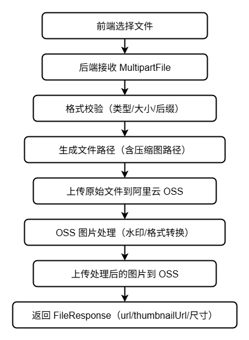

### 4.6.3 核心设计

**模块分层**

| 层次 | 职责 | 代表类 |
|------|------|--------|
| Controller | 接收上传请求、参数校验 | `UserFileController` |
| Service | 业务编排、事务管理 | `PictureService` |
| Manager | OSS 操作、图片处理（可复用） | `PictureUploadManager`、`OssConfig` |

**关键设计决策**

1. **OSS 图片处理替代本地处理**：不进行本地压缩/缩略图生成，而是利用 OSS 的图片处理能力（`image/process`）直接在服务端处理，避免消耗服务器资源
2. **双水印策略**：使用文字水印而非图片水印，包含：
   - 网站水印（默认 `www.springsun.online`）：底部居中
   - 用户水印（上传者用户名）：右侧居中
   - AI 生成图片额外添加 `LZAI` 标识：左上角
3. **OSS 路径规则**：`{dir}/{fileDir}/{yyyy_MM_dd}/{原名}-{snowflakeId}.{ext}`，按日分目录，雪花 ID 确保唯一性
4. **智能压缩**：图片 >2MB 才转换为 WebP 格式，否则只添加水印
5. **CDN 鉴权**：私有读 bucket + 路径访问控制
6. **配置化管理**：水印文字、透明度、字体大小等参数存储在 Redis 中，支持运行时修改

**关键代码示例**

```java
// 1. 校验：文件类型 + 大小
validateFile(file, DEFAULT_PICTURE_SIZE, DEFAULT_FILE_NAME_LENGTH, DEFAULT_PICTURE_ALLOWED_EXTENSION);

// 2. OSS 路径规则（按日）
String filePath = dir + "/" + fileDir + "/" + parseDateToStr + "/" + newFileName;
// 例如: picture/user/2025_06_20/图片名-182345678901234-compressed.jpg

// 3. 上传原始文件到 OSS
ossClient.putObject(bucket, fileInfo.getFilePath(), file);

// 4. 使用 OSS 图片处理获取图片信息
String style = "image/info";
GeneratePresignedUrlRequest req = new GeneratePresignedUrlRequest(bucket, filePath, HttpMethod.GET);
req.setProcess(style);
URL signedUrl = ossClient.generatePresignedUrl(req);
String imageInfo = HttpUtils.sendGet(signedUrl.toString()); // 返回 {"ImageWidth":{"value":"1920"},...}

// 5. OSS 图片处理：格式转换 + 双水印
String process = "image/format,webp/watermark,text_base64水印1,..."
                 + "/watermark,text_base64水印2,...";
req.setProcess(process);
URL compressedUrl = ossClient.generatePresignedUrl(req);

// 6. 将处理后的图片重新上传到 OSS
HttpURLConnection connection = (HttpURLConnection) compressedUrl.openConnection();
inputStream = connection.getInputStream();
ossClient.putObject(bucket, fileInfo.getCompressedFilePath(), inputStream);
```

## 4.7 核心功能七：基于 AOP 的搜索与浏览日志采集

### 4.7.1 功能定位

搜索日志与浏览日志是推荐系统、运营分析、用户画像的基础数据。**本功能**通过 AOP 切面，在不侵入业务代码的前提下，自动记录搜索关键字、命中数、用户、IP、设备信息、耗时、结果数等写入数据库。

### 4.7.2 注解定义

```java
@Target(ElementType.METHOD)
@Retention(RetentionPolicy.RUNTIME)
public @interface SearchLog {
    String searchType() default "0";   // 搜索类型
    String referSource() default "0";  // 来源类型
}
```

### 4.7.3 流程图

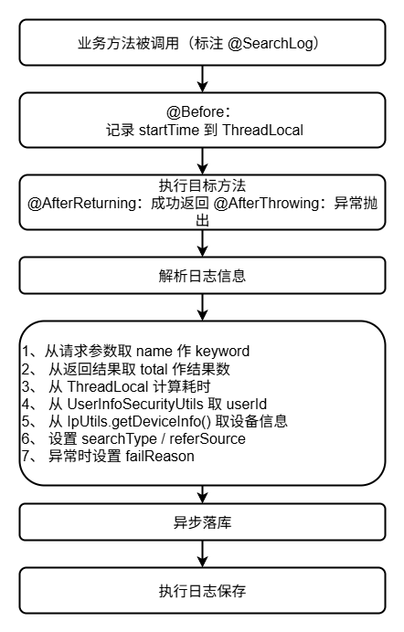

### 4.7.4 关键实现

```java
@Aspect
@Component
public class SearchLogAspect {

    private static final ThreadLocal<Long> TIME_THREADLOCAL = new NamedThreadLocal<>("Cost Time");

    @Before("@annotation(searchLog)")
    public void boBefore(JoinPoint joinPoint, SearchLog searchLog) {
        TIME_THREADLOCAL.set(System.currentTimeMillis());
    }

    @AfterReturning(pointcut = "@annotation(searchLog)", returning = "jsonResult")
    public void doAfterReturning(JoinPoint joinPoint, SearchLog searchLog, Object jsonResult) {
        handleLog(joinPoint, searchLog, null, jsonResult);
    }

    @AfterThrowing(value = "@annotation(searchLog)", throwing = "e")
    public void doAfterThrowing(JoinPoint joinPoint, SearchLog searchLog, Exception e) {
        handleLog(joinPoint, searchLog, e, null);
    }

    protected void handleLog(final JoinPoint joinPoint, SearchLog searchLog, final Exception e, Object jsonResult) {
        // 1. 从请求参数中提取 keyword（必须包含 name 参数）
        Map<?, ?> paramsMap = ServletUtils.getParamMap(ServletUtils.getRequest());
        Object name = paramsMap.get("name");
        if (StringUtils.isNull(name)) {
            return; // 无搜索关键词，不记录日志
        }

        SearchLogInfo searchLogInfo = new SearchLogInfo();
        searchLogInfo.setKeyword(name.toString());

        // 2. 计算耗时
        searchLogInfo.setSearchDuration(System.currentTimeMillis() - TIME_THREADLOCAL.get());

        // 3. 获取用户 ID（用户未登录时设为 null，不抛异常）
        try {
            searchLogInfo.setUserId(UserInfoSecurityUtils.getUserId());
        } catch (ServiceException ex) {
            searchLogInfo.setUserId(null);
        }

        // 4. 获取设备信息（IP、浏览器、操作系统等）
        DeviceInfo deviceInfo = IpUtils.getDeviceInfo();
        BeanUtils.copyProperties(deviceInfo, searchLogInfo);

        // 5. 设置搜索类型和来源
        searchLogInfo.setSearchType(searchLog.searchType());
        searchLogInfo.setReferSource(searchLog.referSource());

        // 6. 解析返回结果获取搜索结果数
        if (StringUtils.isNotNull(jsonResult)) {
            JSONObject jsonObject = JSON.parseObject(JSON.toJSONString(jsonResult));
            Long total = jsonObject.getLong("total");
            searchLogInfo.setResultCount(total);
            searchLogInfo.setSearchStatus(PSearchStatusEnum.SEARCH_STATUS_0.getValue());
        } else {
            // 7. 异常情况：记录失败原因
            searchLogInfo.setResultCount(0L);
            searchLogInfo.setSearchStatus(PSearchStatusEnum.SEARCH_STATUS_1.getValue());
            searchLogInfo.setFailReason(e.getMessage());
        }

        // 8. 异步落库，使用工厂模式创建异步任务
        PictureAsyncManager.me().execute(SearchLogAsyncFactory.recordSearchLog(searchLogInfo));
    }
}
```

使用示例：

```java
@SearchLog(searchType = "1", referSource = "1")
@PostMapping("/list")
public TableDataInfo list(@RequestBody PictureQuery query) {
    return pictureInfoService.selectPictureList(query);
}
```


# 第 5 章 数据库设计

## 5.1命名与规范

- 数据库字符集：utf8mb4 / utf8mb4_0900_ai_ci
- 表名前缀：u_（用户）、p_（图库）、po_（积分）、a_（AI）、c_（配置）、sys_（系统）
- 主键统一：业务字段名 + `_id`，类型 VARCHAR(128)，使用雪花算法生成的字符串形式（MyBatis Plus ASSIGN_ID）
- 公共字段：create_by / create_time / update_by / update_time / remark / is_delete
- 逻辑删除：is_delete 字段，0 未删 1 已删（MyBatis Plus 全局配置）
- 时间字段：DATETIME，默认值 CURRENT_TIMESTAMP
- 字符串：VARCHAR，长度按业务评估，不超过 1024
- 索引：单列索引 idx_xx_字段，组合索引 idx_xx_字段1_字段2，唯一索引 uk_xx_字段

## 5.1数据库设计

因为LZ-Picture平台业务范围过多，本节不便展示所有的表结构，主要取数据分析完成后保存到数据库的统计表与主要用于分析的用户信息表、用户登录日志表、支付订单表、图片信息表、用户行为表、用户搜索记录表七个表设计作为讲解。

(1) 统计信息表：存储统计分析的结果。

| 字段名          | 类型     | 长度 | 键类型 | Null | 默认值   | 描述     |
| --------------- | -------- | ---- | ------ | ---- | -------- | -------- |
| statistics_id   | varchar  | 128  | 主键   | 否   |          | 统计编号 |
| type            | varchar  | 2    |        | 否   |          | 统计类型 |
| statistics_name | varchar  | 128  |        | 否   |          | 统计名称 |
| common_key      | varchar  | 128  |        | 否   |          | 公共KEY  |
| statistics_key  | varchar  | 128  |        | 否   |          | KEY      |
| stages          | int      |      |        | 否   |          | 期数     |
| content         | text     |      |        | 是   |          | 统计内容 |
| extend_content  | text     |      |        | 是   |          | 额外内容 |
| remark          | text     |      |        | 是   |          | 描述     |
| create_time     | datetime |      |        | 否   | 当前时间 | 创建时间 |

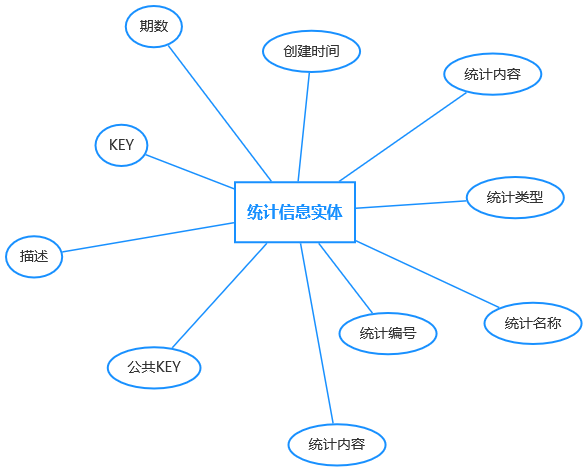

(2) 用户信息表：存储用户信息，参与分析的主要内容为用户创建时间（注册时间）、性别、生日。

| 字段                      | 类型     | 长度 | 键类型                            | null | 默认值   | 描述         |
| :------------------------ | -------- | ---- | --------------------------------- | ---- | -------- | ------------ |
| user_id                   | varchar  | 128  | 主键                              | 否   |          | 主键         |
| user_name                 | varchar  | 36   |                                   | 否   |          | 用户名       |
| phone                     | varchar  | 32   |                                   | 否   |          | 手机号码     |
| country_code              | varchar  | 5    |                                   | 否   | +86      | 国家代码     |
| nick_name                 | varchar  | 32   |                                   | 是   |          | 昵称         |
| avatar_url                | varchar  | 256  |                                   | 是   |          | 头像         |
| password                  | varchar  | 128  |                                   | 是   |          | 密码         |
| status                    | char     | 1    |                                   | 否   |          | 状态         |
| salt                      | varchar  | 64   |                                   | 是   |          | 加密方式     |
| sex                       | char     | 1    |                                   | 是   | 0        | 性别         |
| birthday                  | datetime |      |                                   | 是   |          | 生日         |
| occupation                | varchar  | 64   |                                   | 是   |          | 职业         |
| preferred_language_locale | varchar  | 8    | 外键（c_i18n_locale_info:locale） | 是   | cn       | 偏好语言     |
| introductory              | varchar  | 512  |                                   | 是   |          | 简介         |
| ip_address                | varchar  | 64   |                                   | 是   |          | IP属地       |
| last_login_time           | datetime |      |                                   | 是   |          | 最后登录时间 |
| last_login_ip             | varchar  | 64   |                                   | 是   |          | 最后登录IP   |
| create_time               | datetime |      |                                   | 否   | 当前时间 | 创建时间     |
| update_time               | datetime |      |                                   | 是   |          | 修改时间     |
| is_delete                 | char     | 1    |                                   | 否   | 0        | 删除         |

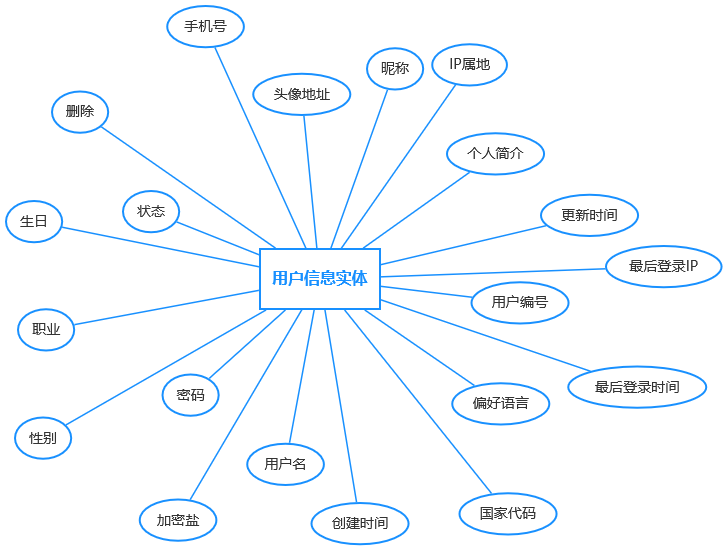

(3) 用户登录日志表：存储用户登录日志，参与分析的主要内容为IP地址与登录时间。

| 字段名         | 类型     | 长度 | 键类型                    | null | 默认值   | 描述         |
| -------------- | -------- | ---- | ------------------------- | ---- | -------- | ------------ |
| info_id        | bigint   | 20   | 主键                      | 否   | 自增     | 日志编号     |
| user_id        | varchar  | 128  | 外键(u_user_info:user_id) | 是   |          | 用户编号     |
| user_name      | varchar  | 36   |                           | 是   |          | 用户名       |
| login_type     | varchar  | 20   |                           | 否   |          | 登录方式     |
| identifier     | varchar  | 128  |                           | 是   |          | 匿名标识     |
| ip_addr        | varchar  | 50   |                           | 否   |          | 登录IP地址   |
| login_location | varchar  | 255  |                           | 是   |          | 登录地点     |
| browser        | varchar  | 50   |                           | 是   |          | 浏览器类型   |
| os             | varchar  | 50   |                           | 是   |          | 操作系统     |
| platform       | varchar  | 20   |                           | 是   |          | 平台         |
| device_id      | varchar  | 255  |                           | 是   |          | 设备唯一标识 |
| status         | char     | 1    |                           | 否   |          | 状态         |
| error_code     | varchar  | 64   |                           | 是   |          | 错误码       |
| msg            | varchar  | 255  |                           | 是   |          | 提示消息     |
| login_time     | datetime |      | 索引                      | 否   | 当前时间 | 登录时间     |

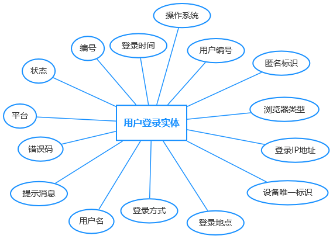

(4) 支付订单表：存储支付信息，参与分析的主要内容为实付金额、支付方式、IP属地。

| 字段名            | 类型     | 长度 | 键类型                     | Null | 默认值   | 描述                 |
| ----------------- | -------- | ---- | -------------------------- | ---- | -------- | -------------------- |
| order_id          | varchar  | 128  | 主键                       | 否   |          | 订单编号             |
| user_id           | varchar  | 128  | 外键 (u_user_info:user_id) | 否   |          | 用户编号             |
| order_type        | char     | 1    |                            | 否   |          | 使用场景             |
| order_status      | char     | 32   |                            | 否   | 0        | 订单状态             |
| payment_type      | varchar  | 1    |                            | 否   |          | 支付方式             |
| total_amount      | decimal  | 10,2 |                            | 否   | 0.00     | 订单总金额           |
| buyer_pay_amount  | decimal  | 10,2 |                            | 是   | 0.00     | 实付金额             |
| receipt_amount    | decimal  | 10,2 |                            | 是   | 0.00     | 实收金额             |
| discount_amount   | decimal  | 10,2 |                            | 是   | 0.00     | 平台优惠金额         |
| third_party       | varchar  | 128  |                            | 否   |          | 第三方支付平台       |
| third_user_id     | varchar  | 128  |                            | 是   |          | 第三方用户编号       |
| third_party_order | varchar  | 128  |                            | 是   |          | 第三方支付平台订单号 |
| payment_time      | datetime |      |                            | 是   |          | 支付时间             |
| payment_status    | varchar  | 32   |                            | 否   | 0        | 支付状态             |
| payment_code      | varchar  | 128  |                            | 是   |          | 支付返回Code         |
| payment_msg       | varchar  | 128  |                            | 是   |          | 支付返回Msg          |
| payment_extend    | text     |      |                            | 是   |          | 支付返回额外信息     |
| create_time       | datetime |      |                            | 否   | 当前时间 | 创建时间             |
| update_time       | datetime |      |                            | 否   | 当前时间 | 更新时间             |
| device_id         | varchar  | 255  |                            | 是   |          | 设备唯一标识         |
| browser           | varchar  | 50   |                            | 是   |          | 浏览器类型           |
| os                | varchar  | 50   |                            | 是   |          | 操作系统             |
| platform          | varchar  | 20   |                            | 是   |          | 平台                 |
| ip_addr           | varchar  | 50   |                            | 否   |          | IP地址               |
| ip_address        | varchar  | 64   |                            | 是   |          | IP属地               |
| remark            | varchar  | 512  |                            | 是   |          | 备注                 |
| is_delete         | char     | 1    |                            | 否   | 0        | 删除                 |

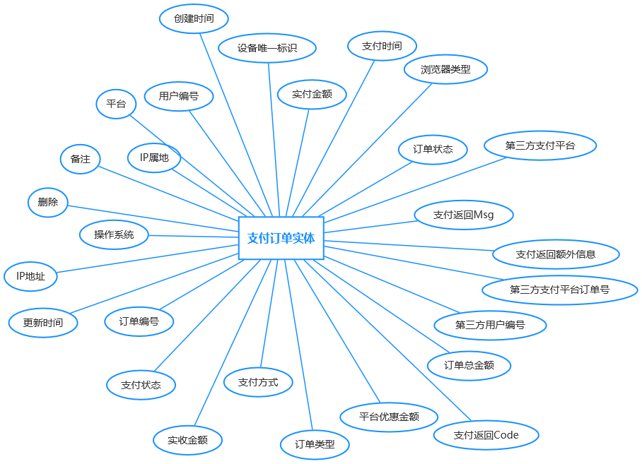

(5) 图片信息表：存储图片信息，参与分析的主要内容为图片体积、下载次数、图片状态、发布时间等。

| 字段           | 类型     | 长度 | 键类型                            | Null | 默认值         | 描述                |
| -------------- | -------- | ---- | --------------------------------- | ---- | -------------- | ------------------- |
| picture_id     | varchar  | 128  | 主键                              | 否   | auto_increment | 图片编号            |
| picture_url    | varchar  | 512  |                                   | 否   |                | 图片 url            |
| name           | varchar  | 32   |                                   | 否   |                | 图片名称            |
| introduction   | text     |      |                                   | 是   |                | 简介                |
| category_id    | te       | 128  | 外键(p_category_info:category_id) | 否   |                | 分类                |
| pic_size       | bigint   |      |                                   | 是   |                | 图片体积            |
| pic_width      | int      |      |                                   | 是   | 0              | 图片宽度            |
| pic_height     | int      |      |                                   | 是   | 0              | 图片高度            |
| pic_scale      | double   |      |                                   | 是   | 0              | 宽高比例            |
| pic_format     | varchar  | 32   |                                   | 是   |                | 图片格式            |
| user_id        | varchar  | 128  | 外键(u_user_info:user_id)         | 否   |                | 用户                |
| create_time    | datetime |      |                                   | 否   | 当前时间       | 创建时间            |
| publish_time   | datetime |      |                                   | 是   | 当前时间       | 发布时间            |
| update_time    | datetime |      |                                   | 是   | 当前时间       | 更新时间            |
| picture_status | char     | 1    |                                   | 否   | 0              | 图片状态            |
| thumbnail_url  | varchar  | 512  |                                   | 是   |                | 缩略图 url          |
| look_count     | bigint   |      | 索引                              | 否   | 0              | 查看次数            |
| collect_count  | bigint   |      | 索引                              | 否   | 0              | 收藏次数            |
| like_count     | bigint   |      | 索引                              | 否   | 0              | 点赞次数            |
| share_count    | bigint   |      | 索引                              | 否   | 0              | 分享次数            |
| download_count | bigint   |      | 索引                              | 否   | 0              | 下载次数            |
| upload_type    | char     | 1    |                                   | 否   |                | 上传类型            |
| more_info      | text     |      |                                   | 是   |                | 更多信息            |
| space_id       | varchar  | 128  | 外键（p_spece_info:space_id）     | 是   |                | 空间编号            |
| folder_id      | varchar  | 128  |                                   | 是   |                | 文件夹              |
| is_delete      | char     | 1    |                                   | 否   | 0              | 删除(0否 1是) 默认0 |
| deleted_time   | datetime |      |                                   | 是   |                | 删除时间            |

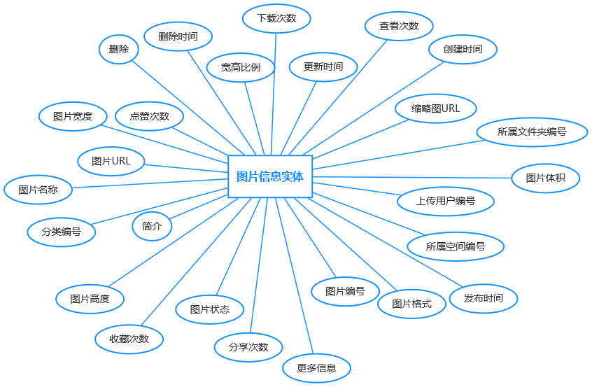

(6) 用户行为表：存储用户对图片点赞、分享、转发信息，参与分析的主要内容为行为类型、目标类型等。

| 字段名         | 类型     | 长度 | 键类型                                    | Null | 默认值   | 描述         |
| -------------- | -------- | ---- | ----------------------------------------- | ---- | -------- | ------------ |
| behavior_id    | varchar  | 128  | 主键                                      | 否   |          | 转发编号     |
| behavior_type  | char     | 1    |                                           | 否   |          | 行为类型     |
| user_id        | varchar  | 128  | 外键 (u_user_info:user_id)                | 否   |          | 用户编号     |
| target_type    | char     | 1    |                                           | 否   |          | 目标类型     |
| target_id      | varchar  | 128  |                                           | 否   |          | 目标对象     |
| target_content | varchar  | 256  |                                           | 是   |          | 目标内容     |
| score          | decimal  | 5,2  |                                           | 否   |          | 分数         |
| share_link     | varchar  | 512  |                                           | 是   |          | 分享链接     |
| category_id    | varchar  | 128  | 外键(p_picture_category_info:category_id) | 是   |          | 图片分类     |
| space_id       | varchar  | 128  |                                           | 是   |          | 空间         |
| tags           | varchar  | 256  |                                           | 是   |          | 图片标签     |
| target_cover   | varchar  | 512  |                                           | 是   |          | 封面         |
| create_time    | datetime |      |                                           | 否   | 当前时间 | 转发时间     |
| has_statistics | char     | 1    |                                           | 否   |          | 是否统计     |
| device_id      | varchar  | 256  |                                           | 是   |          | 设备唯一标识 |
| browser        | varchar  | 50   |                                           | 是   |          | 浏览器类型   |
| os             | varchar  | 50   |                                           | 是   |          | 操作系统     |
| platform       | varchar  | 20   |                                           | 是   |          | 平台         |
| ip_addr        | varchar  | 50   |                                           | 是   |          | IP地址       |
| ip_address     | varchar  | 64   |                                           | 是   |          | IP属地       |

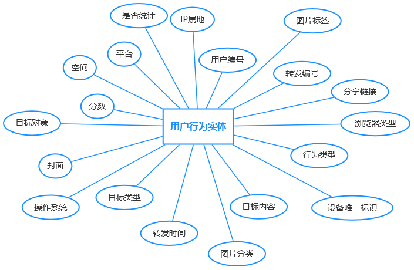

(7) 用户搜索记录表：存储用户搜索记录，参与分析的主要内容为搜索关键词。

| 字段名          | 类型     | 长度 | 键类型                     | Null | 默认值   | 描述         |
| --------------- | -------- | ---- | -------------------------- | ---- | -------- | ------------ |
| search_id       | varchar  | 128  | 主键                       | 否   |          | 搜索记录编号 |
| user_id         | varchar  | 128  | 外键 (u_user_info:user_id) | 是   |          | 用户编号     |
| keyword         | varchar  | 32   |                            | 否   |          | 搜索关键词   |
| search_type     | char     | 1    |                            | 否   | 0        | 搜索类型     |
| refer_source    | char     | 1    |                            | 是   | 0        | 搜索来源     |
| search_status   | char     | 1    |                            | 否   | 0        | 搜索状态     |
| fail_reason     | varchar  | 256  |                            | 是   |          | 失败原因     |
| result_count    | int      |      |                            | 否   | 0        | 返回数量     |
| create_time     | datetime |      |                            | 否   | 当前时间 | 搜索时间     |
| search_duration | int      |      |                            | 是   | 0        | 搜索时长     |
| device_id       | varchar  | 256  |                            | 是   |          | 设备唯一标识 |
| browser         | varchar  | 50   |                            | 是   |          | 浏览器类型   |
| os              | varchar  | 50   |                            | 是   |          | 操作系统     |
| platform        | varchar  | 20   |                            | 是   |          | 平台         |
| ip_addr         | varchar  | 50   |                            | 是   |          | IP地址       |
| ip_address      | varchar  | 64   |                            | 是   |          | IP属地       |

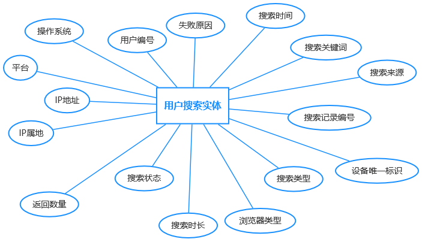


# 第 6 章 接口设计

## 6.1 接口设计原则

1. URL 命名采用**业务名 + 子资源**的 RESTful 风格，避免暴露数据库表名（但不强制全 RESTful，CRUD 兼容 /list /export）；
2. 用户端 `/user/**`、管理端 `/admin/**`，路径前缀与代码模块一一对应；
3. 列表查询统一 `GET /list`，写接口使用 `POST/PUT/DELETE`；
4. 所有需要鉴权的接口必须携带 `Authorization: Bearer <jwt>`（过滤器全局解析）；
5. 列表接口统一返回 `TableDataInfo { total, rows, code, msg }`；
6. 关键写接口标注 `@Log` 注解，自动记录操作日志；
7. 导出接口统一 `POST /export`，底层走异步线程池生成 Excel；
8. 异常统一由 `GlobalExceptionHandler` 拦截并返回 `AjaxResult`。

## 6.2 统一响应结构

### 6.2.1 AjaxResult（增删改、详情）

```json
{
  "code": 200,
  "msg": "操作成功",
  "data": { ... }
}
```

### 6.2.2 TableDataInfo（分页查询）

```json
{
  "code": 200,
  "msg": "查询成功",
  "total": 1234,
  "rows": [ ... ]
}
```

| 字段 | 类型 | 说明 |
| --- | --- | --- |
| code | int | 业务码（200 成功，500 失败，401 未登录，403 无权限，4001~4xxx 业务异常） |
| msg | String | 提示信息 |
| data / total / rows | Object | 业务数据 |

### 6.2.3 请求规范

**（1）请求头（必填）**

| Header | 必填 | 说明 |
| --- | --- | --- |
| `Content-Type` | 是 | 固定 `application/json;charset=UTF-8` |
| `Authorization` | 是（除登录/注册/公开接口） | `Bearer <jwt>`，由 `JwtAuthenticationTokenFilter` 统一解析 |
| `Accept-Language` | 否 | `zh-CN` / `en-US`，用于国际化文案返回 |
| `X-Request-Id` | 否 | 客户端 UUID，用于链路追踪；服务端会覆盖并写入 MDC |
| `User-Agent` | 否 | 客户端标识，敏感接口风控辅助 |

**（2）请求方法与路径**

| 场景 | 方法 | 路径示例 | 说明 |
| --- | --- | --- | --- |
| 列表查询 | `GET` | `/user/picture/list` | Query 参数 |
| 详情 | `GET` | `/user/picture/{id}` | 路径参数 |
| 新增 | `POST` | `/admin/picture` | 新增 |
| 修改 | `PUT` | `/admin/picture` | 修改 |
| 删除 | `DELETE` | `/admin/picture/{ids}` | 支持批量 |
| 导出 | `POST` | `/admin/picture/export` | 导出Excel |
| 文件上传 | `POST` | `/admin/common/upload` 或 OSS 直传 | `multipart/form-data` |
| 文件下载 | `GET` | `/admin/common/download?fileName=xxx` | 鉴权后返回文件流 |

**（3）请求参数规范**

- 列表查询统一包装：

  ```json
  {
    "query": {
      "pageNum": 1,
      "pageSize": 20,
      "orderByColumn": "createTime",
      "isAsc": "desc",
      "params": {
        "beginCreateTime": "2026-01-01",
        "endCreateTime": "2026-06-15",
        "categoryId": "10"
      }
    }
  }
  ```
- 排序字段必须落在 `@CustomSort` 白名单中，未声明字段一律忽略，防止 SQL 注入。
- 时间统一 ISO-8601（`yyyy-MM-dd HH:mm:ss`）或毫秒时间戳，由 `JacksonConfig` 统一解析。
- 分页默认 `pageSize=10, max=200`；超过 200 自动截断，防止慢 SQL。
- 文件上传大小限制：图片 ≤ 10MB，压缩包/Excel ≤ 50MB（在 Nginx 与 Spring Boot 双端限制）。

## 6.4 C 端（用户端）接口

### 6.4.1 鉴权模块 `/user/auth/**`

| 序号 | 接口路径 | 方法 | Controller | 说明 |
| --- | --- | --- | --- | --- |
| 1 | `/user/login` | POST | AuthUserInfoController | 账号密码登录 |
| 2 | `/user/getInfo` | GET | AuthUserInfoController | 获取当前登录用户信息 |
| 3 | `/user/getSmsLoginCode` | GET | AuthUserInfoController | 获取短信登录验证码 |
| 4 | `/user/smsLogin` | POST | AuthUserInfoController | 短信验证码登录 |
| 5 | `/user/getRegisterCode` | GET | AuthUserInfoController | 获取注册短信验证码 |
| 6 | `/user/register` | POST | AuthUserInfoController | 用户注册（手机号） |
| 7 | `/user/getForgetPasswordCode` | GET | AuthUserInfoController | 获取忘记密码验证码 |
| 8 | `/user/forgetPassword` | POST | AuthUserInfoController | 忘记密码（重置密码） |
| 9 | `/user/logout` | POST | AuthUserInfoController | 注销（加入 JWT 黑名单） |

### 6.4.2 公共模块

| 序号 | 接口路径 | 方法 | Controller | 说明 |
| --- | --- | --- | --- | --- |
| 10 | `/user/captchaImage` | GET | CaptchaController | 图形验证码 |

### 6.4.3 用户模块 `/user/user/**`

| 序号 | 接口路径 | 方法 | Controller | 说明 |
| --- | --- | --- | --- | --- |
| 11 | `/user/user/userInfo/menu` | GET | UserUserInfoController | 获取用户菜单 |
| 12 | `/user/user/userInfo/my/{userName}` | GET | UserUserInfoController | 获取指定用户公开信息 |
| 13 | `/user/user/userInfo/update` | PUT | UserUserInfoController | 修改个人资料 |
| 14 | `/user/user/userInfo/update/avatar` | PUT | UserUserInfoController | 修改头像 |
| 15 | `/user/user/userInfo/password` | PUT | UserUserInfoController | 修改登录密码 |
| 16 | `/user/user/informInfo/list` | GET | UserInformInfoController | 通知分页 |
| 17 | `/user/user/informInfo/{recordId}` | GET | UserInformInfoController | 通知详情 |
| 18 | `/user/user/informInfo/unread` | GET | UserInformInfoController | 未读数 |
| 19 | `/user/user/informInfo/resetRead` | GET | UserInformInfoController | 全部标记已读 |
| 20 | `/user/user/loginLogInfo/list` | GET | UserLoginLogInfoController | 登录日志 |
| 21 | `/user/system/dict/data/type/{dictType}` | GET | UserDictDataController | 字典数据 |

### 6.4.4 图片模块 `/user/picture/**`

| 序号 | 接口路径 | 方法 | Controller | 说明 |
| --- | --- | --- | --- | --- |
| 22 | `/user/picture/pictureInfo` | POST | UserPictureInfoController | 新增图片 |
| 23 | `/user/picture/pictureInfo/upload/url` | POST | UserPictureInfoController | URL 上传 |
| 24 | `/user/picture/pictureInfo/upload/ai` | POST | UserPictureInfoController | 上传 AI 生成结果 |
| 25 | `/user/picture/pictureInfo/update` | PUT | UserPictureInfoController | 修改图片 |
| 26 | `/user/picture/pictureInfo/update/name` | PUT | UserPictureInfoController | 修改图片名 |
| 27 | `/user/picture/pictureInfo/{pictureId}` | GET | UserPictureInfoController | 图片详情 |
| 28 | `/user/picture/pictureInfo/ai/{pictureId}` | GET | UserPictureInfoController | AI 图片详情 |
| 29 | `/user/picture/pictureInfo/my/{pictureId}` | GET | UserPictureInfoController | 我自己的图片详情 |
| 30 | `/user/picture/pictureInfo/list/my/table` | GET | UserPictureInfoController | 我的图片表格 |
| 31 | `/user/picture/pictureInfo/list/my/space/table` | GET | UserPictureInfoController | 我的空间图片表格 |
| 32 | `/user/picture/pictureInfo/list` | GET | UserPictureInfoController | 公共分页 |
| 33 | `/user/picture/pictureInfo/query` | GET | UserPictureInfoController | 公共查询 |
| 34 | `/user/picture/pictureInfo/query/ai` | GET | UserPictureInfoController | AI 查询 |
| 35 | `/user/picture/pictureInfo/list/my` | GET | UserPictureInfoController | 我的图片列表 |
| 36 | `/user/picture/pictureInfo/list/ai` | GET | UserPictureInfoController | AI 图片列表 |
| 37 | `/user/picture/pictureInfo/search/recommend` | GET | UserPictureInfoController | 搜索推荐词 |
| 38 | `/user/picture/pictureInfo/search/suggestion` | GET | UserPictureInfoController | 搜索建议 |
| 39 | `/user/picture/pictureInfo/detail/recommend` | GET | UserPictureInfoController | 详情相关推荐 |
| 40 | `/user/picture/pictureInfo/detail/recommend/ai` | GET | UserPictureInfoController | AI 详情推荐 |
| 41 | `/user/picture/pictureInfo/{pictureIds}` | DELETE | UserPictureInfoController | 删除图片 |
| 42 | `/user/picture/pictureInfo/hot` | GET | UserPictureInfoController | 热门图片 |
| 43 | `/user/picture/pictureInfo/recommend` | GET | UserPictureInfoRecommendController | 推荐列表 |
| 44 | `/user/picture/pictureInfo/recommend/ai` | GET | UserPictureInfoRecommendController | AI 推荐列表 |
| 45 | `/user/picture/file/upload` | POST | UserFileController | 图片上传（multipart） |
| 46 | `/user/picture/file/upload/cover` | POST | UserFileController | 上传封面图 |
| 47 | `/user/picture/file/upload/file` | POST | UserFileController | 上传附件 |
| 48 | `/user/picture/file/upload/url` | POST | UserFileController | URL 抓取上传 |
| 49 | `/user/picture/file/download/{pictureId}` | GET | UserFileController | 下载图片（公共） |
| 50 | `/user/picture/file/download/my/{pictureId}` | GET | UserFileController | 下载自己的图片 |
| 51 | `/user/picture/file/download/log/{downloadId}` | GET | UserFileController | 通过下载日志下载 |
| 52 | `/user/picture/file/original/{pictureId}` | GET | UserFileController | 访问原图（公共） |
| 53 | `/user/picture/file/original/my/{pictureId}` | GET | UserFileController | 访问原图（私有） |
| 54 | `/user/picture/file/log/original/{downloadId}` | GET | UserFileController | 通过日志访问原图 |
| 55 | `/user/picture/pictureCategoryInfo/list` | GET | UserPictureCategoryInfoController | 公共分类 |
| 56 | `/user/picture/pictureTagInfo/list` | GET | UserPictureTagInfoController | 公共标签 |
| 57 | `/user/picture/api/search/keyword` | GET | UserPictureApiSearchController | 关键字联想 |
| 58 | `/user/picture/userinfo/{username}` | GET | PictureUserInfoController | 公开主页 |
| 59 | `/user/picture/userBehaviorInfo` | POST | UserUserBehaviorInfoController | 上报用户行为 |
| 60 | `/user/picture/userBehaviorInfo/list` | GET | UserUserBehaviorInfoController | 我的行为 |
| 61 | `/user/picture/userViewLogInfo/list` | GET | UserUserViewLogInfoController | 我的浏览日志 |
| 62 | `/user/picture/pictureDownloadLogInfo/list` | GET | UserPictureDownloadLogInfoController | 我的下载日志 |
| 63 | `/user/picture/pictureApplyInfo` | POST | UserPictureApplyInfoController | 申请公共图 |
| 64 | `/user/picture/userReportInfo` | POST | UserUserReportInfoController | 举报 |

### 6.4.5 空间模块 `/user/picture/space**`

| 序号 | 接口路径 | 方法 | Controller | 说明 |
| --- | --- | --- | --- | --- |
| 65 | `/user/picture/spaceInfo` | POST | UserSpaceInfoController | 创建空间 |
| 66 | `/user/picture/spaceInfo` | PUT | UserSpaceInfoController | 修改空间 |
| 67 | `/user/picture/spaceInfo/mySpace` | GET | UserSpaceInfoController | 我的空间 |
| 68 | `/user/picture/spaceInfo/list/table` | GET | UserSpaceInfoController | 我的空间表格 |
| 69 | `/user/picture/spaceInfo/list/team/table` | GET | UserSpaceInfoController | 团队空间表格 |
| 70 | `/user/picture/spaceInfo/{spaceId}` | GET | UserSpaceInfoController | 空间详情 |
| 71 | `/user/picture/spaceInfo/perm` | GET | UserSpaceInfoController | 我的空间权限 |
| 72 | `/user/picture/spaceInfo/space` | GET | UserSpaceInfoController | 我的空间简略信息 |
| 73 | `/user/picture/spaceMemberInfo/list` | GET | UserSpaceMemberInfoController | 空间成员列表 |
| 74 | `/user/picture/spaceMemberInfo/{memberId}` | DELETE | UserSpaceMemberInfoController | 移除成员 |
| 75 | `/user/picture/spaceMemberInfo` | PUT | UserSpaceMemberInfoController | 修改成员角色 |
| 76 | `/user/picture/spaceFolderInfo` | POST | UserSpaceFolderInfoController | 新建文件夹 |
| 77 | `/user/picture/spaceFolderInfo` | PUT | UserSpaceFolderInfoController | 修改文件夹 |
| 78 | `/user/picture/spaceFolderInfo/{folderId}` | DELETE | UserSpaceFolderInfoController | 删除文件夹 |
| 79 | `/user/picture/spaceFolderInfo/list` | GET | UserSpaceFolderInfoController | 文件夹列表 |
| 80 | `/user/picture/spaceFolderInfo/{folderId}` | GET | UserSpaceFolderInfoController | 文件夹详情 |
| 81 | `/user/picture/spaceInvitationInfo` | POST | UserSpaceInvitationInfoController | 发起邀请 |
| 82 | `/user/picture/spaceInvitationInfo/list` | GET | UserSpaceInvitationInfoController | 邀请列表 |
| 83 | `/user/picture/spaceInvitationInfo/action` | PUT | UserSpaceInvitationInfoController | 接受/拒绝邀请 |
| 84 | `/user/picture/spaceInvitationInfo/cancel` | PUT | UserSpaceInvitationInfoController | 取消邀请 |
| 85 | `/user/picture/spaceInvitationInfo/{invitationId}` | DELETE | UserSpaceInvitationInfoController | 删除邀请 |
| 86 | `/user/picture/spaceDilatationInfo` | POST | UserSpaceDilatationInfoController | 申请扩容 |
| 87 | `/user/picture/spaceDilatationInfo/calculate` | GET | UserSpaceDilatationInfoController | 扩容价格预估 |

### 6.4.6 AI 模块 `/user/ai/**` + `/user/picture/ai/**`

| 序号 | 接口路径 | 方法 | Controller | 说明 |
| --- | --- | --- | --- | --- |
| 88 | `/user/ai/modelParamsInfo/list` | GET | UserModelParamsInfoController | 可用 AI 模型列表 |
| 89 | `/user/ai/promptInfo/list` | GET | UserPromptInfoController | 提示词模板 |
| 90 | `/user/ai/generateLogInfo/list` | GET | UserPictureGenerateController | 我的生成记录 |
| 91 | `/user/ai/generateLogInfo/{logId}` | DELETE | UserPictureGenerateController | 删除生成记录 |
| 92 | `/user/picture/ai/outPainting/createTask` | POST | UserAiEditPictureController | 创建扩图任务 |
| 93 | `/user/picture/ai/outPainting/getTask` | GET | UserAiEditPictureController | 查询扩图任务 |
| 94 | `/user/picture/ai/generate` | POST | UserAiEditPictureController | AI 生图 |
| 95 | `/user/picture/ai/query/{logId}` | GET | UserAiEditPictureController | 查询生图结果 |

### 6.4.7 积分模块 `/user/points/**`

| 序号 | 接口路径 | 方法 | Controller | 说明 |
| --- | --- | --- | --- | --- |
| 96 | `/user/points/accountInfo` | GET | UserAccountInfoController | 我的账户信息 |
| 97 | `/user/points/accountInfo` | PUT | UserAccountInfoController | 修改支付密码 |
| 98 | `/user/points/accountInfo/verifyPassword` | GET | UserAccountInfoController | 校验支付密码（查询） |
| 99 | `/user/points/accountInfo/verifyPassword` | POST | UserAccountInfoController | 校验支付密码（提交） |
| 100 | `/user/points/accountInfo/password/code` | GET | UserAccountInfoController | 获取短信验证码 |
| 101 | `/user/points/accountInfo/password/reset` | POST | UserAccountInfoController | 重置支付密码 |
| 102 | `/user/points/pointsRechargePackageInfo/list` | GET | UserPointsRechargePackageInfoController | 套餐列表 |
| 103 | `/user/points/pointsRechargePackageInfo/{packageId}` | GET | UserPointsRechargePackageInfoController | 套餐详情 |
| 104 | `/user/points/pointsRechargeInfo/list` | GET | UserPointsRechargeInfoController | 充值记录 |
| 105 | `/user/points/pointsUsageLogInfo/list` | GET | UserPointsUsageLogInfoController | 消费记录 |
| 106 | `/user/points/pay/alipay/web` | POST | UserPayController | 支付宝 PC 网站支付下单 |
| 107 | `/user/points/pay/alipay/callback` | GET | UserPayController | 支付宝同步回调 |
| 108 | `/user/points/pay/alipay/web/order/{outTradeNo}` | GET | UserPayController | 前端轮询订单状态 |
| 109 | `/user/points/pay/alipay/web/{outTradeNo}` | GET | UserPayController | 跳转到支付宝 |

### 6.4.8 配置模块 `/user/config/**`

| 序号 | 接口路径 | 方法 | Controller | 说明 |
| --- | --- | --- | --- | --- |
| 110 | `/user/config/configInfo/key/{configKey}` | GET | UserConfigInfoController | 按 key 查配置 |
| 111 | `/user/config/noticeInfo/list` | GET | UserNoticeInfoController | 公告列表 |
| 112 | `/user/config/noticeInfo/{noticeId}` | GET | UserNoticeInfoController | 公告详情 |
| 113 | `/user/config/noticeInfo/exhibit` | GET | UserNoticeInfoController | 首页轮播公告 |

## 6.5 B 端（管理端）接口

### 6.5.1 鉴权模块

| 序号 | 接口路径 | 方法 | Controller | 说明 |
| --- | --- | --- | --- | --- |
| 1 | `/admin/login` | POST | SysLoginController | 管理端登录 |
| 2 | `/admin/logout` | POST | SysLoginController | 管理端注销 |
| 3 | `/admin/getInfo` | GET | SysLoginController | 管理端当前用户 |
| 4 | `/admin/getRouters` | GET | SysLoginController | 当前用户的菜单树 |
| 5 | `/admin/register` | POST | SysRegisterController | 管理端注册（默认关闭） |
| 6 | `/admin/captchaImage` | GET | CaptchaController | 图形验证码 |

### 6.5.2 公共模块

| 序号 | 接口路径 | 方法 | Controller | 说明 |
| --- | --- | --- | --- | --- |
| 7 | `/admin/common/download` | GET | CommonController | 资源下载（本地） |
| 8 | `/admin/common/download/network` | GET | CommonController | 网络资源下载 |
| 9 | `/admin/common/upload` | POST | CommonController | 通用单文件上传 |
| 10 | `/admin/common/uploads` | POST | CommonController | 通用多文件上传 |
| 11 | `/admin/common/download/resource` | GET | CommonController | 资源下载（OSS） |
| 12 | `/admin/common/geo` | GET | CommonController | 加载本地 geoJson |

### 6.5.3 系统管理模块 `/admin/system/**`

| 序号 | 接口路径 | 方法 | Controller | 说明 |
| --- | --- | --- | --- | --- |
| 13 | `/admin/system/user/list` | GET | SysUserController | 用户分页 |
| 14 | `/admin/system/user/export` | POST | SysUserController | 导出 Excel |
| 15 | `/admin/system/user/importData` | POST | SysUserController | 导入 Excel |
| 16 | `/admin/system/user/importTemplate` | POST | SysUserController | 下载导入模板 |
| 17 | `/admin/system/user/{userId}` | GET | SysUserController | 详情 |
| 18 | `/admin/system/user` | POST | SysUserController | 新增 |
| 19 | `/admin/system/user` | PUT | SysUserController | 修改 |
| 20 | `/admin/system/user/{userIds}` | DELETE | SysUserController | 批量删除 |
| 21 | `/admin/system/user/resetPwd` | PUT | SysUserController | 重置密码 |
| 22 | `/admin/system/user/changeStatus` | PUT | SysUserController | 启停账号 |
| 23 | `/admin/system/user/authRole/{userId}` | GET | SysUserController | 查询已分配角色 |
| 24 | `/admin/system/user/authRole` | PUT | SysUserController | 分配角色 |
| 25 | `/admin/system/user/deptTree` | GET | SysUserController | 部门树（用户分配） |
| 26 | `/admin/system/user/profile` | GET | SysProfileController | 个人信息 |
| 27 | `/admin/system/user/profile` | PUT | SysProfileController | 修改个人信息 |
| 28 | `/admin/system/user/profile/updatePwd` | PUT | SysProfileController | 修改密码 |
| 29 | `/admin/system/user/profile/avatar` | POST | SysProfileController | 上传头像 |
| 30 | `/admin/system/role/list` | GET | SysRoleController | 角色分页 |
| 31 | `/admin/system/role/export` | POST | SysRoleController | 导出 |
| 32 | `/admin/system/role/{roleId}` | GET | SysRoleController | 详情 |
| 33 | `/admin/system/role` | POST | SysRoleController | 新增 |
| 34 | `/admin/system/role` | PUT | SysRoleController | 修改 |
| 35 | `/admin/system/role/dataScope` | PUT | SysRoleController | 分配数据权限 |
| 36 | `/admin/system/role/changeStatus` | PUT | SysRoleController | 启停角色 |
| 37 | `/admin/system/role/{roleIds}` | DELETE | SysRoleController | 删除 |
| 38 | `/admin/system/role/optionselect` | GET | SysRoleController | 角色下拉 |
| 39 | `/admin/system/role/authUser/allocatedList` | GET | SysRoleController | 已分配该角色的用户 |
| 40 | `/admin/system/role/authUser/unallocatedList` | GET | SysRoleController | 未分配的用户 |
| 41 | `/admin/system/role/authUser/cancel` | PUT | SysRoleController | 取消用户角色 |
| 42 | `/admin/system/role/authUser/cancelAll` | PUT | SysRoleController | 批量取消 |
| 43 | `/admin/system/role/authUser/selectAll` | PUT | SysRoleController | 批量分配 |
| 44 | `/admin/system/role/deptTree/{roleId}` | GET | SysRoleController | 角色部门树 |
| 45 | `/admin/system/menu/list` | GET | SysMenuController | 菜单列表 |
| 46 | `/admin/system/menu/{menuId}` | GET | SysMenuController | 详情 |
| 47 | `/admin/system/menu/treeselect` | GET | SysMenuController | 菜单树下拉 |
| 48 | `/admin/system/menu/roleMenuTreeselect/{roleId}` | GET | SysMenuController | 角色对应菜单树 |
| 49 | `/admin/system/menu` | POST / PUT | SysMenuController | 新增 / 修改 |
| 50 | `/admin/system/menu/{menuId}` | DELETE | SysMenuController | 删除 |
| 51 | `/admin/system/dept/list` | GET | SysDeptController | 部门列表（树） |
| 52 | `/admin/system/dept/list/exclude/{deptId}` | GET | SysDeptController | 排除节点的部门树 |
| 53 | `/admin/system/dept/{deptId}` | GET / POST / PUT / DELETE | SysDeptController | 部门 CRUD |
| 54 | `/admin/system/post/list` | GET | SysPostController | 岗位分页 |
| 55 | `/admin/system/post/export` | POST | SysPostController | 导出 |
| 56 | `/admin/system/post/{postId}` | GET / POST / PUT / DELETE | SysPostController | 岗位 CRUD |
| 57 | `/admin/system/post/optionselect` | GET | SysPostController | 岗位下拉 |
| 58 | `/admin/system/dict/type/list` | GET | SysDictTypeController | 字典类型分页 |
| 59 | `/admin/system/dict/type/refreshCache` | DELETE | SysDictTypeController | 刷新字典缓存 |
| 60 | `/admin/system/dict/type/optionselect` | GET | SysDictTypeController | 字典类型下拉 |
| 61 | `/admin/system/dict/type/{dictId}` | GET / POST / PUT / DELETE | SysDictTypeController | 字典类型 CRUD |
| 62 | `/admin/system/dict/data/list` | GET | SysDictDataController | 字典数据分页 |
| 63 | `/admin/system/dict/data/type/{dictType}` | GET | SysDictDataController | 按类型查字典 |
| 64 | `/admin/system/dict/data/{dictCode}` | GET | SysDictDataController | 详情 |
| 65 | `/admin/system/notice/list` | GET | SysNoticeController | 公告分页 |
| 66 | `/admin/system/notice/{noticeId}` | GET | SysNoticeController | 详情 |
| 67 | `/admin/system/notice` | POST / PUT / DELETE | SysNoticeController | 公告 CRUD |
| 68 | `/admin/system/config/list` | GET | SysConfigController | 参数分页 |
| 69 | `/admin/system/config/configKey/{configKey}` | GET | SysConfigController | 按 key 查 |
| 70 | `/admin/system/config/refreshCache` | DELETE | SysConfigController | 刷新参数缓存 |
| 71 | `/admin/system/config/{configId}` | GET | SysConfigController | 详情 |
| 72 | `/admin/system/config` | POST / PUT / DELETE | SysConfigController | 参数 CRUD |

### 6.5.4 监控模块 `/admin/monitor/**`

| 序号 | 接口路径 | 方法 | Controller | 说明 |
| --- | --- | --- | --- | --- |
| 73 | `/admin/monitor/operlog/list` | GET | SysOperlogController | 操作日志分页 |
| 74 | `/admin/monitor/operlog/export` | POST | SysOperlogController | 导出 |
| 75 | `/admin/monitor/operlog/{operIds}` | DELETE | SysOperlogController | 删除 |
| 76 | `/admin/monitor/operlog/clean` | DELETE | SysOperlogController | 清空 |
| 77 | `/admin/monitor/logininfor/list` | GET | SysLogininforController | 登录日志分页 |
| 78 | `/admin/monitor/logininfor/export` | POST | SysLogininforController | 导出 |
| 79 | `/admin/monitor/logininfor/{infoIds}` | DELETE | SysLogininforController | 删除 |
| 80 | `/admin/monitor/logininfor/clean` | DELETE | SysLogininforController | 清空 |
| 81 | `/admin/monitor/logininfor/unlock/{userName}` | GET | SysLogininforController | 解除登录锁定 |
| 82 | `/admin/monitor/online/list` | GET | SysUserOnlineController | 在线用户列表 |
| 83 | `/admin/monitor/online/{tokenId}` | DELETE | SysUserOnlineController | 强退 |
| 84 | `/admin/monitor/cache` | GET | CacheController | 缓存监控信息 |
| 85 | `/admin/monitor/cache/getNames` | GET | CacheController | 所有缓存名 |
| 86 | `/admin/monitor/cache/getKeys/{cacheName}` | GET | CacheController | 缓存 key 列表 |
| 87 | `/admin/monitor/cache/getValue/{cacheName}/{cacheKey}` | GET | CacheController | 缓存 value |
| 88 | `/admin/monitor/cache/clearCacheName/{cacheName}` | DELETE | CacheController | 清除指定缓存 |
| 89 | `/admin/monitor/cache/clearCacheKey/{cacheKey}` | DELETE | CacheController | 清除指定 key |
| 90 | `/admin/monitor/cache/clearCacheAll` | DELETE | CacheController | 清除全部 |
| 91 | `/admin/monitor/server` | GET | ServerController | 服务器 CPU/内存/磁盘/堆栈 |

### 6.5.5 定时任务模块 `/admin/monitor/job/**` + `/admin/monitor/jobLog/**`

| 序号 | 接口路径 | 方法 | Controller | 说明 |
| --- | --- | --- | --- | --- |
| 92 | `/admin/monitor/job/list` | GET | SysJobController | 任务分页 |
| 93 | `/admin/monitor/job/export` | POST | SysJobController | 导出 |
| 94 | `/admin/monitor/job/{jobId}` | GET | SysJobController | 详情 |
| 95 | `/admin/monitor/job` | POST | SysJobController | 新增 |
| 96 | `/admin/monitor/job` | PUT | SysJobController | 修改 |
| 97 | `/admin/monitor/job/changeStatus` | PUT | SysJobController | 启停 |
| 98 | `/admin/monitor/job/run` | PUT | SysJobController | 立即执行一次 |
| 99 | `/admin/monitor/job/{jobIds}` | DELETE | SysJobController | 删除 |
| 100 | `/admin/monitor/jobLog/list` | GET | SysJobLogController | 执行日志分页 |
| 101 | `/admin/monitor/jobLog/export` | POST | SysJobLogController | 导出 |
| 102 | `/admin/monitor/jobLog/{jobLogId}` | GET | SysJobLogController | 详情 |
| 103 | `/admin/monitor/jobLog/{jobLogIds}` | DELETE | SysJobLogController | 删除 |
| 104 | `/admin/monitor/jobLog/clean` | DELETE | SysJobLogController | 清空 |

### 6.5.6 代码生成模块 `/admin/tool/gen/**`

| 序号 | 接口路径 | 方法 | Controller | 说明 |
| --- | --- | --- | --- | --- |
| 105 | `/admin/tool/gen/list` | GET | GenController | 表分页 |
| 106 | `/admin/tool/gen/{tableId}` | GET | GenController | 表详情 |
| 107 | `/admin/tool/gen/db/list` | GET | GenController | 数据库表列表 |
| 108 | `/admin/tool/gen/column/{tableId}` | GET | GenController | 字段信息 |
| 109 | `/admin/tool/gen/importTable` | POST | GenController | 导入表 |
| 110 | `/admin/tool/gen/createTable` | POST | GenController | 创建表 |
| 111 | `/admin/tool/gen` | PUT | GenController | 修改生成配置 |
| 112 | `/admin/tool/gen/{tableIds}` | DELETE | GenController | 删除导入记录 |
| 113 | `/admin/tool/gen/preview/{tableId}` | GET | GenController | 预览代码 |
| 114 | `/admin/tool/gen/download/{tableName}` | GET | GenController | 下载 ZIP |
| 115 | `/admin/tool/gen/genCode/{tableName}` | GET | GenController | 生成到本地目录 |
| 116 | `/admin/tool/gen/synchDb/{tableName}` | GET | GenController | 同步表结构 |
| 117 | `/admin/tool/gen/batchGenCode` | GET | GenController | 批量生成 |
| 118 | `/admin/tool/gen/genValue` | POST | GenController | 自定义模板生成 |
| 119 | `/admin/tool/swagger/index` | GET | GenController | Swagger 文档 |

### 6.5.7 用户模块 `/admin/user/**`

| 序号 | 接口路径 | 方法 | Controller | 说明 |
| --- | --- | --- | --- | --- |
| 120 | `/admin/user/userInfo/list` | GET | UserInfoController | 用户分页 |
| 121 | `/admin/user/userInfo/{userId}` | GET | UserInfoController | 用户详情 |
| 122 | `/admin/user/userInfo` | POST | UserInfoController | 新增用户 |
| 123 | `/admin/user/userInfo` | PUT | UserInfoController | 修改用户 |
| 124 | `/admin/user/userInfo/{userIds}` | DELETE | UserInfoController | 删除用户 |
| 125 | `/admin/user/userInfo/export` | POST | UserInfoController | 导出 |
| 126 | `/admin/user/loginLogInfo/list` | GET | LoginLogInfoController | 登录日志分页 |
| 127 | `/admin/user/loginLogInfo` | POST | LoginLogInfoController | 新增登录日志 |
| 128 | `/admin/user/loginLogInfo` | PUT | LoginLogInfoController | 修改登录日志 |
| 129 | `/admin/user/loginLogInfo/{infoIds}` | DELETE | LoginLogInfoController | 删除登录日志 |
| 130 | `/admin/user/loginLogInfo/{infoId}` | GET | LoginLogInfoController | 登录日志详情 |
| 131 | `/admin/user/loginLogInfo/export` | POST | LoginLogInfoController | 导出 |
| 132 | `/admin/user/informInfo/list` | GET | InformInfoController | 通知分页 |
| 133 | `/admin/user/informInfo/{recordId}` | GET | InformInfoController | 通知详情 |
| 134 | `/admin/user/informInfo` | POST | InformInfoController | 新增通知 |
| 135 | `/admin/user/informInfo` | PUT | InformInfoController | 修改通知 |
| 136 | `/admin/user/informInfo/{recordIds}` | DELETE | InformInfoController | 删除通知 |
| 137 | `/admin/user/informInfo/export` | POST | InformInfoController | 导出 |
| 138 | `/admin/user/userRelationInfo/list` | GET | UserRelationInfoController | 关系分页 |
| 139 | `/admin/user/userRelationInfo/{relationId}` | GET | UserRelationInfoController | 关系详情 |
| 140 | `/admin/user/userRelationInfo` | POST | UserRelationInfoController | 新增关系 |
| 141 | `/admin/user/userRelationInfo` | PUT | UserRelationInfoController | 修改关系 |
| 142 | `/admin/user/userRelationInfo/{relationIds}` | DELETE | UserRelationInfoController | 删除关系 |
| 143 | `/admin/user/userRelationInfo/export` | POST | UserRelationInfoController | 导出 |
| 144 | `/admin/user/userFriendInfo/list` | GET | UserFriendInfoController | 好友分页 |
| 145 | `/admin/user/userFriendInfo/{relationId}` | GET | UserFriendInfoController | 好友详情 |
| 146 | `/admin/user/userFriendInfo` | POST | UserFriendInfoController | 新增好友 |
| 147 | `/admin/user/userFriendInfo` | PUT | UserFriendInfoController | 修改好友 |
| 148 | `/admin/user/userFriendInfo/{relationIds}` | DELETE | UserFriendInfoController | 删除好友 |
| 149 | `/admin/user/userFriendInfo/export` | POST | UserFriendInfoController | 导出 |
| 150 | `/admin/user/userBindingInfo/list` | GET | UserBindingInfoController | 第三方绑定分页 |
| 151 | `/admin/user/userBindingInfo/{bindingId}` | GET | UserBindingInfoController | 第三方绑定详情 |
| 152 | `/admin/user/userBindingInfo` | POST | UserBindingInfoController | 新增绑定 |
| 153 | `/admin/user/userBindingInfo` | PUT | UserBindingInfoController | 修改绑定 |
| 154 | `/admin/user/userBindingInfo/{bindingIds}` | DELETE | UserBindingInfoController | 删除绑定 |
| 155 | `/admin/user/userBindingInfo/export` | POST | UserBindingInfoController | 导出 |
| 156 | `/admin/user/bannedPermissionInfo/list` | GET | BannedPermissionInfoController | 封禁列表分页 |
| 157 | `/admin/user/bannedPermissionInfo/{bannedId}` | GET | BannedPermissionInfoController | 封禁详情 |
| 158 | `/admin/user/bannedPermissionInfo` | POST | BannedPermissionInfoController | 新增封禁 |
| 159 | `/admin/user/bannedPermissionInfo` | PUT | BannedPermissionInfoController | 修改封禁 |
| 160 | `/admin/user/bannedPermissionInfo/{bannedIds}` | DELETE | BannedPermissionInfoController | 删除封禁 |
| 161 | `/admin/user/bannedPermissionInfo/export` | POST | BannedPermissionInfoController | 导出 |
| 162 | `/admin/user/uStatisticsInfo/list` | GET | UStatisticsInfoController | 统计基础列表 |
| 163 | `/admin/user/uStatisticsInfo/{statisticsId}` | GET | UStatisticsInfoController | 统计详情 |
| 164 | `/admin/user/uStatisticsInfo` | POST | UStatisticsInfoController | 新增统计 |
| 165 | `/admin/user/uStatisticsInfo` | PUT | UStatisticsInfoController | 修改统计 |
| 166 | `/admin/user/uStatisticsInfo/{statisticsIds}` | DELETE | UStatisticsInfoController | 删除统计 |
| 167 | `/admin/user/uStatisticsInfo/export` | POST | UStatisticsInfoController | 导出 |
| 168 | `/admin/user/uStatisticsInfo/user/register` | GET | UStatisticsInfoController | 注册统计 |
| 169 | `/admin/user/uStatisticsInfo/user/login` | GET | UStatisticsInfoController | 登录统计 |
| 170 | `/admin/user/uStatisticsInfo/user/informType` | GET | UStatisticsInfoController | 通知类型分布 |
| 171 | `/admin/user/uStatisticsInfo/user/sex` | GET | UStatisticsInfoController | 性别分布 |
| 172 | `/admin/user/uStatisticsInfo/user/age` | GET | UStatisticsInfoController | 年龄分布 |
| 173 | `/admin/user/uStatisticsInfo/user/inform` | GET | UStatisticsInfoController | 通知发送统计 |
| 174 | `/admin/user/uStatisticsInfo/user/total` | GET | UStatisticsInfoController | 用户总数 |
| 175 | `/admin/user/uStatisticsInfo/user/online/total` | GET | UStatisticsInfoController | 在线总数 |
| 176 | `/admin/user/uStatisticsInfo/user/location` | GET | UStatisticsInfoController | 用户地区分布 |
| 177 | `/admin/user/uStatisticsInfo/user/login/location` | GET | UStatisticsInfoController | 登录地区分布 |

### 6.5.8 图片模块 `/admin/picture/**`

| 序号 | 接口路径 | 方法 | Controller | 说明 |
| --- | --- | --- | --- | --- |
| 178 | `/admin/picture/pictureInfo/list` | GET | PictureInfoController | 图片分页 |
| 179 | `/admin/picture/pictureInfo/export` | POST | PictureInfoController | 导出 |
| 180 | `/admin/picture/pictureInfo/{pictureId}` | GET | PictureInfoController | 图片详情 |
| 181 | `/admin/picture/pictureInfo` | POST | PictureInfoController | 新增图片 |
| 182 | `/admin/picture/pictureInfo` | PUT | PictureInfoController | 修改图片 |
| 183 | `/admin/picture/pictureInfo/{pictureIds}` | DELETE | PictureInfoController | 删除图片 |
| 184 | `/admin/picture/pictureCategoryInfo/list` | GET | PictureCategoryInfoController | 图片分类分页 |
| 185 | `/admin/picture/pictureCategoryInfo/export` | POST | PictureCategoryInfoController | 导出 |
| 186 | `/admin/picture/pictureCategoryInfo/{categoryId}` | GET | PictureCategoryInfoController | 图片分类详情 |
| 187 | `/admin/picture/pictureCategoryInfo` | POST | PictureCategoryInfoController | 新增图片分类 |
| 188 | `/admin/picture/pictureCategoryInfo` | PUT | PictureCategoryInfoController | 修改图片分类 |
| 189 | `/admin/picture/pictureCategoryInfo/{categoryIds}` | DELETE | PictureCategoryInfoController | 删除图片分类 |
| 190 | `/admin/picture/pictureTagInfo/list` | GET | PictureTagInfoController | 图片标签分页 |
| 191 | `/admin/picture/pictureTagInfo/export` | POST | PictureTagInfoController | 导出 |
| 192 | `/admin/picture/pictureTagInfo/{tagId}` | GET | PictureTagInfoController | 图片标签详情 |
| 193 | `/admin/picture/pictureTagInfo` | POST | PictureTagInfoController | 新增图片标签 |
| 194 | `/admin/picture/pictureTagInfo` | PUT | PictureTagInfoController | 修改图片标签 |
| 195 | `/admin/picture/pictureTagInfo/{tagIds}` | DELETE | PictureTagInfoController | 删除图片标签 |
| 196 | `/admin/picture/pictureTagRelInfo/list` | GET | PictureTagRelInfoController | 标签关联分页 |
| 197 | `/admin/picture/pictureTagRelInfo/export` | POST | PictureTagRelInfoController | 导出 |
| 198 | `/admin/picture/pictureTagRelInfo/{relId}` | GET | PictureTagRelInfoController | 标签关联详情 |
| 199 | `/admin/picture/pictureTagRelInfo` | POST | PictureTagRelInfoController | 新增标签关联 |
| 200 | `/admin/picture/pictureTagRelInfo` | PUT | PictureTagRelInfoController | 修改标签关联 |
| 201 | `/admin/picture/pictureTagRelInfo/{relIds}` | DELETE | PictureTagRelInfoController | 删除标签关联 |
| 202 | `/admin/picture/pictureCommentInfo/list` | GET | PictureCommentInfoController | 评论分页 |
| 203 | `/admin/picture/pictureCommentInfo/export` | POST | PictureCommentInfoController | 导出 |
| 204 | `/admin/picture/pictureCommentInfo/{commentId}` | GET | PictureCommentInfoController | 评论详情 |
| 205 | `/admin/picture/pictureCommentInfo` | POST | PictureCommentInfoController | 新增评论 |
| 206 | `/admin/picture/pictureCommentInfo` | PUT | PictureCommentInfoController | 修改评论 |
| 207 | `/admin/picture/pictureCommentInfo/{commentIds}` | DELETE | PictureCommentInfoController | 删除评论 |
| 208 | `/admin/picture/pictureCommentLikeInfo/list` | GET | PictureCommentLikeInfoController | 评论点赞分页 |
| 209 | `/admin/picture/pictureCommentLikeInfo/export` | POST | PictureCommentLikeInfoController | 导出 |
| 210 | `/admin/picture/pictureCommentLikeInfo/{likeId}` | GET | PictureCommentLikeInfoController | 评论点赞详情 |
| 211 | `/admin/picture/pictureCommentLikeInfo` | POST | PictureCommentLikeInfoController | 新增评论点赞 |
| 212 | `/admin/picture/pictureCommentLikeInfo` | PUT | PictureCommentLikeInfoController | 修改评论点赞 |
| 213 | `/admin/picture/pictureCommentLikeInfo/{likeIds}` | DELETE | PictureCommentLikeInfoController | 删除评论点赞 |
| 214 | `/admin/picture/pictureDownloadLogInfo/list` | GET | PictureDownloadLogInfoController | 下载日志分页 |
| 215 | `/admin/picture/pictureDownloadLogInfo/export` | POST | PictureDownloadLogInfoController | 导出 |
| 216 | `/admin/picture/pictureDownloadLogInfo/{downloadId}` | GET | PictureDownloadLogInfoController | 下载日志详情 |
| 217 | `/admin/picture/pictureDownloadLogInfo` | POST | PictureDownloadLogInfoController | 新增下载日志 |
| 218 | `/admin/picture/pictureDownloadLogInfo` | PUT | PictureDownloadLogInfoController | 修改下载日志 |
| 219 | `/admin/picture/pictureDownloadLogInfo/{downloadIds}` | DELETE | PictureDownloadLogInfoController | 删除下载日志 |
| 220 | `/admin/picture/pictureApplyInfo/list` | GET | PictureApplyInfoController | 公共图申请分页 |
| 221 | `/admin/picture/pictureApplyInfo/export` | POST | PictureApplyInfoController | 导出 |
| 222 | `/admin/picture/pictureApplyInfo/{applyId}` | GET | PictureApplyInfoController | 公共图申请详情 |
| 223 | `/admin/picture/pictureApplyInfo` | POST | PictureApplyInfoController | 新增公共图申请 |
| 224 | `/admin/picture/pictureApplyInfo` | PUT | PictureApplyInfoController | 修改公共图申请 |
| 225 | `/admin/picture/pictureApplyInfo/{applyIds}` | DELETE | PictureApplyInfoController | 删除公共图申请 |
| 226 | `/admin/picture/pictureRecommendInfo/list` | GET | PictureRecommendInfoController | 推荐分页 |
| 227 | `/admin/picture/pictureRecommendInfo/export` | POST | PictureRecommendInfoController | 导出 |
| 228 | `/admin/picture/pictureRecommendInfo/{recommendId}` | GET | PictureRecommendInfoController | 推荐详情 |
| 229 | `/admin/picture/pictureRecommendInfo` | POST | PictureRecommendInfoController | 新增推荐 |
| 230 | `/admin/picture/pictureRecommendInfo` | PUT | PictureRecommendInfoController | 修改推荐 |
| 231 | `/admin/picture/pictureRecommendInfo/{recommIds}` | DELETE | PictureRecommendInfoController | 删除推荐 |
| 232 | `/admin/picture/searchLogInfo/list` | GET | SearchLogInfoController | 搜索日志分页 |
| 233 | `/admin/picture/searchLogInfo/export` | POST | SearchLogInfoController | 导出 |
| 234 | `/admin/picture/searchLogInfo/{searchId}` | GET | SearchLogInfoController | 搜索日志详情 |
| 235 | `/admin/picture/searchLogInfo` | POST | SearchLogInfoController | 新增搜索日志 |
| 236 | `/admin/picture/searchLogInfo` | PUT | SearchLogInfoController | 修改搜索日志 |
| 237 | `/admin/picture/searchLogInfo/{searchIds}` | DELETE | SearchLogInfoController | 删除搜索日志 |
| 238 | `/admin/picture/userReportInfo/list` | GET | UserReportInfoController | 举报分页 |
| 239 | `/admin/picture/userReportInfo/export` | POST | UserReportInfoController | 导出 |
| 240 | `/admin/picture/userReportInfo/{reportId}` | GET | UserReportInfoController | 举报详情 |
| 241 | `/admin/picture/userReportInfo` | POST | UserReportInfoController | 新增举报 |
| 242 | `/admin/picture/userReportInfo` | PUT | UserReportInfoController | 修改举报 |
| 243 | `/admin/picture/userReportInfo/{reportIds}` | DELETE | UserReportInfoController | 删除举报 |
| 244 | `/admin/picture/userReportInfo/audit` | PUT | UserReportInfoController | 举报审核 |
| 245 | `/admin/picture/userBehaviorInfo/list` | GET | UserBehaviorInfoController | 用户行为分页 |
| 246 | `/admin/picture/userBehaviorInfo/export` | POST | UserBehaviorInfoController | 导出 |
| 247 | `/admin/picture/userBehaviorInfo/{behaviorId}` | GET | UserBehaviorInfoController | 用户行为详情 |
| 248 | `/admin/picture/userBehaviorInfo` | POST | UserBehaviorInfoController | 新增用户行为 |
| 249 | `/admin/picture/userBehaviorInfo` | PUT | UserBehaviorInfoController | 修改用户行为 |
| 250 | `/admin/picture/userBehaviorInfo/{behaviorIds}` | DELETE | UserBehaviorInfoController | 删除用户行为 |
| 251 | `/admin/picture/userViewLogInfo/list` | GET | UserViewLogInfoController | 浏览日志分页 |
| 252 | `/admin/picture/userViewLogInfo/export` | POST | UserViewLogInfoController | 导出 |
| 253 | `/admin/picture/userViewLogInfo/{viewId}` | GET | UserViewLogInfoController | 浏览日志详情 |
| 254 | `/admin/picture/userViewLogInfo` | POST | UserViewLogInfoController | 新增浏览日志 |
| 255 | `/admin/picture/userViewLogInfo` | PUT | UserViewLogInfoController | 修改浏览日志 |
| 256 | `/admin/picture/userViewLogInfo/{viewIds}` | DELETE | UserViewLogInfoController | 删除浏览日志 |
| 257 | `/admin/picture/spaceInfo/list` | GET | SpaceInfoController | 空间分页 |
| 258 | `/admin/picture/spaceInfo/export` | POST | SpaceInfoController | 导出 |
| 259 | `/admin/picture/spaceInfo/{spaceId}` | GET | SpaceInfoController | 空间详情 |
| 260 | `/admin/picture/spaceInfo` | POST | SpaceInfoController | 新增空间 |
| 261 | `/admin/picture/spaceInfo` | PUT | SpaceInfoController | 修改空间 |
| 262 | `/admin/picture/spaceInfo/{spaceIds}` | DELETE | SpaceInfoController | 删除空间 |
| 263 | `/admin/picture/spaceMemberInfo/list` | GET | SpaceMemberInfoController | 空间成员分页 |
| 264 | `/admin/picture/spaceMemberInfo/export` | POST | SpaceMemberInfoController | 导出 |
| 265 | `/admin/picture/spaceMemberInfo/{memberId}` | GET | SpaceMemberInfoController | 空间成员详情 |
| 266 | `/admin/picture/spaceMemberInfo` | POST | SpaceMemberInfoController | 新增空间成员 |
| 267 | `/admin/picture/spaceMemberInfo` | PUT | SpaceMemberInfoController | 修改空间成员 |
| 268 | `/admin/picture/spaceMemberInfo/{memberIds}` | DELETE | SpaceMemberInfoController | 删除空间成员 |
| 269 | `/admin/picture/spaceFolderInfo/list` | GET | SpaceFolderInfoController | 空间文件夹分页 |
| 270 | `/admin/picture/spaceFolderInfo/export` | POST | SpaceFolderInfoController | 导出 |
| 271 | `/admin/picture/spaceFolderInfo/{folderId}` | GET | SpaceFolderInfoController | 空间文件夹详情 |
| 272 | `/admin/picture/spaceFolderInfo` | POST | SpaceFolderInfoController | 新增空间文件夹 |
| 273 | `/admin/picture/spaceFolderInfo` | PUT | SpaceFolderInfoController | 修改空间文件夹 |
| 274 | `/admin/picture/spaceFolderInfo/{folderIds}` | DELETE | SpaceFolderInfoController | 删除空间文件夹 |
| 275 | `/admin/picture/spaceInvitationInfo/list` | GET | SpaceInvitationInfoController | 空间邀请分页 |
| 276 | `/admin/picture/spaceInvitationInfo/export` | POST | SpaceInvitationInfoController | 导出 |
| 277 | `/admin/picture/spaceInvitationInfo/{invitationId}` | GET | SpaceInvitationInfoController | 空间邀请详情 |
| 278 | `/admin/picture/spaceInvitationInfo` | POST | SpaceInvitationInfoController | 新增空间邀请 |
| 279 | `/admin/picture/spaceInvitationInfo` | PUT | SpaceInvitationInfoController | 修改空间邀请 |
| 280 | `/admin/picture/spaceInvitationInfo/{invitationIds}` | DELETE | SpaceInvitationInfoController | 删除空间邀请 |
| 281 | `/admin/picture/spaceDilatationInfo/list` | GET | SpaceDilatationInfoController | 空间扩容分页 |
| 282 | `/admin/picture/spaceDilatationInfo/export` | POST | SpaceDilatationInfoController | 导出 |
| 283 | `/admin/picture/spaceDilatationInfo/{dilatationId}` | GET | SpaceDilatationInfoController | 空间扩容详情 |
| 284 | `/admin/picture/spaceDilatationInfo` | POST | SpaceDilatationInfoController | 新增空间扩容 |
| 285 | `/admin/picture/spaceDilatationInfo` | PUT | SpaceDilatationInfoController | 修改空间扩容 |
| 286 | `/admin/picture/spaceDilatationInfo/{dilatationIds}` | DELETE | SpaceDilatationInfoController | 删除空间扩容 |
| 287 | `/admin/picture/statisticsInfo/list` | GET | StatisticsInfoController | 图片统计分页 |
| 288 | `/admin/picture/statisticsInfo/stages` | GET | StatisticsInfoController | 阶段数据统计 |
| 289 | `/admin/picture/statisticsInfo/download/hot` | GET | StatisticsInfoController | 下载热门图片 |
| 290 | `/admin/picture/statisticsInfo/search/keyword` | GET | StatisticsInfoController | 搜索关键字 Top |
| 291 | `/admin/picture/statisticsInfo/tag/keyword` | GET | StatisticsInfoController | 标签关键字 Top |
| 292 | `/admin/picture/statisticsInfo/user/behavior` | GET | StatisticsInfoController | 用户行为分布 |
| 293 | `/admin/picture/statisticsInfo/picture/download` | GET | StatisticsInfoController | 下载趋势 |
| 294 | `/admin/picture/statisticsInfo/space` | GET | StatisticsInfoController | 空间统计 |
| 295 | `/admin/picture/statisticsInfo/picture` | GET | StatisticsInfoController | 图片总览 |
| 296 | `/admin/picture/statisticsInfo/picture/hot` | GET | StatisticsInfoController | 热门图片 |
| 297 | `/admin/picture/statisticsInfo/picture/category` | GET | StatisticsInfoController | 分类分布 |
| 298 | `/admin/picture/statisticsInfo/picture/status` | GET | StatisticsInfoController | 状态分布 |
| 299 | `/admin/picture/statisticsInfo/picture/upload/type` | GET | StatisticsInfoController | 上传方式分布 |
| 300 | `/admin/picture/statisticsInfo/space/file/total` | GET | StatisticsInfoController | 空间文件总数 |
| 301 | `/admin/picture/statisticsInfo/space/file/size` | GET | StatisticsInfoController | 空间总大小 |

### 6.5.9 积分模块 `/admin/points/**`

| 序号 | 接口路径 | 方法 | Controller | 说明 |
| --- | --- | --- | --- | --- |
| 302 | `/admin/points/accountInfo/list` | GET | AccountInfoController | 账户分页 |
| 303 | `/admin/points/accountInfo/export` | POST | AccountInfoController | 导出 |
| 304 | `/admin/points/accountInfo/{accountId}` | GET | AccountInfoController | 账户详情 |
| 305 | `/admin/points/accountInfo` | POST | AccountInfoController | 新增账户 |
| 306 | `/admin/points/accountInfo` | PUT | AccountInfoController | 修改账户 |
| 307 | `/admin/points/accountInfo/{accountIds}` | DELETE | AccountInfoController | 删除账户 |
| 308 | `/admin/points/pointsRechargePackageInfo/list` | GET | PointsRechargePackageInfoController | 套餐分页 |
| 309 | `/admin/points/pointsRechargePackageInfo/export` | POST | PointsRechargePackageInfoController | 导出 |
| 310 | `/admin/points/pointsRechargePackageInfo/{packageId}` | GET | PointsRechargePackageInfoController | 套餐详情 |
| 311 | `/admin/points/pointsRechargePackageInfo` | POST | PointsRechargePackageInfoController | 新增套餐 |
| 312 | `/admin/points/pointsRechargePackageInfo` | PUT | PointsRechargePackageInfoController | 修改套餐 |
| 313 | `/admin/points/pointsRechargePackageInfo/{packageIds}` | DELETE | PointsRechargePackageInfoController | 删除套餐 |
| 314 | `/admin/points/pointsRechargeInfo/list` | GET | PointsRechargeInfoController | 充值记录分页 |
| 315 | `/admin/points/pointsRechargeInfo/export` | POST | PointsRechargeInfoController | 导出 |
| 316 | `/admin/points/pointsRechargeInfo/{rechargeId}` | GET | PointsRechargeInfoController | 充值记录详情 |
| 317 | `/admin/points/pointsRechargeInfo` | POST | PointsRechargeInfoController | 新增充值记录 |
| 318 | `/admin/points/pointsRechargeInfo` | PUT | PointsRechargeInfoController | 修改充值记录 |
| 319 | `/admin/points/pointsRechargeInfo/{rechargeIds}` | DELETE | PointsRechargeInfoController | 删除充值记录 |
| 320 | `/admin/points/pointsUsageLogInfo/list` | GET | PointsUsageLogInfoController | 消费流水分页 |
| 321 | `/admin/points/pointsUsageLogInfo/export` | POST | PointsUsageLogInfoController | 导出 |
| 322 | `/admin/points/pointsUsageLogInfo/{logId}` | GET | PointsUsageLogInfoController | 消费流水详情 |
| 323 | `/admin/points/pointsUsageLogInfo` | POST | PointsUsageLogInfoController | 新增消费流水 |
| 324 | `/admin/points/pointsUsageLogInfo` | PUT | PointsUsageLogInfoController | 修改消费流水 |
| 325 | `/admin/points/pointsUsageLogInfo/{logIds}` | DELETE | PointsUsageLogInfoController | 删除消费流水 |
| 326 | `/admin/points/paymentMethodInfo/list` | GET | PaymentMethodInfoController | 支付方式分页 |
| 327 | `/admin/points/paymentMethodInfo/export` | POST | PaymentMethodInfoController | 导出 |
| 328 | `/admin/points/paymentMethodInfo/{methodId}` | GET | PaymentMethodInfoController | 支付方式详情 |
| 329 | `/admin/points/paymentMethodInfo` | POST | PaymentMethodInfoController | 新增支付方式 |
| 330 | `/admin/points/paymentMethodInfo` | PUT | PaymentMethodInfoController | 修改支付方式 |
| 331 | `/admin/points/paymentMethodInfo/{methodIds}` | DELETE | PaymentMethodInfoController | 删除支付方式 |
| 332 | `/admin/points/paymentOrderInfo/list` | GET | PaymentOrderInfoController | 支付订单分页 |
| 333 | `/admin/points/paymentOrderInfo/export` | POST | PaymentOrderInfoController | 导出 |
| 334 | `/admin/points/paymentOrderInfo/{orderId}` | GET | PaymentOrderInfoController | 支付订单详情 |
| 335 | `/admin/points/paymentOrderInfo` | POST | PaymentOrderInfoController | 新增支付订单 |
| 336 | `/admin/points/paymentOrderInfo` | PUT | PaymentOrderInfoController | 修改支付订单 |
| 337 | `/admin/points/paymentOrderInfo/{orderIds}` | DELETE | PaymentOrderInfoController | 删除支付订单 |
| 338 | `/admin/points/withdrawalOrderInfo/list` | GET | WithdrawalOrderInfoController | 提现订单分页 |
| 339 | `/admin/points/withdrawalOrderInfo/export` | POST | WithdrawalOrderInfoController | 导出 |
| 340 | `/admin/points/withdrawalOrderInfo/{withdrawalId}` | GET | WithdrawalOrderInfoController | 提现订单详情 |
| 341 | `/admin/points/withdrawalOrderInfo` | POST | WithdrawalOrderInfoController | 新增提现订单 |
| 342 | `/admin/points/withdrawalOrderInfo` | PUT | WithdrawalOrderInfoController | 修改提现订单 |
| 343 | `/admin/points/withdrawalOrderInfo/{withdrawalIds}` | DELETE | WithdrawalOrderInfoController | 删除提现订单 |
| 344 | `/admin/points/errorLogInfo/list` | GET | ErrorLogInfoController | 错误日志分页 |
| 345 | `/admin/points/errorLogInfo/export` | POST | ErrorLogInfoController | 导出 |
| 346 | `/admin/points/errorLogInfo/{logId}` | GET | ErrorLogInfoController | 错误日志详情 |
| 347 | `/admin/points/errorLogInfo` | POST | ErrorLogInfoController | 新增错误日志 |
| 348 | `/admin/points/errorLogInfo` | PUT | ErrorLogInfoController | 修改错误日志 |
| 349 | `/admin/points/errorLogInfo/{logIds}` | DELETE | ErrorLogInfoController | 删除错误日志 |
| 350 | `/admin/points/riskControlLogInfo/list` | GET | RiskControlLogInfoController | 风控日志分页 |
| 351 | `/admin/points/riskControlLogInfo/export` | POST | RiskControlLogInfoController | 导出 |
| 352 | `/admin/points/riskControlLogInfo/{logId}` | GET | RiskControlLogInfoController | 风控日志详情 |
| 353 | `/admin/points/riskControlLogInfo` | POST | RiskControlLogInfoController | 新增风控日志 |
| 354 | `/admin/points/riskControlLogInfo` | PUT | RiskControlLogInfoController | 修改风控日志 |
| 355 | `/admin/points/riskControlLogInfo/{logIds}` | DELETE | RiskControlLogInfoController | 删除风控日志 |
| 356 | `/admin/points/statisticsInfo/list` | GET | PoStatisticsInfoController | 积分统计分页 |
| 357 | `/admin/points/statisticsInfo/points/usage/type` | GET | PoStatisticsInfoController | 消费类型分布 |
| 358 | `/admin/points/statisticsInfo/points/usage` | GET | PoStatisticsInfoController | 消费趋势 |
| 359 | `/admin/points/statisticsInfo/points/order/rank` | GET | PoStatisticsInfoController | 充值排行 |
| 360 | `/admin/points/statisticsInfo/points/payment` | GET | PoStatisticsInfoController | 支付方式分布 |
| 361 | `/admin/points/statisticsInfo/points/package/rank` | GET | PoStatisticsInfoController | 套餐热度排行 |
| 362 | `/admin/points/statisticsInfo/points/order/address` | GET | PoStatisticsInfoController | 充值地区分布 |

### 6.5.10 AI 模块 `/admin/ai/**`

| 序号 | 接口路径 | 方法 | Controller | 说明 |
| --- | --- | --- | --- | --- |
| 363 | `/admin/ai/modelParamsInfo/list` | GET | ModelParamsInfoController | 模型参数分页 |
| 364 | `/admin/ai/promptInfo/list` | GET | PromptInfoController | 提示词模板分页 |
| 365 | `/admin/ai/promptInfo/export` | POST | PromptInfoController | 导出 |
| 366 | `/admin/ai/promptInfo/{infoId}` | GET | PromptInfoController | 提示词模板详情 |
| 367 | `/admin/ai/promptInfo` | POST | PromptInfoController | 新增提示词模板 |
| 368 | `/admin/ai/promptInfo` | PUT | PromptInfoController | 修改提示词模板 |
| 369 | `/admin/ai/promptInfo/{infoIds}` | DELETE | PromptInfoController | 删除提示词模板 |
| 370 | `/admin/ai/generateLogInfo/list` | GET | GenerateLogInfoController | 生成记录分页 |
| 371 | `/admin/ai/generateLogInfo/export` | POST | GenerateLogInfoController | 导出 |
| 372 | `/admin/ai/generateLogInfo/{logId}` | GET | GenerateLogInfoController | 生成记录详情 |
| 373 | `/admin/ai/generateLogInfo` | POST | GenerateLogInfoController | 新增生成记录 |
| 374 | `/admin/ai/generateLogInfo` | PUT | GenerateLogInfoController | 修改生成记录 |
| 375 | `/admin/ai/generateLogInfo/{logIds}` | DELETE | GenerateLogInfoController | 删除生成记录 |
| 376 | `/admin/ai/conversationLogInfo/list` | GET | ConversationLogInfoController | 对话日志分页 |
| 377 | `/admin/ai/conversationLogInfo/export` | POST | ConversationLogInfoController | 导出 |
| 378 | `/admin/ai/conversationLogInfo/{conversationId}` | GET | ConversationLogInfoController | 对话日志详情 |
| 379 | `/admin/ai/conversationLogInfo` | POST | ConversationLogInfoController | 新增对话日志 |
| 380 | `/admin/ai/conversationLogInfo` | PUT | ConversationLogInfoController | 修改对话日志 |
| 381 | `/admin/ai/conversationLogInfo/{conversationIds}` | DELETE | ConversationLogInfoController | 删除对话日志 |
| 382 | `/admin/ai/conversationSessionInfo/list` | GET | ConversationSessionInfoController | 对话会话分页 |
| 383 | `/admin/ai/conversationSessionInfo/export` | POST | ConversationSessionInfoController | 导出 |
| 384 | `/admin/ai/conversationSessionInfo/{sessionId}` | GET | ConversationSessionInfoController | 对话会话详情 |
| 385 | `/admin/ai/conversationSessionInfo` | POST | ConversationSessionInfoController | 新增对话会话 |
| 386 | `/admin/ai/conversationSessionInfo` | PUT | ConversationSessionInfoController | 修改对话会话 |
| 387 | `/admin/ai/conversationSessionInfo/{sessionIds}` | DELETE | ConversationSessionInfoController | 删除对话会话 |
| 388 | `/admin/ai/userUsageLogInfo/list` | GET | UserUsageLogInfoController | 用户使用流水分页 |
| 389 | `/admin/ai/userUsageLogInfo/export` | POST | UserUsageLogInfoController | 导出 |
| 390 | `/admin/ai/userUsageLogInfo/{logId}` | GET | UserUsageLogInfoController | 用户使用流水详情 |
| 391 | `/admin/ai/userUsageLogInfo` | POST | UserUsageLogInfoController | 新增用户使用流水 |
| 392 | `/admin/ai/userUsageLogInfo` | PUT | UserUsageLogInfoController | 修改用户使用流水 |
| 393 | `/admin/ai/userUsageLogInfo/{logIds}` | DELETE | UserUsageLogInfoController | 删除用户使用流水 |
| 394 | `/admin/ai/officialUsageLogInfo/list` | GET | OfficialUsageLogInfoController | 官方调用流水分页 |
| 395 | `/admin/ai/officialUsageLogInfo/export` | POST | OfficialUsageLogInfoController | 导出 |
| 396 | `/admin/ai/officialUsageLogInfo/{logId}` | GET | OfficialUsageLogInfoController | 官方调用流水详情 |
| 397 | `/admin/ai/officialUsageLogInfo` | POST | OfficialUsageLogInfoController | 新增官方调用流水 |
| 398 | `/admin/ai/officialUsageLogInfo` | PUT | OfficialUsageLogInfoController | 修改官方调用流水 |
| 399 | `/admin/ai/officialUsageLogInfo/{logIds}` | DELETE | OfficialUsageLogInfoController | 删除官方调用流水 |

### 6.5.11 配置模块 `/admin/config/**`

| 序号 | 接口路径 | 方法 | Controller | 说明 |
| --- | --- | --- | --- | --- |
| 400 | `/admin/config/configInfo/list` | GET | ConfigInfoController | 动态配置分页 |
| 401 | `/admin/config/configInfo/export` | POST | ConfigInfoController | 导出 |
| 402 | `/admin/config/configInfo/{configId}` | GET | ConfigInfoController | 动态配置详情 |
| 403 | `/admin/config/configInfo` | POST | ConfigInfoController | 新增动态配置 |
| 404 | `/admin/config/configInfo` | PUT | ConfigInfoController | 修改动态配置 |
| 405 | `/admin/config/configInfo/{configIds}` | DELETE | ConfigInfoController | 删除动态配置 |
| 406 | `/admin/config/configInfo/reset` | DELETE | ConfigInfoController | 重置动态配置 |
| 407 | `/admin/config/menuInfo/list` | GET | MenuInfoController | 菜单分页 |
| 408 | `/admin/config/menuInfo/export` | POST | MenuInfoController | 导出 |
| 409 | `/admin/config/menuInfo/{menuId}` | GET | MenuInfoController | 菜单详情 |
| 410 | `/admin/config/menuInfo` | POST | MenuInfoController | 新增菜单 |
| 411 | `/admin/config/menuInfo` | PUT | MenuInfoController | 修改菜单 |
| 412 | `/admin/config/menuInfo/{menuIds}` | DELETE | MenuInfoController | 删除菜单 |
| 413 | `/admin/config/menuInfo/reset` | DELETE | MenuInfoController | 重置菜单 |
| 414 | `/admin/config/noticeInfo/list` | GET | NoticeInfoController | 公告分页 |
| 415 | `/admin/config/noticeInfo/export` | POST | NoticeInfoController | 导出 |
| 416 | `/admin/config/noticeInfo/{noticeId}` | GET | NoticeInfoController | 公告详情 |
| 417 | `/admin/config/noticeInfo` | POST | NoticeInfoController | 新增公告 |
| 418 | `/admin/config/noticeInfo` | PUT | NoticeInfoController | 修改公告 |
| 419 | `/admin/config/noticeInfo/{noticeIds}` | DELETE | NoticeInfoController | 删除公告 |
| 420 | `/admin/config/fileLogInfo/list` | GET | FileLogInfoController | 文件操作日志分页 |
| 421 | `/admin/config/fileLogInfo/export` | POST | FileLogInfoController | 导出 |
| 422 | `/admin/config/fileLogInfo/{logId}` | GET | FileLogInfoController | 文件操作日志详情 |
| 423 | `/admin/config/fileLogInfo` | POST | FileLogInfoController | 新增文件操作日志 |
| 424 | `/admin/config/fileLogInfo` | PUT | FileLogInfoController | 修改文件操作日志 |
| 425 | `/admin/config/fileLogInfo/{logIds}` | DELETE | FileLogInfoController | 删除文件操作日志 |
| 426 | `/admin/config/informTemplateInfo/list` | GET | InformTemplateInfoController | 通知模板分页 |
| 427 | `/admin/config/informTemplateInfo/export` | POST | InformTemplateInfoController | 导出 |
| 428 | `/admin/config/informTemplateInfo/{templateId}` | GET | InformTemplateInfoController | 通知模板详情 |
| 429 | `/admin/config/informTemplateInfo` | POST | InformTemplateInfoController | 新增通知模板 |
| 430 | `/admin/config/informTemplateInfo` | PUT | InformTemplateInfoController | 修改通知模板 |
| 431 | `/admin/config/informTemplateInfo/{templateIds}` | DELETE | InformTemplateInfoController | 删除通知模板 |
| 432 | `/admin/config/informTemplateInfo/version` | GET | InformTemplateInfoController | 获取模板版本 |
| 433 | `/admin/config/informTemplateInfo/getExample` | POST | InformTemplateInfoController | 获取示例 |
| 434 | `/admin/config/i18nKeyInfo/list` | GET | I18nKeyInfoController | 国际化键名分页 |
| 435 | `/admin/config/i18nKeyInfo/export` | POST | I18nKeyInfoController | 导出 |
| 436 | `/admin/config/i18nKeyInfo/{keyId}` | GET | I18nKeyInfoController | 国际化键名详情 |
| 437 | `/admin/config/i18nKeyInfo` | POST | I18nKeyInfoController | 新增国际化键名 |
| 438 | `/admin/config/i18nKeyInfo` | PUT | I18nKeyInfoController | 修改国际化键名 |
| 439 | `/admin/config/i18nKeyInfo/{keyIds}` | DELETE | I18nKeyInfoController | 删除国际化键名 |
| 440 | `/admin/config/i18nLocaleInfo/list` | GET | I18nLocaleInfoController | 国际化国家分页 |
| 441 | `/admin/config/i18nLocaleInfo/export` | POST | I18nLocaleInfoController | 导出 |
| 442 | `/admin/config/i18nLocaleInfo/{localeId}` | GET | I18nLocaleInfoController | 国际化国家详情 |
| 443 | `/admin/config/i18nLocaleInfo` | POST | I18nLocaleInfoController | 新增国际化国家 |
| 444 | `/admin/config/i18nLocaleInfo` | PUT | I18nLocaleInfoController | 修改国际化国家 |
| 445 | `/admin/config/i18nLocaleInfo/{localeIds}` | DELETE | I18nLocaleInfoController | 删除国际化国家 |
| 446 | `/admin/config/i18nMessageInfo/list` | GET | I18nMessageInfoController | 国际化消息分页 |
| 447 | `/admin/config/i18nMessageInfo/export` | POST | I18nMessageInfoController | 导出 |
| 448 | `/admin/config/i18nMessageInfo/{messageId}` | GET | I18nMessageInfoController | 国际化消息详情 |
| 449 | `/admin/config/i18nMessageInfo` | POST | I18nMessageInfoController | 新增国际化消息 |
| 450 | `/admin/config/i18nMessageInfo` | PUT | I18nMessageInfoController | 修改国际化消息 |
| 451 | `/admin/config/i18nMessageInfo/{messageIds}` | DELETE | I18nMessageInfoController | 删除国际化消息 |

## 6.13 关键接口详述

> 本节挑选"高频且关键"的接口，给出完整报文样例。

### 6.13.1 【C 端】用户登录（账号密码）

**请求示例：**

```http
POST /user/login
Content-Type: application/json

{
  "username": "RSA加密的用户名",
  "password": "RSA加密的密码",
  "phone": "RSA加密的手机号（可选）",
  "countryCode": "RSA加密的国家码（可选）"
}
```

**响应示例：**

```json
{
  "code": 200,
  "msg": "操作成功",
  "data": {
    "token": "eyJhbGciOiJIUzUxMiJ9..."
  }
}
```

### 6.13.2 【C 端】短信登录

**请求示例：**

```http
POST /user/smsLogin
Content-Type: application/json

{
  "smsCode": "RSA加密的短信验证码",
  "phone": "RSA加密的手机号",
  "countryCode": "RSA加密的国家码"
}
```

**响应示例：**

```json
{
  "code": 200,
  "data": {
    "token": "eyJhbGciOiJIUzUxMiJ9..."
  }
}
```

### 6.13.3 【C 端】用户注册

**请求示例：**

```http
POST /user/register
Content-Type: application/json

{
  "phone": "RSA加密的手机号",
  "countryCode": "RSA加密的国家码",
  "smsCode": "RSA加密的短信验证码",
  "password": "RSA加密的密码",
  "confirmPassword": "RSA加密的确认密码"
}
```

**响应示例：**

```json
{
  "code": 200,
  "data": {
    "token": "eyJhbGciOiJIUzUxMiJ9..."
  }
}
```

### 6.13.4 【C 端】图片上传

**请求示例：**

```http
POST /user/picture/file/upload
Content-Type: multipart/form-data
Authorization: UserBearer <jwt>

file: (binary)
```

**响应示例：**

```json
{
  "code": 200,
  "data": {
    "url": "https://cdn.xxx/picture/202606/abc.jpg",
    "thumbnailUrl": "https://cdn.xxx/thumb/202606/abc.jpg",
    "picSize": 524288,
    "picWidth": 1920,
    "picHeight": 1080,
    "picFormat": "jpg"
  }
}
```

### 6.13.5 【C 端】AI 生图

**请求示例：**

```http
POST /user/picture/ai/generate
Authorization: UserBearer <jwt>
Content-Type: application/json

{
  "modelKeys": ["jimeng_i2i_v30"],
  "numbers": 1,
  "prompt": "一只在月光下的橘猫，水彩风格"
}
```

**响应示例：**

```json
{
  "code": 200,
  "data": {
    "logId": "xxx",
    "status": "0"
  }
}
```

### 6.13.6 【C 端】积分充值下单（支付宝）

**请求示例：**

```http
POST /user/points/pay/alipay/web
Authorization: UserBearer <jwt>

{ "packageId": "1001" }
```

**响应示例：**

```json
{
  "code": 200,
  "data": {
    "orderNo": "RC20260615abc",
    "payForm": "<form id='alipaysubmit'>...</form>",
    "expireSeconds": 1800
  }
}
```

### 6.13.7 【C 端】团队空间创建

**请求示例：**

```http
POST /user/picture/spaceInfo
Authorization: UserBearer <jwt>

{ "spaceName": "设计部空间", "spaceCapacity": 1073741824 }
```

### 6.13.8 【C 端】团队空间邀请

**请求示例：**

```http
POST /user/picture/spaceInvitationInfo
Authorization: UserBearer <jwt>

{ "spaceId": "xxx", "role": "1", "expireHours": 24 }
```

### 6.13.9 【第三方】支付宝同步回调

**请求示例：**

```http
GET /user/points/pay/alipay/callback?out_trade_no=xxx&trade_status=TRADE_SUCCESS&total_amount=29.90&trade_no=xxx
```

### 6.13.10 【B 端】管理端登录

**请求示例：**

```http
POST /admin/login
Content-Type: application/json

{
  "username": "admin",
  "password": "admin123",
  "code": "8+2=?",
  "uuid": "captcha-uuid"
}
```

**响应示例：**

```json
{
  "code": 200,
  "msg": "操作成功",
  "data": {
    "token": "eyJhbGciOiJIUzUxMiJ9..."
  }
}
```

### 6.13.11 【B 端】图片审核

**请求示例：**

```http
PUT /admin/picture/userReportInfo/audit
Authorization: Bearer <jwt>
Content-Type: application/json

{
  "reportId": "xxx",
  "status": "1"
}
```

## 6.14 接口安全

1. **JWT 鉴权**：
   - B端：`HS512`，Token 前缀 `Bearer`，Header `Authorization`，通过 `TokenService` 管理
   - C端：`HS512`，Token 前缀 `UserBearer `，Header `Authorization`，通过 `UserInfoTokenService` 管理
   - 令牌有效期默认 30 分钟（可配置），提前 20 分钟自动刷新

2. **IP 黑名单**：在 `SysLoginService.loginPreCheck()` 中校验 `sys.login.blackIPList`，命中则拒绝登录，抛出 `BlackListException`

3. **数据权限**：基于 `@DataScope` 注解 + `DataScopeAspect` 切面，在 SQL 查询前动态拼接 `dataScope` 条件，支持全部/自定/部门/部门及以下/仅本人五种权限范围

4. **XSS 过滤**：`XssFilter` 过滤器对 POST/PUT 请求的 Body 参数进行 XSS 过滤（GET/DELETE 不过滤），可配置排除路径

5. **CSRF 防护**：前后端分离架构 + 请求携带 Token，无需 CSRF token

6. **密码加密传输**：C端登录/注册/忘记密码等接口使用 RSA 公钥加密密码传输，服务端使用私钥解密

7. **短信验证码**：登录、注册、忘记密码等敏感操作需短信验证码，验证码存储在 Redis，5 分钟有效期

8. **单终端登录控制**：`UserInfoTokenService` 支持配置 `token.soloLogin` 控制是否允许多终端同时登录


# 第 7 章 用户界面设计

## 7.1 设计原则

1. 用户端：浅色清新风格，**Tailwind CSS + ant-design-vue**，强调"瀑布流"和"沉浸式"浏览；
2. 管理端：经典后台风格，**Element Plus**，强调"表格 + 表单 + 树 + 图表"高密度信息呈现；
3. AI 模块：深色主题，凸显"科技感"；
4. 大屏：深色背景 + 高对比配色，关键数字 80px+ 字号。

## 7.2 主要界面清单

> 清单**完全基于前端项目 `Picture-ui/src/views/` 与 `Picture-back-ui/src/views/` 下的实际 .vue 文件**生成。
> 用户端（C 端，Picture-ui）共 37 个页面，管理端（B 端，Picture-back-ui）共 101 个页面。
> 本节按"业务模块"分小节，**C 端 / B 端分开编号**，便于软著审查时按模块定位。

### 7.2.1 C 端用户端（Picture-ui）

> 清单基于 `Picture-ui/src/views/` 下实际 .vue 文件，共 37 个页面。

**（1）公共页**

| 序号 | 路径 / 文件 | 名称 | 设计要点 |
| --- | --- | --- | --- |
| 1 | `src/views/HomeView.vue` | 首页 | 顶部导航 + 搜索框 + 分类/标签 + 瀑布流 |
| 2 | `src/views/AboutView.vue` | 关于 | 项目介绍 |
| 3 | `src/views/404.vue` | 404 页 | 简洁占位 |

**（2）登录注册模块**

| 序号 | 路径 / 文件 | 名称 | 设计要点 |
| --- | --- | --- | --- |
| 4 | `src/views/user/login/login.vue` | 账号密码登录 | 表单 + 验证码 + 跳转注册 |
| 5 | `src/views/user/login/smsLogin.vue` | 短信登录 | 手机号 + 验证码 + 倒计时 |
| 6 | `src/views/user/login/register.vue` | 注册 | 手机号 + 验证码 + 用户名/密码 |
| 7 | `src/views/user/login/forgetPassword.vue` | 忘记密码 | 验证码 → 新密码 → 完成 |

**（3）个人中心模块**

| 序号 | 路径 / 文件 | 名称 | 设计要点 |
| --- | --- | --- | --- |
| 8 | `src/views/user/userinfo.vue` | 个人中心 | 头像、昵称、签名、菜单 |

**（4）通知/站内信模块**

| 序号 | 路径 / 文件 | 名称 | 设计要点 |
| --- | --- | --- | --- |
| 9 | `src/views/user/inform/noticeList.vue` | 通知公告列表 | 滚动加载 |
| 10 | `src/views/user/inform/noticeDetail.vue` | 通知详情 | 标题 + 富文本 + 附件 |
| 11 | `src/views/user/inform/informList.vue` | 站内信列表 | 红点未读 + 全部已读 |
| 12 | `src/views/user/inform/informDetail.vue` | 站内信详情 | 发件人 + 内容 + 跳转 |

**（5）公共图库模块**

| 序号 | 路径 / 文件 | 名称 | 设计要点 |
| --- | --- | --- | --- |
| 13 | `src/views/picture/picture/picture.vue` | 公共图库（瀑布流） | 分类筛选 + 标签筛选 + 无限滚动 |
| 14 | `src/views/picture/picture/pictureDetail.vue` | 图片详情 | 大图 + 作者 + 简介 + 评论 + 推荐 |
| 15 | `src/views/picture/picture/pictureEdit.vue` | 图片编辑 | 修改名称、简介、标签、分类 |
| 16 | `src/views/picture/picture/pictureUpdate.vue` | 重新上传 | 替换文件 + 保留属性 |
| 17 | `src/views/picture/picture/pictureHot.vue` | 热门图库 | 按热度排序瀑布流 |
| 18 | `src/views/picture/picture/pictureQuery.vue` | 多条件查询 | 高级筛选侧栏 |
| 19 | `src/views/picture/picture/pictureSearchUpload.vue` | 搜索 + 上传 | 搜索关键字 + URL 上传 |

**（6）我的图片 / 空间图片模块**

| 序号 | 路径 / 文件 | 名称 | 设计要点 |
| --- | --- | --- | --- |
| 20 | `src/views/picture/picture/pictureTable.vue` | 我的图片（表格） | 表格视图、批量操作 |
| 21 | `src/views/picture/picture/pictureTeamTable.vue` | 团队空间图片（表格） | 空间选择 + 表格 |

**（7）空间模块**

| 序号 | 路径 / 文件 | 名称 | 设计要点 |
| --- | --- | --- | --- |
| 22 | `src/views/picture/space/space.vue` | 空间总览 | 卡片列表 + 容量进度条 |
| 23 | `src/views/picture/space/spaceFolder.vue` | 空间文件夹 | 树 + 文件网格 |
| 24 | `src/views/picture/space/spacePersonalTable.vue` | 我的个人空间 | 表格 + 容量 |
| 25 | `src/views/picture/space/spaceTeamTable.vue` | 我加入的团队空间 | 卡片 + 角色 |
| 26 | `src/views/picture/space/spaceMemberInfoTable.vue` | 空间成员管理 | 表格 + 角色下拉 + 移除 |
| 27 | `src/views/picture/space/spaceInvitationInfoTable.vue` | 空间邀请 | 待我接受 / 我发起的 |

**（8）AI 生图模块**

| 序号 | 路径 / 文件 | 名称 | 设计要点 |
| --- | --- | --- | --- |
| 28 | `src/views/ai/index.vue` | AI 主页 | 模型卡片 + 入口 |
| 29 | `src/views/ai/generate.vue` | AI 生图 | 模型选择 + 参数 + prompt + 实时预览 |
| 30 | `src/views/ai/aiPicture.vue` | AI 图片库 | AI 作品瀑布流 |
| 31 | `src/views/ai/detail.vue` | AI 详情 | 提示词 + 引用 + 二次生成 |
| 32 | `src/views/ai/discover.vue` | AI 发现 | 标签筛选 + 灵感瀑布流 |
| 33 | `src/views/ai/assets.vue` | 我的资产 | 上传 + AI 记录 |
| 34 | `src/views/ai/user.vue` | AI 主页（个人） | AI 作品 + 粉丝 + 关注 |

**（9）积分充值模块**

| 序号 | 路径 / 文件 | 名称 | 设计要点 |
| --- | --- | --- | --- |
| 35 | `src/views/points/points.vue` | 积分中心 | 余额 + 套餐 + 流水 |
| 36 | `src/views/points/payment.vue` | 支付页 | 套餐确认 + 倒计时 + 跳转支付宝 |
| 37 | `src/views/points/detail.vue` | 流水详情 | 充值/消费记录 |

### 7.2.2 B 端管理端（Picture-back-ui）

> 清单基于 `Picture-back-ui/src/views/` 下实际 .vue 文件，共 102 个页面。
> 管理端基于若依 Vue3 + Element Plus，按"业务域"组织目录。

**（1）登录与控制台**

| 序号 | 路径 / 文件 | 名称 | 设计要点 |
| --- | --- | --- | --- |
| 1 | `src/views/login.vue` | 登录 | 居中表单 + 验证码 |
| 2 | `src/views/register.vue` | 注册 | 默认关闭 |
| 3 | `src/views/index.vue` | 控制台 | 统计卡片 + 折线 + 待办 |

**（2）通用页**

| 序号 | 路径 / 文件 | 名称 | 设计要点 |
| --- | --- | --- | --- |
| 4 | `src/views/error/401.vue` | 401 错误页 | 无权限提示 |
| 5 | `src/views/error/404.vue` | 404 错误页 | 页面不存在提示 |
| 6 | `src/views/redirect/index.vue` | 重定向 | 兼容旧路由 |
| 7 | `src/views/jay/index.vue` | 大屏入口 | 各业务大屏跳转 |
| 8 | `src/views/convenient/common/index.vue` | 通用工具 | 文件预览 / 一键跳转 |

**（3）系统管理模块**

| 序号 | 路径 / 文件 | 名称 | 设计要点 |
| --- | --- | --- | --- |
| 9 | `src/views/system/user/index.vue` | 用户管理 | 左侧部门树 + 右侧表格 + 重置密码 |
| 10 | `src/views/system/user/authRole.vue` | 分配角色 | 弹窗 + 已选/未选穿梭框 |
| 11 | `src/views/system/user/profile/index.vue` | 个人中心 | Tab：资料/密码/头像 |
| 12 | `src/views/system/user/profile/userInfo.vue` | 修改资料 | 表单 |
| 13 | `src/views/system/user/profile/resetPwd.vue` | 修改密码 | 旧密码 + 新密码 |
| 14 | `src/views/system/user/profile/userAvatar.vue` | 修改头像 | 裁剪上传 |
| 15 | `src/views/system/role/index.vue` | 角色管理 | 表格 + 分配权限/数据范围/用户 |
| 16 | `src/views/system/role/authUser.vue` | 分配用户 | 已分配/未分配 |
| 17 | `src/views/system/role/selectUser.vue` | 选择用户 | 弹窗选人 |
| 18 | `src/views/system/menu/index.vue` | 菜单管理 | 树 + 表单 |
| 19 | `src/views/system/dept/index.vue` | 部门管理 | 树 + 表格 |
| 20 | `src/views/system/post/index.vue` | 岗位管理 | 表格 |
| 21 | `src/views/system/dict/index.vue` | 字典类型 | 表格 |
| 22 | `src/views/system/dict/data.vue` | 字典数据 | 表格 + 类型筛选 |
| 23 | `src/views/system/notice/index.vue` | 通知公告 | 富文本编辑器 |
| 24 | `src/views/system/config/index.vue` | 参数管理 | 表格 + 缓存刷新 |

**（4）监控模块**

| 序号 | 路径 / 文件 | 名称 | 设计要点 |
| --- | --- | --- | --- |
| 25 | `src/views/monitor/operlog/index.vue` | 操作日志 | 表格 + 导出 |
| 26 | `src/views/monitor/logininfor/index.vue` | 登录日志 | 表格 + 解锁 |
| 27 | `src/views/monitor/online/index.vue` | 在线用户 | 表格 + 强退 |
| 28 | `src/views/monitor/cache/index.vue` | 缓存列表 | 缓存名列表 |
| 29 | `src/views/monitor/cache/list.vue` | 缓存 key | key 列表 + 值预览 |
| 30 | `src/views/monitor/druid/index.vue` | Druid 监控 | 嵌入 Druid 页面 |
| 31 | `src/views/monitor/server/index.vue` | 服务器监控 | CPU/内存/磁盘/堆栈 |
| 32 | `src/views/monitor/job/index.vue` | 定时任务 | 表格 + Cron 表达式 |
| 33 | `src/views/monitor/job/log.vue` | 任务日志 | 表格 + 清理 |

**（5）工具模块**

| 序号 | 路径 / 文件 | 名称 | 设计要点 |
| --- | --- | --- | --- |
| 34 | `src/views/tool/swagger/index.vue` | Swagger 文档 | 接口文档 |
| 35 | `src/views/tool/build/index.vue` | 在线构建 | 拖拽表单生成 Vue |
| 36 | `src/views/tool/build/CodeTypeDialog.vue` | 代码类型弹窗 | |
| 37 | `src/views/tool/build/DraggableItem.vue` | 拖拽项 | |
| 38 | `src/views/tool/build/IconsDialog.vue` | 图标选择 | |
| 39 | `src/views/tool/build/RightPanel.vue` | 属性面板 | |
| 40 | `src/views/tool/build/TreeNodeDialog.vue` | 树节点弹窗 | |
| 41 | `src/views/tool/gen/index.vue` | 代码生成列表 | 表列表 |
| 42 | `src/views/tool/gen/importTable.vue` | 导入表 | 弹窗 |
| 43 | `src/views/tool/gen/createTable.vue` | 建表 | |
| 44 | `src/views/tool/gen/editTable.vue` | 编辑表信息 | |
| 45 | `src/views/tool/gen/basicInfoForm.vue` | 基础信息 | |
| 46 | `src/views/tool/gen/genInfoForm.vue` | 生成信息 | |
| 47 | `src/views/tool/gen/genValue.vue` | 自定义模板 | |

**（6）配置域模块**

| 序号 | 路径 / 文件 | 名称 | 设计要点 |
| --- | --- | --- | --- |
| 48 | `src/views/config/configInfo/index.vue` | 动态配置 | 表格 + 键值对 |
| 49 | `src/views/config/menuInfo/index.vue` | 菜单管理 | 树 + 表格 |
| 50 | `src/views/config/noticeInfo/index.vue` | 公告管理 | 富文本 |
| 51 | `src/views/config/fileLogInfo/index.vue` | 文件操作日志 | 表格 |
| 52 | `src/views/config/informTemplateInfo/index.vue` | 通知模板 | 模板编辑 + 预览 |
| 53 | `src/views/config/i18nKeyInfo/index.vue` | 国际化键名 | 表格 |
| 54 | `src/views/config/i18nLocaleInfo/index.vue` | 国际化国家 | 表格 |
| 55 | `src/views/config/i18nMessageInfo/index.vue` | 国际化消息 | 表格 |

**（7）用户域模块**

| 序号 | 路径 / 文件 | 名称 | 设计要点 |
| --- | --- | --- | --- |
| 56 | `src/views/user/userInfo/index.vue` | 用户管理 | 表格 |
| 57 | `src/views/user/userRelationInfo/index.vue` | 用户关系 | 关注/粉丝 |
| 58 | `src/views/user/userFriendInfo/index.vue` | 好友管理 | 表格 |
| 59 | `src/views/user/userBindingInfo/index.vue` | 第三方绑定 | 表格 |
| 60 | `src/views/user/informInfo/index.vue` | 站内信管理 | 表格 |
| 61 | `src/views/user/loginLogInfo/index.vue` | 登录日志 | 表格 |
| 62 | `src/views/user/bannedPermissionInfo/index.vue` | 封禁管理 | 表格 |
| 63 | `src/views/user/uStatisticsInfo/index.vue` | 用户统计 | 折线/分布 |
| 64 | `src/views/user/statistics/index.vue` | 统计大屏入口 | 跳转各统计页 |

**（8）图片域模块**

| 序号 | 路径 / 文件 | 名称 | 设计要点 |
| --- | --- | --- | --- |
| 65 | `src/views/picture/pictureInfo/index.vue` | 图片主表 | 缩略图 + 审核 + 标签 |
| 66 | `src/views/picture/pictureCategoryInfo/index.vue` | 图片分类 | 树 + 表格 |
| 67 | `src/views/picture/pictureTagInfo/index.vue` | 图片标签 | 表格 + 标签云 |
| 68 | `src/views/picture/pictureTagRelInfo/index.vue` | 标签关联 | 表格 |
| 69 | `src/views/picture/pictureCommentInfo/index.vue` | 评论管理 | 表格 + 敏感词 |
| 70 | `src/views/picture/pictureCommentLikeInfo/index.vue` | 评论点赞 | 表格 |
| 71 | `src/views/picture/pictureDownloadLogInfo/index.vue` | 下载流水 | 表格 |
| 72 | `src/views/picture/pictureApplyInfo/index.vue` | 公共图申请 | 表格 + 审核 |
| 73 | `src/views/picture/pictureRecommendInfo/index.vue` | 推荐位 | 表格 + 排序 |
| 74 | `src/views/picture/searchLogInfo/index.vue` | 搜索日志 | 表格 + Top |
| 75 | `src/views/picture/userReportInfo/index.vue` | 举报管理 | 表格 + 审核 |
| 76 | `src/views/picture/userBehaviorInfo/index.vue` | 用户行为 | 表格 |
| 77 | `src/views/picture/userViewLogInfo/index.vue` | 浏览日志 | 表格 |
| 78 | `src/views/picture/spaceInfo/index.vue` | 空间管理 | 表格 + 启停 |
| 79 | `src/views/picture/spaceMemberInfo/index.vue` | 空间成员 | 表格 |
| 80 | `src/views/picture/spaceFolderInfo/index.vue` | 空间文件夹 | 树 + 表格 |
| 81 | `src/views/picture/spaceInvitationInfo/index.vue` | 空间邀请 | 表格 |
| 82 | `src/views/picture/spaceDilatationInfo/index.vue` | 空间扩容 | 表格 + 审核 |
| 83 | `src/views/picture/statistics/index.vue` | 图片大屏入口 | 跳转 |
| 84 | `src/views/picture/statisticsInfo/index.vue` | 图片统计 | 折线/地图/排行 |

**（9）积分域模块**

| 序号 | 路径 / 文件 | 名称 | 设计要点 |
| --- | --- | --- | --- |
| 85 | `src/views/points/accountInfo/index.vue` | 账户管理 | 表格 + 余额调整 |
| 86 | `src/views/points/pointsRechargePackageInfo/index.vue` | 套餐管理 | 表格 + 上下架 |
| 87 | `src/views/points/pointsRechargeInfo/index.vue` | 充值记录 | 表格 + 导出 |
| 88 | `src/views/points/pointsUsageLogInfo/index.vue` | 消费流水 | 表格 |
| 89 | `src/views/points/paymentMethodInfo/index.vue` | 支付方式 | 表格 + 启停 |
| 90 | `src/views/points/paymentOrderInfo/index.vue` | 支付订单 | 表格 |
| 91 | `src/views/points/withdrawalOrderInfo/index.vue` | 提现订单 | 表格 + 审核 |
| 92 | `src/views/points/errorLogInfo/index.vue` | 错误日志 | 表格 |
| 93 | `src/views/points/riskControlLogInfo/index.vue` | 风控日志 | 表格 |
| 94 | `src/views/points/statistics/index.vue` | 积分大屏入口 | 跳转 |
| 95 | `src/views/points/statisticsInfo/index.vue` | 积分统计 | 充值/消费/排行 |

**（10）AI 域模块**

| 序号 | 路径 / 文件 | 名称 | 设计要点 |
| --- | --- | --- | --- |
| 96 | `src/views/ai/modelParamsInfo/index.vue` | AI 模型参数 | 表格 + JSON 编辑器 |
| 97 | `src/views/ai/promptInfo/index.vue` | 提示词模板 | 表格 |
| 98 | `src/views/ai/generateLogInfo/index.vue` | 生成记录 | 表格 + 缩略图 |
| 99 | `src/views/ai/conversationLogInfo/index.vue` | 对话日志 | 表格 |
| 100 | `src/views/ai/conversationSessionInfo/index.vue` | 对话会话 | 表格 |
| 101 | `src/views/ai/userUsageLogInfo/index.vue` | 用户使用流水 | 表格 |
| 102 | `src/views/ai/officialUsageLogInfo/index.vue` | 官方调用流水 | 表格 |

## 7.3 关键交互说明

1. **AI 生图交互**：用户输入提示词 → 选择模型 → 点击"生成" → 立即扣积分 → 同步时直接显示结果，异步时显示"生成中"占位 + 进度条 → 完成后自动滚动到结果；
2. **空间协作交互**：用户 A 邀请 B → 生成邀请码 → B 输入邀请码 → 后端校验（未过期、未用完）→ 加入空间 → A 收到通知；
3. **支付交互**：选套餐 → 创建订单 → 跳转支付宝 → 用户完成 → 异步回调到账 → 回到积分页弹"充值成功"。


# 第 8 章 部署与运行

## 8.1 部署架构

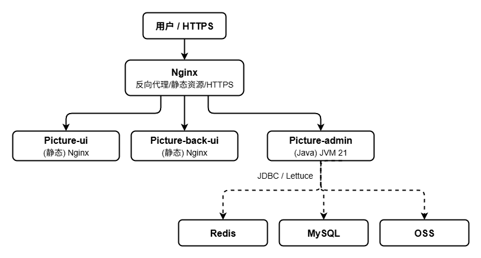

> 前端两个 Web SPA（Picture-ui 用户端、Picture-back-ui 管理端）打包后均为静态资源，统一由 Nginx 托管；`picture-admin.jar` 为后端聚合服务，对外暴露 8080 端口，统一处理 `/user/**`、`/admin/**` 两类接口。

## 8.2 服务启动

### 8.2.1 MySQL 启动

使用 Docker 容器化部署 MySQL 8.0，数据卷挂载实现配置、日志、数据持久化，容器随系统重启自动启动。

```bash
docker run -p 3306:3306 --name mysql --restart always \
  -v /code/container/mysql/conf/my.cnf:/etc/mysql/my.cnf \
  -v /code/container/mysql/logs:/logs \
  -v /code/container/mysql/data:/var/lib/mysql \
  -e MYSQL_ROOT_PASSWORD=mysql1234 \
  -d mysql:8.0.36
```

### 8.2.2 Redis 启动

使用 Docker 部署 Redis 8.0，支持 AOF 持久化与密码认证，配置文件通过挂载方式管理。

```bash
docker run -p 6379:6379 --name redis8.0.2 \
  -v /code/container/redis/conf/redis.conf:/etc/redis/redis.conf \
  -v /code/container/redis/data:/data \
  -v /code/container/redis/logs:/logs \
  -d redis:8.0.2 redis-server /etc/redis/redis.conf
```

### 8.2.3 后端启动

`picture-admin.jar` 聚合所有业务模块，对外暴露 8080 端口。采用 nohup 后台运行方式，配置 JVM 堆内存上限 512MB、直接内存 64MB，元空间 192MB，并开启 OOM 时自动导出堆转储文件便于问题排查。

```bash
nohup java \
  -Xms256m -Xmx512m \
  -XX:MaxMetaspaceSize=192m \
  -XX:MaxDirectMemorySize=64m \
  -XX:+UseParallelGC \
  -XX:+TieredCompilation \
  -XX:TieredStopAtLevel=1 \
  -XX:+HeapDumpOnOutOfMemoryError \
  -XX:HeapDumpPath=./dump.hprof \
  -XX:+ExitOnOutOfMemoryError \
  -XX:ThreadStackSize=256 \
  -Dfile.encoding=UTF-8 \
  -jar picture-admin.jar > nohup.out 2>&1 &
```

### 8.2.4 前端构建与部署

用户端（Picture-ui）和管理端（Picture-back-ui）均为单页应用，构建产物为纯静态资源目录，通过 Nginx 托管。

```bash
# Picture-ui（用户端）
cd Picture-ui
pnpm install
pnpm build
# 产物 dist/ 上传至 Nginx 静态目录

# Picture-back-ui（管理端）
cd Picture-back-ui
pnpm install
pnpm build
# 产物 dist/ 上传至 Nginx 静态目录
```

### 8.2.5 Nginx 配置示例

Nginx 作为反向代理服务器，统一处理 HTTPS 请求。用户端使用根路径 `/` 托管，管理端使用 `/admin/` 路径，后端 API 转发至 8080 端口。

```nginx
server {
    listen 443 ssl;
    server_name springsun.online;

    ssl_certificate     /etc/nginx/ssl/fullchain.pem;
    ssl_certificate_key /etc/nginx/ssl/privkey.pem;

    # 用户端
    location / {
        root /code/web/picture-ui;
        try_files $uri $uri/ /index.html;
    }

    # 管理端
    location /admin/ {
        alias /code/web/picture-back-ui/;
        try_files $uri $uri/ /admin/index.html;
    }

    # 后端 API
    location /api/ {
        proxy_pass http://127.0.0.1:8080/;
        proxy_set_header Host $host;
        proxy_set_header X-Real-IP $remote_addr;
        proxy_set_header X-Forwarded-For $proxy_add_x_forwarded_for;
    }
}
```

## 8.3 初始化步骤

1. 创建数据库 `picture_v2`，执行 `docments/v2.1init.sql`；
2. 启动 Redis，启动 MySQL；
3. 修改 `application-druid.yml` 中的数据库账号密码；
4. 修改 `application.yml` 中的 Redis 地址；
5. 修改 `application-config.yml` 中的 OSS、短信、支付宝配置；
6. 启动后端 `picture-admin.jar`；
7. 访问 `http://IP:8080/admin/swagger-ui.html` 验证 Swagger；
8. 部署前端静态资源，浏览器访问验证。

## 8.4 监控与运维

| 维度 | 工具 |
| --- | --- |
| 应用监控 | Spring Boot Actuator + 自定义 `/admin/monitor/server` |
| 慢 SQL | MyBatis Plus 慢 SQL 拦截器 + Druid StatView |
| 日志 | Logback + 滚动文件 + ELK（可选） |
| 链路追踪 | MDC + TraceId 过滤器（可对接 SkyWalking） |
| 大盘 | 系统自带的统计大屏 |
| 告警 | 钉钉/企业微信 Webhook（预留） |

## 8.5 升级与回滚

1. 灰度发布：先部署 1 台机器观察 30 分钟；
2. 数据库变更：所有 DDL 必须可逆，配套 downgrade 脚本；
3. 配置变更：走 `c_config_info` 动态调整，紧急时支持 Redis 直接更新；
4. 回滚：保留最近 3 个版本的 `picture-admin.jar`，出问题直接 `nohup` 切回。


# 附录 

## A 名词术语表

| 术语 | 解释 |
| --- | --- |
| 公共图库 | 所有用户可见、可搜索的图片集合 |
| 个人空间 | 用户私有图片存储区 |
| 团队空间 | 多用户共同管理、基于角色控制的图片容器 |
| 角色 | 创建者/编辑者/查看者，决定空间内的操作权限 |
| 积分 | 平台虚拟货币，可通过充值、签到、邀请获取，下载/AI 生图等场景消耗 |
| 套餐 | 预设好的"基础积分 + 赠送积分 + 价格"组合 |
| 充值订单 | 用户发起充值的最小业务单元 |
| 异步任务 | AI 平台返回 taskId、需主动查询的生成任务 |
| 策略 | 对接单个 AI 平台的实现类 |
| 缩略图 | 256×256 的小图，用于列表展示 |
| 水印 | 在原图叠加的版权标识 |
| 邀请码 | 用于加入团队空间的一次性凭证 |
| 雪花算法 | Twitter 开源的分布式 ID 生成算法 |
| 雪崩 | 缓存同时过期导致请求穿透到 DB |
| 穿透 | 恶意查询不存在的 key，绕过缓存直击 DB |
| 击穿 | 热点 key 失效瞬间并发打到 DB |
| 链路追踪 | 通过 TraceId 串联一次请求经过的所有服务 |
| Spring Boot | Java 后端开发框架，本项目使用 3.3.5 |
| MyBatis Plus | MyBatis 增强工具，本项目使用 3.5.12 |
| Redisson | Redis Java 客户端，提供分布式锁与对象服务 |
| Vue 3 | 渐进式 JavaScript 前端框架 |
| Vite | 下一代前端构建工具 |
| Tailwind CSS | 原子化 CSS 框架 |
| Element Plus | 基于 Vue 3 的桌面端组件库 |
| ECharts | 百度开源的数据可视化图表库 |
| OSS | Object Storage Service，对象存储服务 |
| JWT | JSON Web Token，跨域身份认证方案 |
| AOP | Aspect-Oriented Programming，面向切面编程 |
| SpEL | Spring Expression Language，Spring 表达式语言 |
| AIGC | AI Generated Content，AI 生成内容 |
| 文生图 | Text to Image，根据文本描述生成图像 |
| 图生图 | Image to Image，根据输入图像生成新图像 |
| 团队空间 | Team Space，多人协作的图像容器 |
| 公共图库 | Public Picture Pool，所有用户可见的图像 |
| 积分 | Points，平台内虚拟货币 |
| 套餐 | Points Package，预先设定的充值套餐 |
| 支付宝回调 | Alipay Notify，支付成功后的异步通知 |
| 异步任务 | Async Task，由 AI 平台返回的查询型任务 |


## B. 版权与版本

本文档为"LZ-Pictur"系统软件产品的设计说明书，受《中华人民共和国著作权法》保护，仅用于软件著作权登记及项目内部归档使用。

## C. 联系方式

如有问题，请联系技术支持，邮箱：3217778348@qq.com。

## D. 版本信息

| 项目 | 内容 |
|------|------|
| 软件版本 | V1.0 |
| 文档版本 | 1.0 |
| 更新日期 | 2026年6月 |
